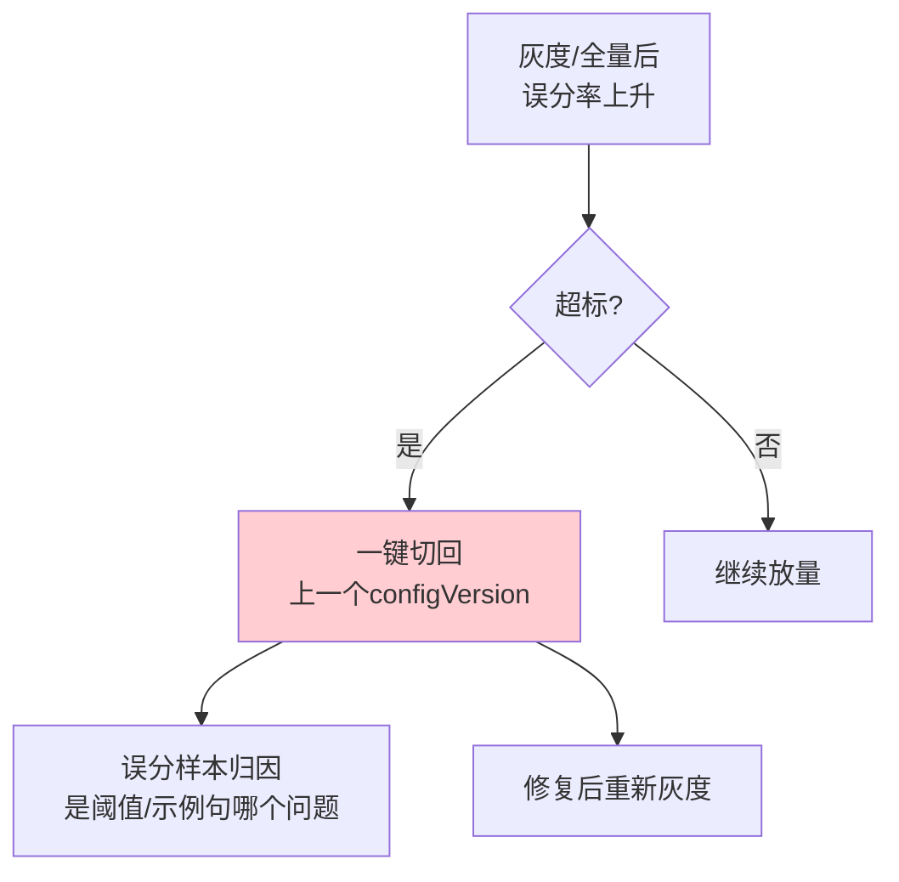

# 06-路由灰度与秒级回滚

> **定位**：让"改路由参数"从**高危操作**变成**可灰度、可回滚**的日常操作。核心三件套：**① 路由配置与代码解耦**（阈值/示例句/意图存配置中心）② **灰度切流**（新路由配置只对 10% 流量生效，对比误分率）③ **秒级回滚**（配置版本回退预案）。呼应 [29-灰度发布与版本管理](../../教程/29-灰度发布与版本管理.md)。前置阅读：[05-命中率优化与按意图阈值](05-命中率优化与按意图阈值.md)。
>
> **铁律 0**：路由配置序列化到 DB/配置中心（自研「概念代码」）；不引入未实证 API。

---

## 一、四问

| 问 | 答 |
|----|----|
| **新增了什么需求** | ①RouteConfig 版本化 + 存储到配置中心 ②灰度切流（按租户/按流量百分比）③同版本 A/B 对比命中/误分 ④回滚预案 |
| **影响了哪些模块** | RouteConfig → 数据源化/版本化；SemanticRouter → 读配置版本；新增 灰度切流器 + 版本切换 |
| **架构如何演进** | 路由参数从"改代码发版"演进为"改配置 + 灰度 + 回滚" |
| **上一版痛点** | 改阈值要发版；全量上线误分事故只能 git revert + 全量重发 |

**本迭代验收**：①配置变更通过配置中心热更新，无需发版 ②灰度 10% 对比误分率，达标才放大 ③任何版本可秒级回滚，回滚后误分率恢复基线。

## 二、配置版本化 + 灰度

```json
{
  "configVersion": "v12",
  "base": { "scenario": "cn_order" },
  "intentThresholds": {
    "APPROVAL": 0.85, "RAG": 0.60, "ORDER": 0.60, "DATA": 0.75
  },
  "rollout": { "percentage": 10, "byTenantGroup": ["beta-group"] }
}
```

```java
// 概念代码：按流量/租户灰度切流
public RouteConfig activeConfig(String tenantId) {
    RouteConfig v = routeConfigStore.latest();
    if (matchesRollout(v, tenantId)) return v;         // 命中灰度 → 用新配置
    return routeConfigStore.version(v.baseVersion());   // 否则 → 用基线路由
}
```

**灰度观测**：对比灰度组 vs 对照组在 04 迭代指标上的**误分率是否恶化**，配对校验（呼应 [附录 12/03](../../附录/12-评估与可观测生态/03-在线实验与AB统计.md)），不达阈值不放量。

## 三、秒级回滚



**要点**：配置必须保留版本历史 + 支持回退到任意历史版本；回滚本身也是"配置切换"（秒级生效），区别于"代码回滚"（需重发）。

## 四、验收

| 测试 | 期望 |
|------|------|
| 改阈值 | 配置中心热更新，10s 生效 |
| 灰度 10% | 仅 beta 组用新配置，误分率可对比 |
| 误分恶化 | 一键回滚 v12，误分率恢复 |
| 版本历史 | 可查所有 configVersion 变更记录 |

> **下一步**：路由能安全地调参上线了，但仍有最后一道防线问题——**误分直达高风险业务怎么办**（如把"帮我删数据"路由进数据链）。07 迭代加**兜底降级链 + HITL 闸门**，把误分落到安全边界内。
