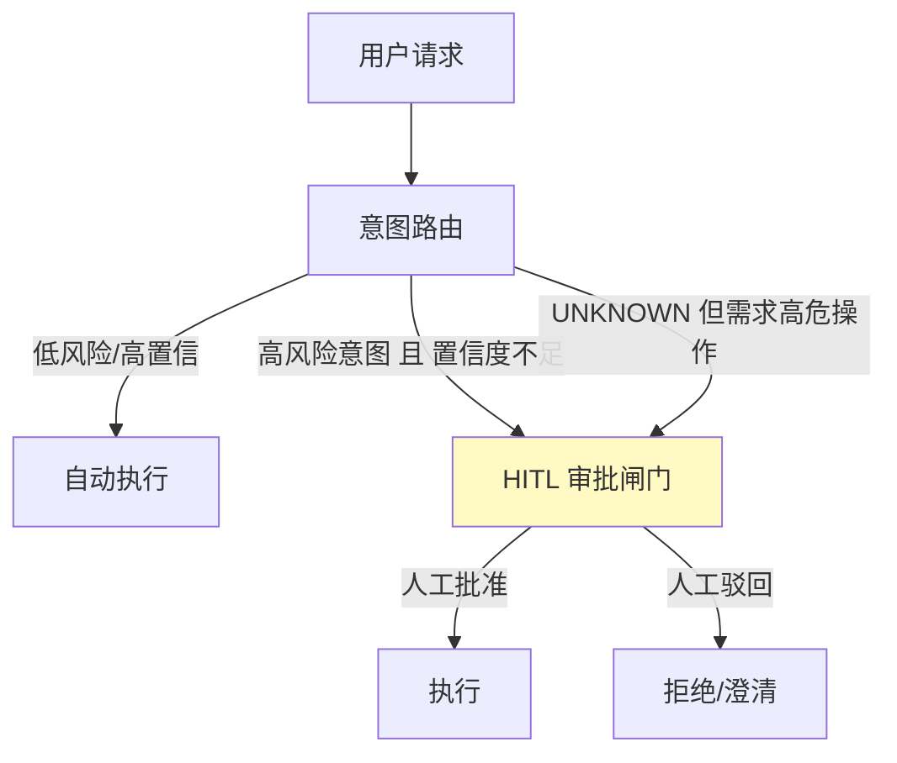

# 07-兜底降级链与 HITL 闸门

> **定位**：给意图路由装上**最后的安全边界**。两个机制：**① 兜底降级链**（路由目标执行失败/空结果 → 逐级降级，绝不裸奔）② **HITL 闸门**（高风险意图强制人工复核才执行，误分也被拦在边界内）。呼应 [63-容错与弹性设计](../../教程/04-企业级架构主干/10-容错与弹性设计.md)、[61-Human-in-the-Loop与审批流](../../教程/04-企业级架构主干/08-Human-in-the-Loop与审批流.md)。前置阅读：[06-路由灰度与秒级回滚](06-路由灰度与秒级回滚.md)。
>
> **铁律 0**：HITL 落点用 ToolCallingManager 装饰器/包装层（已实证基准，见资料库）；路由降级链自研「概念代码」。

---

## 一、四问

| 问 | 答 |
|----|----|
| **新增了什么需求** | ①兜底降级链（目标执行链失败 → 降级到 fallbackChain/更便宜模型 → 人工）②高风险意图 HITL 强制闸门（优先于执行）③误分兜底策略（低置信 → 不自动放行高危操作） |
| **影响了哪些模块** | RouteDispatcher → 包降级链；RouteTarget 增 requiresHitl；新增 HITL 审批服务 |
| **架构如何演进** | 从"只做路由分发"演进为"路由 + 降级 + 人工兜底"的完整执行防护 |
| **上一版痛点** | 误分直达高风险操作无法被拦截；路由目标宕机/空结果直接失败裸奔 |

**本迭代验收**：①目标执行链异常 → onErrorResume 降级到 fallbackChain，链路不中断 ②高风险意图（APPROVAL/DATA 高危操作）置信度不足 → 走 HITL 审批而非自动执行 ③低置信高危请求 100% 走人工复核。

### 一.1 本节核对（四问与迭代验收）

| # | 核对项 | 判据 |
|---|--------|------|
| 1 | 四问口径齐全 | 新增需求（降级链/HITL 闸门/误分兜底）/影响模块（RouteDispatcher 包降级链+RouteTarget 增 requiresHitl+新增审批服务）/架构演进/上一版痛点四行均有 |
| 2 | 本迭代验收可判定 | 异常降级不中断、高风险置信不足走 HITL、低置信高危 100% 复核——三项可判定 |

## 二、兜底降级链

```java
// 概念代码：路由目标执行的多级降级（呼应教程30容错）
public Flux<ChatResponse> safeDispatch(RouteKey key, String input, String tenantId) {
    return dispatch(key, input)
        .onErrorResume(e -> logAndFallback(key, e, input))    // 目标链异常 → 降级
        .switchIfEmpty(fallbackChain.prompt().user(input).stream())  // 空结果 → 通用兜底
        .onErrorResume(e -> Flux.error(routeDegraded(key, e)));      // 兜底也挂 → 明确报错(不进静默裸奔)
}
```

**降级优先级**：专属链 → 通用兜底链 → 明确失败（可观测，不静默）。**关键纪律**：高风险操作降级时**宁可拒绝，不可降级后自动执行高危动作**（防"降级绕过安全"）。

### 二.1 本节测试与验证（兜底降级链）

**前置条件**：`safeDispatch(key, input, tenantId)` 已实现；`dispatch`/`logAndFallback`/`fallbackChain`/`routeDegraded` 已就绪。

**材料——链路核对**：

| 环节 | 触发 | 应行为 |
|------|------|--------|
| 专属链 | 正常 | 直达目标 |
| `onErrorResume` | 专属链抛异常 | 降级 fallbackChain（记录日志） |
| `switchIfEmpty` | 目标返回空 | 用通用兜底 Chain |
| 兜底也挂 | fallback 抛异常 | 明确 `routeDegraded` 报错（不静默） |

**步骤与断言**：

| # | 操作 | 预期（PASS 判据） |
|---|------|------------------|
| 1 | 让 order 链模拟宕机/抛异常 | `onErrorResume` 降级，fallbackChain 接管，链路不中断（验收①） |
| 2 | 目标返回空结果 | `switchIfEmpty` 触发通用兜底 |
| 3 | 同时令兜底也失败 | 返回明确 `routeDegraded` 错误，不静默裸奔 |

**失败排查**：①异常直接中断→`onErrorResume` 未包住 dispatch；②空结果裸奔→缺 `switchIfEmpty`；③降级后仍执行高危动作→关键纪律被违反，必须在降级分支禁止高危操作。

## 三、HITL 闸门（误分的安全边界）



- **落点**：HITL 不是路由的 Advisor，而是**工具执行层/命令边界的强制闸门**（呼应资料库结论：HITL 正确落点是 ToolCallingManager 装饰器或 ToolCallback 包装层）。
- **原则**：路由只管"送对地方"，**高危操作能不能真的执行**由 HITL 闸门独立裁决——即使路由误分（把高危请求当成了低风险），闸门也能在工具执行前拦下。

### 三.1 本节核对（HITL 闸门）

- [ ] "HITL 落点是工具执行边界（ToolCallingManager 装饰器/ToolCallback 包装层），非路由 Advisor"这一点能复述，且能说出"若只放 Advisor，执行链内仍能绕过"的缘由
- [ ] 图中三条入边（高风险+置信不足 / UNKNOWN 但高危）都汇入闸门、人工批准/驳回两条出边，与正文验收"低置信高危 100% 复核"一致

## 四、全篇回归验证

| 测试 | 期望 |
|------|------|
| 目标链宕机 | 降级到 fallbackChain，链路不中断 |
| "帮我删用户数据"被路由到任意意图 | HITL 闸门在工具执行前拦截审批 |
| 低置信高风险 | 100% 走人工复核 |
| 兜底也挂 | 明确报错（可观测），不静默裸奔 |

**回归断言**：

| # | 操作 | 预期（PASS 判据） |
|---|------|------------------|
| 1 | 令目标链宕机并请求 | 降级到 fallbackChain，链路不中断（对应上表首行） |
| 2 | "帮我删用户数据"路由到任意意图 | HITL 闸门在工具执行前拦截审批，不泄露高危操作（对应上表次行） |
| 3 | 统计低置信高危请求 | 100% 走人工复核（对应上表第三行） |
| 4 | 同时让兜底也失败 | 得到明确报错（可观测），不静默裸奔（对应上表末行） |

**回归失败排查**：①降级中断→`onErrorResume`/`switchIfEmpty` 未包全，回 §二.1；②高危操作被自动执行→HITL 闸门未拦在工具边界，回 §三.1；③静默裸奔→`routeDegraded` 未抛出，回 §二.1 步骤 3。

> **下一步**：主体迭代（01-07）完成，路由平台已能：路由→观测→调优→灰度→安全兜底。08 起进入**进阶方向**：先做**多级路由缓存**（把入口延迟再压低），再做审计回放（09）、路由策略动态下发（10）。

## 五、验收对照

| 验收项 | 标准 | 状态 |
|--------|------|------|
| 兜底降级不中断 | 目标链宕机 → onErrorResume 落 fallbackChain | ✅（§二.1，§四 回归断言 1） |
| 高风险 HITL 闸门 | 高危操作在工具执行前拦截审批（不泄露） | ✅（§三.1，§四 回归断言 2） |
| 低置信高危 100% 人工复核 | 统计口径下无一自动执行 | ✅（§四 回归断言 3） |
| 兜底失效可观测 | 兜底也失败时明确报错，不静默裸奔 | ✅（§二.1 步骤 3，§四 回归断言 4） |

> 本节核对（一句话）：四项验收拆自 [00-需求分析与架构设计](00-需求分析与架构设计.md) §三 迭代路线（07 痛点"误分直达高风险业务"）与本篇 §一 本迭代验收三项，逐条锚定 §二.1/§三.1 测验与 §四 回归断言编号，无"验收了但没验证"项即 PASS。
