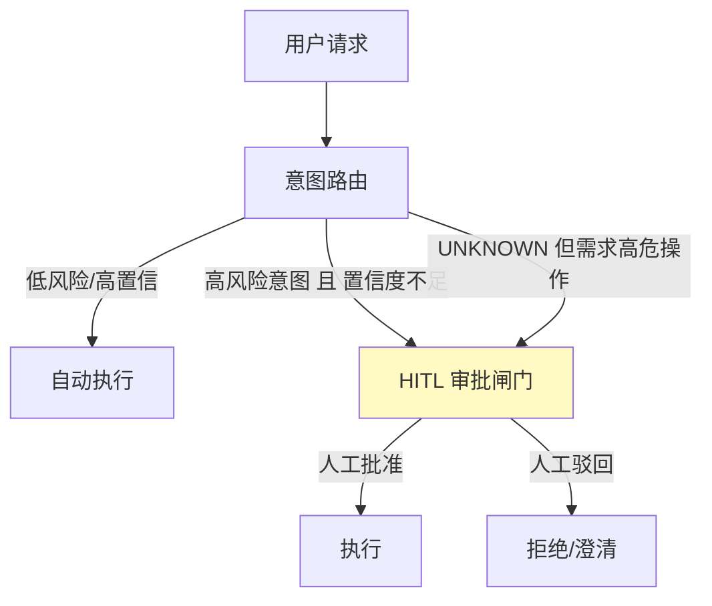

# 07-兜底降级链与 HITL 闸门

> **定位**：给意图路由装上**最后的安全边界**。两个机制：**① 兜底降级链**（路由目标执行失败/空结果 → 逐级降级，绝不裸奔）② **HITL 闸门**（高风险意图强制人工复核才执行，误分也被拦在边界内）。呼应 [30-容错与弹性设计](../../教程/30-容错与弹性设计.md)、[28-Human-in-the-Loop与审批流](../../教程/28-Human-in-the-Loop与审批流.md)。前置阅读：[06-路由灰度与秒级回滚](06-路由灰度与秒级回滚.md)。
>
> **铁律 0**：HITL 落点用 ToolCallingManager 装饰器/包装层（已实证基准，见资料库）；路由降级链自研「概念代码」。

---

## 一、四问

| 问 | 答 |
|----|----|
| **新增了什么需求** | ①兜底降级链（目标执行链失败 → 降级到 fallbackChain/更便宜模型 → 人工）②高风险意图 HITL 强制闸门（优先于执行）③误分兜底策略（低置信 → 不自动放行高危操作） |
| **影响了哪些模块** | RouteDispatcher → 包降级链；RouteTarget 增 requiresHitl；新增 HITL 审批服务 |
| **架构如何演进** | 从"只做路由分发"演进为"路由 + 降级 + 人工兜底"的完整执行防护 |
| **上一版痛点** | 误分直达高风险操作无法被拦截；路由目标宕机/空结果直接失败裸奔 |

**本迭代验收**：①目标执行链异常 → onErrorResume 降级到 fallbackChain，链路不中断 ②高风险意图（APPROVAL/DATA 高危操作）置信度不足 → 走 HITL 审批而非自动执行 ③低置信高危请求 100% 走人工复核。

## 二、兜底降级链

```java
// 概念代码：路由目标执行的多级降级（呼应教程30容错）
public Flux<ChatResponse> safeDispatch(RouteKey key, String input, String tenantId) {
    return dispatch(key, input)
        .onErrorResume(e -> logAndFallback(key, e, input))    // 目标链异常 → 降级
        .switchIfEmpty(fallbackChain.prompt().user(input).stream())  // 空结果 → 通用兜底
        .onErrorResume(e -> Flux.error(routeDegraded(key, e)));      // 兜底也挂 → 明确报错(不进静默裸奔)
}
```

**降级优先级**：专属链 → 通用兜底链 → 明确失败（可观测，不静默）。**关键纪律**：高风险操作降级时**宁可拒绝，不可降级后自动执行高危动作**（防"降级绕过安全"）。

## 三、HITL 闸门（误分的安全边界）



- **落点**：HITL 不是路由的 Advisor，而是**工具执行层/命令边界的强制闸门**（呼应资料库结论：HITL 正确落点是 ToolCallingManager 装饰器或 ToolCallback 包装层）。
- **原则**：路由只管"送对地方"，**高危操作能不能真的执行**由 HITL 闸门独立裁决——即使路由误分（把高危请求当成了低风险），闸门也能在工具执行前拦下。

## 四、验收

| 测试 | 期望 |
|------|------|
| 目标链宕机 | 降级到 fallbackChain，链路不中断 |
| "帮我删用户数据"被路由到任意意图 | HITL 闸门在工具执行前拦截审批 |
| 低置信高风险 | 100% 走人工复核 |
| 兜底也挂 | 明确报错（可观测），不静默裸奔 |

> **下一步**：主体迭代（01-07）完成，路由平台已能：路由→观测→调优→灰度→安全兜底。08 起进入**进阶方向**：先做**多级路由缓存**（把入口延迟再压低），再做审计回放（09）、路由策略动态下发（10）。
