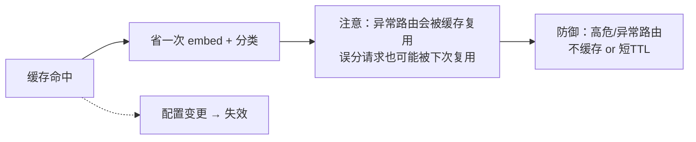

# 08-多级路由缓存

> **定位**：把"入口路由"的延迟再压低一档。核心：**① 会话内路由缓存**（同一会话后续请求不再重复 embed/分类）② **热门查询语义缓存**（命中过的用户输入直接复用路由结果）③ 缓存一致性（配置变化时失效）。呼应 [38-Agent性能优化](../../教程/38-Agent性能优化.md)、[26-多租户隔离](../../教程/26-多租户隔离与资源治理.md)。前置阅读：[07-兜底降级链与HITL闸门](07-兜底降级链与HITL闸门.md)。
>
> **铁律 0**：路由缓存自研（缓存的 key/失效自控）；embedding 用已实证 API。

---

## 一、四问

| 问 | 答 |
|----|----|
| **新增了什么需求** | ①会话级路由缓存（sessionId → 首请求路由结果，会话内复用）②全局语义缓存（用户输入 → 路由结果，LRU+TTL）③配置版本变更 → 缓存失效 |
| **影响了哪些模块** | SemanticRouter → 包缓存层；新增 RouteCache（两级） |
| **架构如何演进** | 从"每次请求都算一次路由"演进为"会话复用 + 热查询复用" |
| **上一版痛点** | 同一会话轮翻几轮，每轮都重复 embed；热门查询每次白白烧 embedding |

**本迭代验收**：①同会话第二次起路由直接命中缓存（省 embed）②热门查询缓存命中率 ≥ 40% ③配置变更后缓存失效，无误用旧路由。

## 二、两级缓存（会话级 + 全局语义级）

```java
// 概念代码：路由缓存
@Component
public class RouteCache {
    // 一级：会话级（同一会话内请求互相关联，首请求路由结果复用）
    private final Map<String, RouteResult> sessionCache = // TTL 30min, per-session
            Caffeine.newBuilder().expireAfterWrite(Duration.ofMinutes(30)).build();

    // 二级：全局语义缓存（同输入 → 同路由），LRU
    private final Cache<String, RouteResult> semanticCache = // Caffeine LRU + TTL 5min
            Caffeine.newBuilder().maximumSize(50_000L)
                    .expireAfterWrite(Duration.ofMinutes(5)).build();

    public RouteResult routeWithCache(String sessionId, String input, String tenantId) {
        // 会话内复用
        if (tenantId != null && sessionId != null) {
            var c = sessionCache.get(tenantId + ":" + sessionId, k -> semanticCache.get(input.hashCode() + ":" + tenantId,
                    k2 -> baseRouter.route(input, tenantId)));
            return c;
        }
        // 无会话：直接全局语义缓存
        return semanticCache.get(input.hashCode() + ":" + tenantId, k -> baseRouter.route(input, tenantId));
    }

    public void invalidateOnConfigChange(long configVersion) {
        sessionCache.invalidateAll();       // 配置版本变更 → 全失效，防误用旧路由
        semanticCache.invalidateAll();
    }
}
```

**缓存 key 必须含租户**（同输入不同租户可能路由不同——多租户矩阵 [26](../../教程/26-多租户隔离与资源治理.md)）。

## 三、缓存与正确性的平衡



**要点**：**误分/低置信路由不要缓存**（否则错一次一直错）。高风险意图缓存 TTL 极短或禁用缓存，宁可慢，不可复用错误路由。

## 四、验收

| 测试 | 期望 |
|------|------|
| 同会话二次请求 | 命中会话缓存，省 embed |
| 热门查询 | 语义缓存命中率 ≥ 40% |
| 配置变更 | 缓存失效，无误用旧路由 |
| 低置信请求 | 不缓存（防错误复用） |

> **下一步**：性能已优化，但"路由违规了怎么追"仍是空白。09 进阶做**审计回放 + 合规**，把高风险路由变成可追溯证据链。
