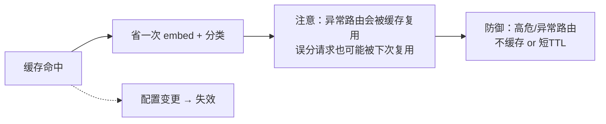

# 08-多级路由缓存

> **定位**：把"入口路由"的延迟再压低一档。核心：**① 会话内路由缓存**（同一会话后续请求不再重复 embed/分类）② **热门查询语义缓存**（命中过的用户输入直接复用路由结果）③ 缓存一致性（配置变化时失效）。呼应 [81-Agent性能优化](../../教程/08-架构师进阶/04-Agent性能优化.md)、[26-多租户隔离](../../教程/04-企业级架构主干/06-多租户隔离与资源治理.md)。前置阅读：[07-兜底降级链与HITL闸门](07-兜底降级链与HITL闸门.md)。
>
> **铁律 0**：路由缓存自研（缓存的 key/失效自控）；embedding 用已实证 API。

---

## 一、四问

| 问 | 答 |
|----|----|
| **新增了什么需求** | ①会话级路由缓存（sessionId → 首请求路由结果，会话内复用）②全局语义缓存（用户输入 → 路由结果，LRU+TTL）③配置版本变更 → 缓存失效 |
| **影响了哪些模块** | SemanticRouter → 包缓存层；新增 RouteCache（两级） |
| **架构如何演进** | 从"每次请求都算一次路由"演进为"会话复用 + 热查询复用" |
| **上一版痛点** | 同一会话轮翻几轮，每轮都重复 embed；热门查询每次白白烧 embedding |

**本迭代验收**：①同会话第二次起路由直接命中缓存（省 embed）②热门查询缓存命中率 ≥ 40% ③配置变更后缓存失效，无误用旧路由。

### 一.1 本节核对（四问与迭代验收）

| # | 核对项 | 判据 |
|---|--------|------|
| 1 | 四问口径齐全 | 新增需求（会话级缓存/全局语义缓存/配置变更失效）/影响模块（SemanticRouter 包缓存层+新增 RouteCache）/架构演进/上一版痛点四行均有 |
| 2 | 本迭代验收可度量 | 会话语 `缓存命中省 embed`、热门查询命中率≥40%、配置变更缓存失效——三项可判定 |

## 二、两级缓存（会话级 + 全局语义级）

```java
// 概念代码：路由缓存
@Component
public class RouteCache {
    // 一级：会话级（同一会话内请求互相关联，首请求路由结果复用）
    private final Map<String, RouteResult> sessionCache = // TTL 30min, per-session
            Caffeine.newBuilder().expireAfterWrite(Duration.ofMinutes(30)).build();

    // 二级：全局语义缓存（同输入 → 同路由），LRU
    private final Cache<String, RouteResult> semanticCache = // Caffeine LRU + TTL 5min
            Caffeine.newBuilder().maximumSize(50_000L)
                    .expireAfterWrite(Duration.ofMinutes(5)).build();

    public RouteResult routeWithCache(String sessionId, String input, String tenantId) {
        // 会话内复用
        if (tenantId != null && sessionId != null) {
            var c = sessionCache.get(tenantId + ":" + sessionId, k -> semanticCache.get(input.hashCode() + ":" + tenantId,
                    k2 -> baseRouter.route(input, tenantId)));
            return c;
        }
        // 无会话：直接全局语义缓存
        return semanticCache.get(input.hashCode() + ":" + tenantId, k -> baseRouter.route(input, tenantId));
    }

    public void invalidateOnConfigChange(long configVersion) {
        sessionCache.invalidateAll();       // 配置版本变更 → 全失效，防误用旧路由
        semanticCache.invalidateAll();
    }
}
```

**缓存 key 必须含租户**（同输入不同租户可能路由不同——多租户矩阵 [26](../../教程/04-企业级架构主干/06-多租户隔离与资源治理.md)）。

### 二.1 本节测试与验证（两级缓存）

**前置条件**：`RouteCache`（会话级 TTL 30min + 语义级 LRU/TTL 5min）已实现；`baseRouter.route` 可被 `routeWithCache` 包裹。

**材料——缓存操作序列**：

```text
S1 会话 c1, 输入 X                      # 首次 → 未命中 → 路由计算并写入
S1 会话 c1, 再次输入 X（同会话）          # 命中会话缓存，省 embed
S2 无会话, 输入 Y（热门查询）             # 命中语义缓存
```

**步骤与断言**：

| # | 操作 | 预期（PASS 判据） |
|---|------|------------------|
| 1 | 会话 c1 首次请求 X | 未命中，`baseRouter.route` 路由一次，结果写入两级缓存 |
| 2 | 同会话二次请求 X | 命中会话缓存，不再 embed（验收①） |
| 3 | 另一会话无 session 请求热门 Y | 命中语义缓存 |
| 4 | key 含租户 | 同一 input 不同 tenant 不串（key 里含 tenantId） |

**失败排查**：①二次仍重复 embed→会话 key（tenantId+sessionId）未命中或缓存未写入；②租户串路由→key 未含 tenantId；③缓存 key 冲突→用 `input.hashCode()` 注意 hash 冲突处理。

## 三、缓存与正确性的平衡



**要点**：**误分/低置信路由不要缓存**（否则错一次一直错）。高风险意图缓存 TTL 极短或禁用缓存，宁可慢，不可复用错误路由。

### 三.1 本节核对（缓存与正确性平衡）

- [ ] "误分/低置信路由不要缓存、高风险 TTL 极短或禁用"这个结论能复述，且说出"否则错一次一直错"的代价
- [ ] 图中"配置变更→失效"边与 §一 验收③（配置变更缓存失效、无误用旧路由）一致，与 06/10 的版本切换衔接

## 四、全篇回归验证

| 测试 | 期望 |
|------|------|
| 同会话二次请求 | 命中会话缓存，省 embed |
| 热门查询 | 语义缓存命中率 ≥ 40% |
| 配置变更 | 缓存失效，无误用旧路由 |
| 低置信请求 | 不缓存（防错误复用） |

**回归断言**：

| # | 操作 | 预期（PASS 判据） |
|---|------|------------------|
| 1 | 同一会话连续多轮请求 | 首轮后均命中会话缓存，embed 次数显著下降（对应上表首行） |
| 2 | 统计热门查询缓存命中占比 | ≥40%（对应上表次行，验收②） |
| 3 | 触发一次配置版本变更 | `invalidateOnConfigChange` 清空两级缓存，旧路由不再复用（对应上表第三行，验收③） |
| 4 | 发起一个低置信请求 | 不被缓存（防错误复用，对应上表末行） |

**回归失败排查**：①命中率 <40%→热门 key 未聚合或 TTL 过短，回 §二；②配置变更仍用旧路由→`invalidateAll` 未在变更时调用，衔接 10 的版本协商；③低置信被缓存→缓存层未做置信度过滤。

> **下一步**：性能已优化，但"路由违规了怎么追"仍是空白。09 进阶做**审计回放 + 合规**，把高风险路由变成可追溯证据链。
