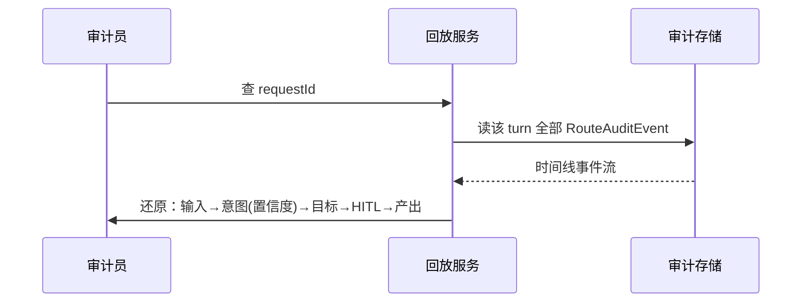

# 09-进阶二：审计回放与合规

> **定位**：让每一次路由决策**可追溯、可回放、可审计**——尤其高风险请求要形成证据链，应对监管与内部追责。核心：**① 路由全链路审计日志**（输入含脱敏 → 意图 → 置信度 → 目标 → 产出 → HITL 审批结果）② **决策回放**（从日志还原一次完整路由 + 执行）③ 合规策略（高风险长期留存、敏感数据脱敏、越权告警）。呼应 [25-历史记录持久化与合规](../../教程/25-历史记录持久化与合规.md)、[23-工具执行可观测与审计](../../教程/23-工具执行可观测与审计.md)。前置阅读：[08-多级路由缓存](08-多级路由缓存.md)。
>
> **铁律 0**：审计日志落库/事件流自研；数据脱敏用已实证工具。

---

## 一、四问

| 问 | 答 |
|----|----|
| **新增了什么需求** | ①路由全链路审计日志（append-only、含 hash 链防篡改）②决策回放服务 ③合规策略（高风险留存 7 年、PII 脱敏、越权告警） |
| **影响了哪些模块** | RouteDispatcher → 全链路埋点；新增 审计日志存储 + 回放服务 + 合规策略 |
| **架构如何演进** | 从"只记单条路由"演进为"完整审计证据链 + 回放 + 合规留存" |
| **上一版痛点** | 只有日志，无回放；高风险误放行了无法追溯；无合规留存策略 |

**本迭代验收**：①任意请求可回放"输入→意图→置信度→目标→HITL→产出" ②审计日志 append-only + 防篡改 ③高风险日志留存 ≥ 7 年，PII 字段强制脱敏。

## 二、路由全链路审计日志

```java
// 概念代码：append-only 审计事件（hash 链防篡改）
public record RouteAuditEvent(
        long seq,              // 单调递增，参与 hash 链
        String prevHash,       // 前一条 hash（防篡改）
        String requestId, String tenantId,
        String inputHash,      // 输入脱敏：只存 hash + 低频可逆脱敏
        RouteKey intent, double confidence,
        String selectedRoute, String outcome,
        String hitlDecision,   // HITL 审批：/ 批准 / 驳回
        long ts) {
    public String computeHash() { /* SHA-256(seq+prevHash+... ) */ }
}
```

**三条合规纪律**：
1. **高风险请求全文留存**：只对 approval/data 高危操作存"可回放明文"，其余存 hash（平衡隐私与审计）。
2. **PII 脱敏**：身份证/手机号/地址在入库前脱敏（呼应 [06-数据脱敏](../../项目/06-金融风控Agent系统/06-数据脱敏与合规.md)）。
3. **留存策略**：按风险分级设定留存时长与归档（呼应 [25](../../教程/25-历史记录持久化与合规.md)、[43-Agent治理与合规框架](../../教程/43-Agent治理与合规框架.md)）。

## 三、决策回放



**回放价值**：误放行追责时，能还原"当时为什么路由到那"（置信度多少、是否过了 HITL、审批人是谁）——是内部追责与监管披露（呼应 [19-跨组织互认与监管披露](../../项目/19-企业级Agent信任与评测平台/10-跨组织信任互认与监管披露.md)）的基础。

## 四、验收

| 测试 | 期望 |
|------|------|
| 单请求回放 | 还原完整路由决策链 |
| hash 链 | 篡改任一条 → 后续 hash 校验失败 |
| PII 脱敏 | 敏感字段入库前已脱敏 |
| 留存 | 高风险日志长期留存，低风险可归档 |

> **下一步**：审计让路由"可追溯"，但路由参数还是靠运维手工改配置。10 进阶做**路由策略动态下发**，把"改路由"从手工升级为平台能力（含审批、灰度、审计一体化）。
