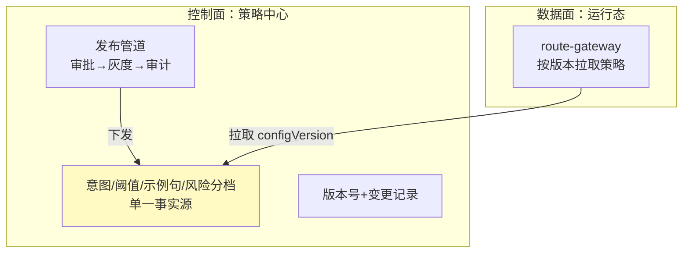

# 10-路由策略动态下发

> **定位**：把"改路由"从**手工改配置**升级为**管线化的策略下发**：策略中心统一托管（意图/阈值/示例句/风险分档），支持**审批后发布 → 灰度 → 审计**一体化；运行态拉取生效。呼应 [16-企业级Agent服务网格](../../项目/16-企业级Agent服务网格/00-需求分析与架构设计.md) 的 xDS 动态下发思想、[20-管控分离架构](../../教程/20-管控分离架构.md)。前置阅读：[09-审计回放与合规](09-审计回放与合规.md)。
>
> **铁律 0**：策略线版本化/下发管道自研「概念代码」；仅模型/工具调用用实证基准。

---

## 一、四问

| 问 | 答 |
|----|----|
| **新增了什么需求** | ①策略中心（意图表/阈值表/示例句/风险分档统一托管）②审批-灰度-审计一体化发布管道 ③运行态策略拉取 + 版本号协商 |
| **影响了哪些模块** | RouteConfig → 归入策略中心；SemanticRouter → 按版本拉取；新增 策略中心 + 发布管道 |
| **架构如何演进** | 从"数据化配置"演进为"策略管线化 + 集中治理"（管控分离的控制面深化） |
| **上一版痛点** | 配置分散、改路由无统一准入；无发布审批；版本管理零散 |

**本迭代验收**：①所有路由参数单一事实源在策略中心 ②一次策略变更走通"审批→灰度→审计"全流程 ③运行态 P95 拉取 ≤ 2s，带版本号协商避免旧版本误用。

## 二、策略中心（单一事实源）



**要点**：这是控制面（管策略、管发放）与数据面（管执行）的分离深化——路由策略由中央治理，执行侧只按配置跑（呼应 [20]../../教程/20-管控分离架构.md)）。

## 三、发布管道（审批-灰度-审计）

```java
// 概念代码：策略发布四步管道
strategyPipeline.draft(changeSpec)          // 1.拟稿：改阈值/示例句/新意图
    .submitForReview(approver)              // 2.审批（高风险变更强制人工）
    .withRollout(pct, tenantGroup)          // 3.灰度（复用06的秒级回滚）
    .onPublish(event -> auditLog.recode(changeEvent))  // 4.审计记录
```

**关键**：策略变更本身就是高价值审计对象——谁在何时改了哪个意图的阈值，都要进 09 的审计链。

## 四、运行态拉取 + 版本协商

- 客户端带**当前 configVersion** 拉取策略中心，返回 `latest + version`；不一致 → 平滑热切换，切换期新老策略并存到会话结束（保证会话内一致）。
- 结合 08 缓存：**策略版本变更 → invalidateAll（08 已实现）**，避免旧路由复用。

## 五、验收

| 测试 | 期望 |
|------|------|
| 改一个意图阈值 | 走审批→灰度→审计，非直接改库 |
| 运行态拉取 | P95 ≤ 2s，版本协商正确 |
| 变更审计 | 每次策略变更都有记录 |
| 会话一致性 | 切换期会话内不混用新旧策略 |

> **下一步**：10 个迭代/进阶让意图路由平台完整覆盖：路由、观测、调优、灰度、兜底、缓存、审计、策略治理。下一步进 **11-核心代码讲解**，把整套实现串起来复盘；随后 12-ADR、13-前沿收官。
