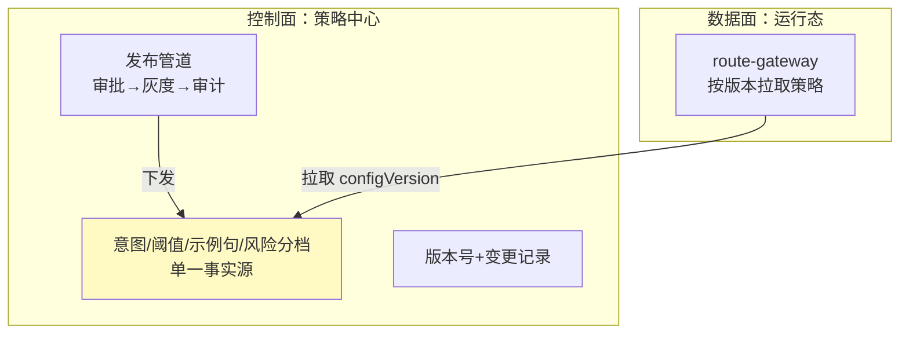

# 10-路由策略动态下发

> **定位**：把"改路由"从**手工改配置**升级为**管线化的策略下发**：策略中心统一托管（意图/阈值/示例句/风险分档），支持**审批后发布 → 灰度 → 审计**一体化；运行态拉取生效。呼应 [16-企业级Agent服务网格](../../项目/16-企业级Agent服务网格/00-需求分析与架构设计.md) 的 xDS 动态下发思想、[29-管控分离架构](../../教程/04-企业级架构主干/00-管控分离架构.md)。前置阅读：[09-审计回放与合规](09-审计回放与合规.md)。
>
> **铁律 0**：策略线版本化/下发管道自研「概念代码」；仅模型/工具调用用实证基准。

---

## 一、四问

| 问 | 答 |
|----|----|
| **新增了什么需求** | ①策略中心（意图表/阈值表/示例句/风险分档统一托管）②审批-灰度-审计一体化发布管道 ③运行态策略拉取 + 版本号协商 |
| **影响了哪些模块** | RouteConfig → 归入策略中心；SemanticRouter → 按版本拉取；新增 策略中心 + 发布管道 |
| **架构如何演进** | 从"数据化配置"演进为"策略管线化 + 集中治理"（管控分离的控制面深化） |
| **上一版痛点** | 配置分散、改路由无统一准入；无发布审批；版本管理零散 |

**本迭代验收**：①所有路由参数单一事实源在策略中心 ②一次策略变更走通"审批→灰度→审计"全流程 ③运行态 P95 拉取 ≤ 2s，带版本号协商避免旧版本误用。

### 一.1 本节核对（四问与迭代验收）

| # | 核对项 | 判据 |
|---|--------|------|
| 1 | 四问口径齐全 | 新增需求（策略中心/审批-灰度-审计发布管道/运行态拉取+版本协商）/影响模块（RouteConfig 归入策略中心+SemanticRouter 按版本拉取+策略中心）/架构演进/上一版痛点四行均有 |
| 2 | 本迭代验收可度量 | 单一事实源、全流程走通、P95 拉取≤2s+版本协商——三项可判定 |

## 二、策略中心（单一事实源）



**要点**：这是控制面（管策略、管发放）与数据面（管执行）的分离深化——路由策略由中央治理，执行侧只按配置跑（呼应 [20]../../教程/29-管控分离架构.md)）。

### 二.1 本节核对（策略中心单一事实源）

- [ ] 图中控制面（策略中心：单一事实源/发布管道/版本号）与数据面（route-gateway 按版本拉取）分离清晰，与 [20 管控分离]、[16 xDS] 语义一致
- [ ] "所有路由参数单一事实源在策略中心"这一验收①能在图中指出（PC1），无分散配置残留

## 三、发布管道（审批-灰度-审计）

```java
// 概念代码：策略发布四步管道
strategyPipeline.draft(changeSpec)          // 1.拟稿：改阈值/示例句/新意图
    .submitForReview(approver)              // 2.审批（高风险变更强制人工）
    .withRollout(pct, tenantGroup)          // 3.灰度（复用06的秒级回滚）
    .onPublish(event -> auditLog.recode(changeEvent))  // 4.审计记录
```

**关键**：策略变更本身就是高价值审计对象——谁在何时改了哪个意图的阈值，都要进 09 的审计链。

### 三.1 本节测试与验证（发布管道四步）

**前置条件**：`strategyPipeline` 已定义 `draft → submitForReview → withRollout → onPublish` 四步；审批与审计已接入。

**材料——四步核对**：

```text
draft(changeSpec) → submitForReview(approver) → withRollout(pct, tenantGroup) → onPublish(auditLog)
```

**步骤与断言**：

| # | 操作 | 预期（PASS 判据） |
|---|------|------------------|
| 1 | 拟稿改一个意图阈值（如 APPROVAL 0.85→0.90） | 不进库，进入 draft 待审 |
| 2 | 提交审批（高风险变更强制人工） | 未批准前不发布 |
| 3 | 批准后 withRollout 灰度 | 复用 06 的秒级回滚，10% 生效 |
| 4 | onPublish | 审计记录"谁/何时/改了哪个阈值"（进 09 审计链） |

**失败排查**：①未审批就下发→submitForReview 被跳过；②变更无审计→onPublish 事件未接审计；③灰度失效→withRollout 未复用 06 配置。

## 四、运行态拉取 + 版本协商

- 客户端带**当前 configVersion** 拉取策略中心，返回 `latest + version`；不一致 → 平滑热切换，切换期新老策略并存到会话结束（保证会话内一致）。
- 结合 08 缓存：**策略版本变更 → invalidateAll（08 已实现）**，避免旧路由复用。

### 四.1 本节核对（运行态拉取 + 版本协商）

- [ ] "带 configVersion 拉取 → 返回 latest+version → 平滑热切换、会话内新旧并存不混用"能复述，与验收③ P95≤2s+版本协商一致
- [ ] "版本变更 → 缓存 invalidateAll（08）"衔接明确，新旧策略在切换期内会话内一致，无旧路由误用

## 五、全篇回归验证

| 测试 | 期望 |
|------|------|
| 改一个意图阈值 | 走审批→灰度→审计，非直接改库 |
| 运行态拉取 | P95 ≤ 2s，版本协商正确 |
| 变更审计 | 每次策略变更都有记录 |
| 会话一致性 | 切换期会话内不混用新旧策略 |

**回归断言**：

| # | 操作 | 预期（PASS 判据） |
|---|------|------------------|
| 1 | 改一个意图阈值走全流程 | 走"审批→灰度→审计"，非直接改库（对应上表首行，验收②） |
| 2 | 运行态拉取压测 | 拉取 URL P95 ≤2s，版本协商返回 `latest+version`（对应上表次行，验收③） |
| 3 | 查询变更审计记录 | 每次策略变更均有记录（对应上表第三行） |
| 4 | 在切换期发起请求 | 会话内不混用新旧策略（对应上表末行） |

**回归失败排查**：①改库绕过管道→未走 strategyPipeline；②P95>2s→拉取/版本协商效率差；③变更无审计→onPublish 未落 09 审计链；④会话内混用→版本协商或缓存失效未覆盖切换期。

> **下一步**：10 个迭代/进阶让意图路由平台完整覆盖：路由、观测、调优、灰度、兜底、缓存、审计、策略治理。下一步进 **11-核心代码讲解**，把整套实现串起来复盘；随后 12-ADR、13-前沿收官。
