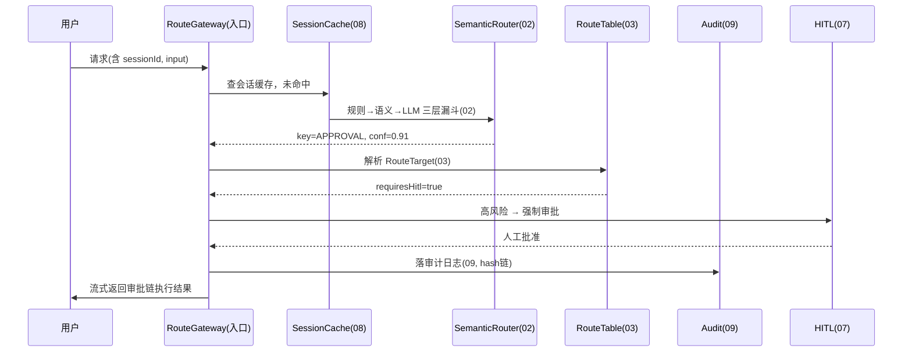

# 11-核心代码讲解

> **定位**：把项目 23 的核心实现串成一条主线——从"一次请求进来"到"正确执行链 + 兜底 + 审计"的完整链路。以**一次"帮我审批报销单 BX-20260821"的请求**贯穿，复盘各迭代的关键代码如何在一条链上协作。前置阅读：[01-最小Demo](01-最小Demo.md) 至 [10-进阶三-路由策略动态下发](10-进阶三-路由策略动态下发.md) 全部。
>
> **铁律 0**：仅 `ChatClient`/`EmbeddingModel`/Observation 用实证基准；路由/缓存/审计引擎为「概念代码」。

---

## 一、一次完整的路由请求旅程



## 二、入口编排（把各迭代串起来）

```java
// 概念代码：路由网关主流程（综合 02-10 各迭代能力）
@Component
public class RouteGateway {
    private final SessionCache cache;        // 08
    private final SemanticRouter router;     // 02
    private final RouteTable table;          // 03
    private final AuditChain audit;          // 09
    private final HitlGate hitl;             // 07
    private final ObservationRegistry obs;   // 04

    public Flux<ChatResponse> handle(String sessionId, String tenantId, String input) {
        return Mono.deferContextual(ctx -> {
            // 1) 路由（含 08 缓存 + 04 打点）
            RouteResult rr = cache.routeWithCache(sessionId, input, tenantId);  // 08 两级缓存
            RouteKey key = rr.key(); double conf = rr.confidence();

            // 2) 05 按意图独立阈值
            if (!confThresholdPass(key, conf)) key = RouteKey.UNKNOWN;

            // 3) 03 路由表解析执行链 + 07 HITL 闸门
            RouteTarget target = table.resolve(key);
            if (target.requiresHitl() && !hitl.approve(ctx, input, key)) {
                return Flux.just(ChatResponse.from("已转人工复核，请补充单号")); // 高风险驳回
            }

            // 4) 07 兜底降级链 + 04/09 打点审计
            return target.execute(input)
                .onErrorResume(e -> fallback(target, e, input))
                .doOnTerminate(() -> audit.record(rr, target, ctx));   // 09 审计
        });
    }
}
```

**设计意图**：每个迭代是一个**可替换的环节**，Routes 编排成完整链路——这也正是 [03-路由表与执行链注册](03-路由表与执行链注册.md) 控/数分离后的自然形态。

## 三、分层职责（读代码的抓手）

| 类 | 迭代来源 | 职责 |
|----|---------|------|
| `SemanticRouter` | 02/05 | 意图识别（三层漏斗）+ 按意图阈值 |
| `RouteTable` → `RouteTarget` | 03 | 路由目标注册 + 可执行链封装 |
| `RouteCache` | 08 | 会话级/语义级两级缓存 |
| `RouteGateway` | 04/07/09/10 | 编排 + 打点 + HITL + 审计 + 兜底 |
| `RouteConfig` | 05/06/10 | 阈值/意图数据化 + 策略中心版本化 |

## 四、最容易踩的三个坑

1. **阈值全局一个** → 高风险误放行。**解法**：按意图独立阈值（05）。
2. **低置信路由被缓存复用** → 错一次一直错。**解法**：低置信/高风险不缓存或短 TTL（08）。
3. **HITL 放错层**（放路由的 Advisor）→ 执行链内仍能绕过。**解法**：HITL 放工具执行边界的强制闸门（07）。

## 五、验收自测（对照 00 的量化指标）

| 指标 | 目标 | 实现 |
|------|------|------|
| 命中率 | ≥ 85% | 05 按意图阈值 + 03 示例句飞轮 |
| 误分率 | ≤ 3% | 05 语料回放标定 |
| 路由额外延迟 | 规则≤10ms / 语义≤30ms | 08 缓存进一步压低 |
| 兜底率可观测 | 基线告警 | 04 |
| 高风险 HITL | 100% | 07 |

> **下一步**：代码串讲完成。12-ADR 记录本项目 8 条关键架构决策；13-前沿方向把意图路由放到 Agent 平台演进长河中收官。
