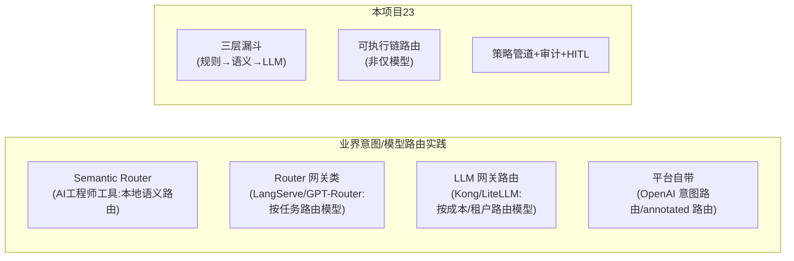

# 13-工业前沿与演进方向

> **定位**：收官篇。把项目 23（意图路由网关）放到"Agent 平台演进"的长河中，校准**本平台当前成熟度**、对照业界（Semantic Router / RouterOS / GPT-Router / LangChain 路由 / OpenAI 意图路由等）实践，给出**可落地的演进方向**。读者画像：要判断"意图路由在真实 Agent 平台里该做到什么程度、下一步往哪走"的架构师。前置阅读：本项目全部正向迭代。

---

## 一、平台成熟度回看（对照 00 量化指标）

| 能力 | 迭代落地 | 成熟度 |
|------|---------|--------|
| 三层漏斗识别 | 02 | ✅ 生产可用 |
| 按意图独立阈值 | 05 | ✅ 生产可用 |
| 路由可观测/漂移 | 04 | ✅ 生产可用 |
| 灰度秒级回滚 | 06 | ✅ 生产可用 |
| 兜底+HITL 安全边界 | 07 | ✅ 生产可用 |
| 两级缓存 | 08 | ✅ 性能优化 |
| 审计回放 | 09 | ✅ 合规基础 |
| 策略中心下发 | 10 | 🟡 半生产（需治理平台配套） |

**收敛判断**：核心（识别-阈值-观测-灰度-兜底）已达**可直接投产**水平；策略中心（10）与多网关扩展需在更大平台语境下深化。

### 一.1 本节核对（平台成熟度回看）

- [ ] 八项能力各自的迭代落地号与成熟度标记（生产可用/性能优化/合规基础/半生产）能对应上对应篇，无错挂
- [ ] "核心已达可直接投产、策略中心待深化"的收敛判断与 00 §三 迭代路线一致，无夸大成熟度

## 二、业界对照（校准）

**差异点**：业界多数路由停在"**按模型/供应商**路由"（等价教程 04-企业级架构主干/03-工具执行可观测与审计 + LiteLLM）；本平台把路由抽象到"**按意图选执行链**"，并配套观测/审计/HITL——更贴近"Agent 平台的入口控制面"而非"模型网关"。

### 二.1 本节核对（业界对照）

- [ ] 业界四类实践（Semantic Router / Router 网关 / LLM 网关路由 / 平台自带）与本平台三亮点（三层漏斗/可执行链/策略+审计HITL）的差异点能复述
- [ ] "本平台按意图选链，业界多数按模型路由"这一分层定位与 [32 模型路由] 的区分说得清

## 三、演进方向（校准后，按价值排序）

1. **示例句自动生成飞轮**：用 LLM 从兜底/误分日志自动生成候选示例句 + 人工勾选入库（补 05 的手工维护，降维护成本）。
2. **多网关联邦**：多个意图路由网关共享一个策略中心，全局路由可达性矩阵（10 的基础，呼应项目 16 联邦）。
3. **从路由上升到"意图编排"**：不只选一条链，而是按意图**编排多段**（如先 RAG 检索 → 再审批 → 再生成），打通 [教程 08-架构师进阶/02-Agent工作流编排](../../教程/08-架构师进阶/02-Agent工作流编排.md)。
4. **路由与评测联动**：把 04 的误分率指标对接 [项目 19-信任与评测平台](../../项目/19-企业级Agent信任与评测平台/00-需求分析与架构设计.md)，路由变更纳入信任分发布闸门。
5. **端侧路由**：边缘部署场景下，语义路由下沉到端侧（Ollama embedding），云端只处理模糊兜底（呼应 [前沿 10-边缘Agent](../../前沿/10-边缘Agent与端云协同.md)）。

### 三.1 本节核对（演进方向）

- [ ] 五条方向能按价值排序复述，且每条都标了迭代基础或呼应来源，无"空想方向"
- [ ] 方向 1（示例句自动生成飞轮）明确解决 ADR-02 的示例句维护代价，方向 2（多网关）呼应 10 与项目 16 联邦，衔接得当

## 四、提示词/工程纪律复盘

- **不要**把 intent 关键词当唯一依据（规则只是第一层，语义才兜住变体）。
- **不要**全局一个阈值；**务必**按风险分档。
- **不要**把全部路由权威性放给一个 LLM；确定性漏斗保本。
- **务必**让每条高危路由"可审计、可回放、可灰度回滚"——这是生产路由的第一天就要求的底线。

### 四.1 本节核对（提示词/工程纪律复盘）

- [ ] 四条纪律（不唯关键词/不全局阈值/不单 LLM 权威/高危可审计回滚）均能在正文迭代里找到落地（[01] 规则优先 / [05] 独立阈值 / [01] 三层漏斗 / [06+09] 灰度回滚+审计）
- [ ] 每条纪律对应一个"反模式→本平台正解"的映射，无"只提纪律不落地"

---

## 五、全篇回归验证

> 前沿收官篇，全篇回归聚焦"成熟度判断与各迭代篇真实状态一致，方向可落地"。

| # | 操作 | 预期（PASS 判据） |
|---|------|------------------|
| 1 | 对照 §一 成熟度表逐项抽查对应迭代篇实现 | 生产可用项（02-07）该能力真实落地，半生产（10 策略中心）如实标注 |
| 2 | 抽查任一演进方向引用 → 迭代/附录/前沿篇 | 引用存在（如 [附录 20]、[前沿 10]、项目 19/16），无悬空 |
| 3 | 对照 §四 四条纪律与对应迭代 | 每条纪律都有落地篇，无"纸上纪律" |

**回归失败排查**：①成熟度虚标→该能力在对应迭代未真正实现，回查篇目；②引用悬空→补/校引用路径；③纪律不落地→回查对应迭代能力缺失。

---

> **收官**：项目 23（意图路由网关）从"收敛入口"第一性出发，建立了三层漏斗识别、可执行链路由表、按意图阈值、观测漂移、灰度回滚、兜底 HITL 安全边界、缓存、审计、策略下发的完整入口控制面。它与项目 16（网格，旁路治理）互补——**23 管"入口内聚"，16 管"流量旁路"，合起来构成 Agent 平台的编排与治理骨架**。想深入语义路由阈值标定 → [附录 17-路由表与语义路由](../../附录/17-路由与推理策略/00-路由表与语义路由.md)；想立框架总览 → [教程 09-前沿专题/04-意图路由与路由编排](../../教程/09-前沿专题/04-意图路由与路由编排.md)。
