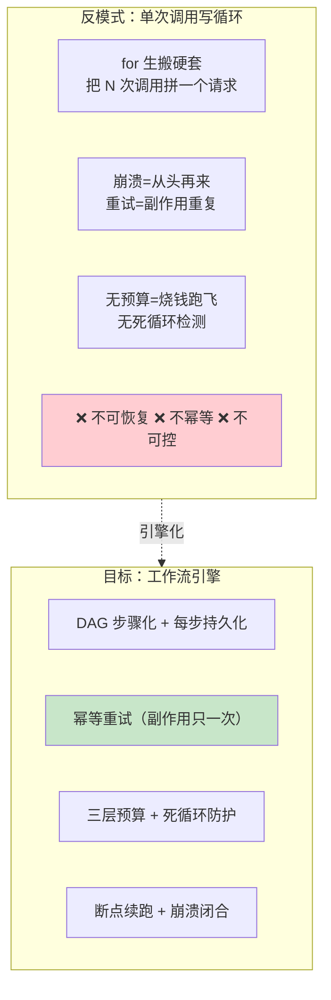
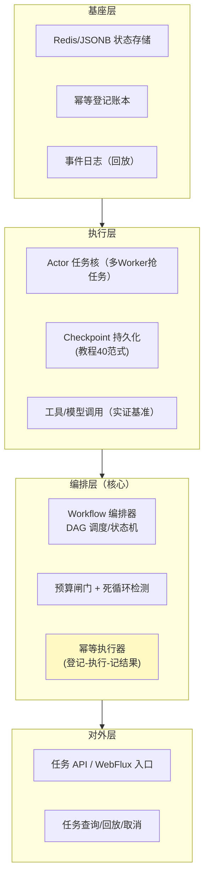

# 00-需求分析与架构设计：企业级长任务工作流引擎

> **定位**：第十一旗舰·**长任务可靠视角**——第一性原理：**长任务 = 可持久化、可重放、可恢复的执行轨迹**。普通 Agent 回答秒级一次调用，但订单流程、数据作业、长链审批是**小时级、跨多次模型/工具、可中断**的超长任务——它们不能靠"单次调用写循环"硬扛，而要一个**分布式工作流引擎**：DAG 步骤化、多 Worker 抢任务、每步状态持久化、工具幂等重试（副作用绝不重复）、三层预算（轮次/Token/时长）+ 死循环防护、崩溃后断点续跑。方法学源自教程 40 的 CheckpointStore 范式 + 工程"并发历史记录"。读者画像：要回答"几小时的 Agent 任务怎么不怕崩溃、不怕重试爆炸"的架构师。前置阅读：[教程 40-长任务持久化与中断恢复]、[教程 51-超长任务与分布式工作流引擎]、[教程 36-Agent工作流编排]。
>
> **铁律 0**：Spring AI 生态无官方工作流引擎 API；Temporal 为业界方案但本机未下载（需引入依赖后 javap 实证，本文不写成已实证 API）。本平台全部自研「概念代码」（承教程 40 `CheckpointStore` 范式）；仅模型/工具调用用已实证 `ChatClient`/`@Tool` 基准。

---

## ★ 阅读顺序总览（序号 = 阅读顺序）

> 本子文件夹 14 个文件（00-13）：

| 阶段 | 文件 | 读者定位 |
|------|------|---------|
| ① 全貌 | 00-需求分析与架构设计 | **先读**：长任务引擎四层架构 |
| ② 起步 | 01-最小Demo | **动手**：单任务 Checkpoint + 断点续跑 |
| ③ 主体迭代 | 02~07（Actor任务核/幂等重试/预结算死循环/DAG多Worker/续跑闭合/可视回放） | **严格顺序** |
| ④ 进阶 | 08~10（独立引擎/Temporal对照/多机分布+HITL暂停恢复） | **严格顺序** |
| ⑤ 讲解 | 11-核心代码讲解 | **回顾** |
| ⑥ 资产 | 12-ADR / 13-前沿 | **按需/收官** |

---

## 一、为什么长任务需要独立引擎

**三个核心论点**：

1. **任务即轨迹**：长任务不是"一个大调用"，而是**可持久化的执行轨迹**——每步状态可存、可回放、可恢复（呼应 [22-会话引擎](../../项目/22-企业级Agent会话引擎/00-需求分析与架构设计.md) 的事件日志恢复）。
2. **幂等是命门**：长任务里重试必然发生（网络抖动/进程重启），若副作用（扣款/发消息/写库）被重复触发就是事故——**幂等键 + 登记-执行-记结果**是底线（呼应 [20-支付幂等](../../项目/20-企业级Agent经济与结算平台/04-支付轨道与幂等.md)）。
3. **预算即救命**：长任务 Token 消耗庞大，无上限会"烧钱跑飞"——轮次/Token/时长三层闸门 + 死循环检测是经济红线（呼应 [27-成本治理与Token计量](../../教程/27-成本治理与Token计量.md)）。

### 一.1 本节核对（为什么长任务需要独立引擎）

- [ ] 三个核心论点（任务即轨迹/幂等是命门/预算即救命）能不看正文复述，且各对应后续迭代篇（02 Actor/03 幂等/04 预算）
- [ ] 反模式图（单次调用写循环）的不可恢复/不幂等/不可控三点与引擎四能力（DAG持久化/幂等重试/三层预算/断点续跑）逐一相消
- [ ] 提及的呼应引用（[22-会话引擎]/[20-支付幂等]/[27-成本治理]）路径真实存在，非虚构锚点

## 二、总体架构（四层）

### 二.1 本节核对（总体架构四层）

- [ ] 四层（对外层/编排层/执行层/基座层）的节点能对应到后续具体迭代篇（编排层→01-07 主体、执行层 Actor→02、幂等→03、预算→04），映射一致
- [ ] 层间依赖方向 `l1 → l2 → l3 → l4` 遵循"基座→执行→编排→对外"的稳定顺序，无反向依赖
- [ ] 幂等执行器、预算闸门、Checkpoint 持久化三处核心都在图上有显式节点（R3/R2/E2），非口述未画

## 三、微服务清单与迭代路线

| 服务 | 职责 | 落地 |
|------|------|------|
| `workflow-service` | 编排 + 预算 + 幂等（核心） | 主体迭代 |
| `actor-worker` | 任务执行（多 Worker 可横向扩展） | 迭代 6 |
| `checkpoint-store` | Checkpoint/幂等登记持久化 | 迭代 2/3 |
| `workflow-obs` | 回放/可观测/取消 | 迭代 7 + 进阶 |

### 三.1 本节核对（微服务清单与迭代路线）

- [ ] 四个微服务（workflow-service/actor-worker/checkpoint-store/workflow-obs）各自的职责与落地迭代号能不看正文复述，无错位
- [ ] 迭代路线表（01~10）的每一行"核心新增"都对应后续某个文件标题（01-最小Demo/02-Actor任务核/…/10-预算可视化），缺一即可断言 FAIL
- [ ] 量化验收四条（续跑 ≥95%、副作用重复=0、预算超限 100% 拦截、P95 回放 ≤5s）均为可度量指标，非空话

**迭代路线**（每迭代回答四问）：

| # | 迭代 | 核心新增 | 痛点回应 |
|---|------|---------|---------|
| 01-最小Demo | 单任务 Checkpoint + 断点续跑 | 起点 |
| 02 | Actor 任务核 + 任务生命周期 | 任务状态分散不可控 |
| 03 | 幂等重试（副作用只一次） | 重试重复扣款 |
| 04 | 三层预算 + 死循环防护 | 长任务烧钱跑飞 |
| 05 | DAG 步骤化 + 多 Worker 抢任务 | 任务无法编排/并行 |
| 06 | 断点续跑 + 崩溃闭合 | 孤儿步骤裸重跑 |
| 07 | 工作流可视回放 + 取消 | 长任务不可观测 |
| 进阶08 | 独立工作流引擎抽象 | 单进程内嵌局限 |
| 进阶09 | 多机分布式续跑（K8s Worker） | 单机容量不足 |
| 进阶10 | 预算可视化 + HITL 暂停/恢复 | 长任务需人工介入 |

**量化验收**：①崩溃后断点续跑 ≥ 95%（一次性场景成功率）②幂等重试下副作用重复触发 = 0③预算超限 100% 被拦截（不死循环跑飞）④长任务 P95 可回放定位 ≤ 5s。

---

## 四、与教程/附录的映射

| 本平台能力 | 教程 | 附录/项目 |
|-----------|------|-----------|
| Checkpoint 续跑 | [40-长任务持久化](../../教程/40-长任务持久化与中断恢复.md) | — |
| 工作流引擎原理 | [51-超长任务与分布式工作流引擎](../../教程/51-超长任务与分布式工作流引擎.md) | — |
| 幂等 | [30-容错与弹性设计](../../教程/30-容错与弹性设计.md) | [20-支付幂等](../../项目/20-企业级Agent经济与结算平台/04-支付轨道与幂等.md) |
| 预算/成本 | [27-成本治理与Token计量](../../教程/27-成本治理与Token计量.md) | — |
| HITL | [28-Human-in-the-Loop](../../教程/28-Human-in-the-Loop与审批流.md) | — |
| 事件日志/回放 | — | [22-会话引擎](../../项目/22-企业级Agent会话引擎/00-需求分析与架构设计.md) |

> **铁律提醒**：引擎全部自研（概念代码），承教程40；Temporal 仅作业界对照（标注需引入依赖后实证）。

### 四.1 本节核对（与教程/附录的映射）

- [ ] 能力表每一行的教程/附录引用（[40-长任务持久化]/[51-超长任务]/[30-容错弹性]/[28-HITL]/[22-会话引擎]）路径真实，非编造锚点
- [ ] 表格覆盖了核心四能力（Checkpoint 续跑/工作流引擎/幂等/预算/HITL）各自至少一处落地参考资料，无留白行
- [ ] 与铁律 0 声明一致：引擎标注自研概念代码、Temporal 标注待实证，未写成已实证 API
