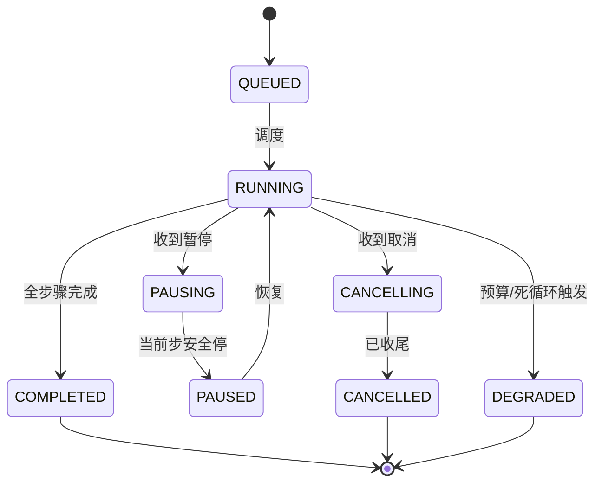

# 02-Actor 任务核与任务生命周期

> **定位**：把"散乱的任务状态"收敛为**单写者 Actor 任务核 + 统一任务生命周期**。核心：**① 每个长任务一个 Actor（单写者、有界命令）② 统一生命周期状态机（RUNNING→PAUSING→PAUSED/COMPLETED/CANCELLED/DEGRADED）③ 命令具备暂停/恢复/取消钩子**。呼应 [22-会话引擎 Actor核](../../项目/22-企业级Agent会话引擎/02-Actor核与任务生命周期.md)。前置阅读：[01-最小Demo](01-最小Demo.md)、[12-教程状态管理](../../教程/21-Agent状态管理.md)。
>
> **铁律 0**：Actor 核自研「概念代码」；仅模型/工具调用用实证基准。

---

## 一、四问

| 问 | 答 |
|----|----|
| **新增了什么需求** | ①单任务 Actor 核（单写者循环）②任务生命周期状态机 ③暂停/恢复/取消命令（三段取消语义） |
| **影响了哪些模块** | WorkflowEngine → 拆出 TaskActor（单写者）+ TaskStateMachine |
| **架构如何演进** | 任务从"for 循环"演进为"有状态生命周期 + 可暂停/可取消" |
| **上一版痛点** | 任务状态裸散在各步；无法暂停/取消；多命令互相覆盖 |

**本迭代验收**：①每任务单写者，命令有界队列不冲突 ②生命周期状态机清晰 ③可暂停/恢复/取消（取消触发后正在执行的步骤安全收尾）。

### 一.1 本节核对（四问与本迭代验收）

| # | 核对项 | 判据 |
|---|--------|------|
| 1 | 四问口径齐全 | 新增需求（单写者/状态机/三段取消）/影响模块/架构演进/上一版痛点四行均有，无空答 |
| 2 | 本迭代验收可度量 | ①单写者有界队列 ②状态机清晰 ③暂停/恢复/取消可判定，非空话 |

## 二、任务生命周期状态机



### 二.1 本节核对（任务生命周期状态机）

- [ ] 状态机图中每个状态（QUEUED/RUNNING/PAUSING/PAUSED/CANCELLING/CANCELLED/DEGRADED/COMPLETED）与 §三 代码/§四 语义一一对应，无图有码外状态
- [ ] 暂停（RUNNING→PAUSING→PAUSED）与取消（RUNNING→CANCELLING→CANCELLED）两条路径都经过"中间态"（PAUSING/CANCELLING），反映安全收尾语义，非直接跳终态

## 三、Actor 任务核（单写者）

```java
// 概念代码：单写者 + 有界命令（适配虚拟线程/Reactor）
@Component
public class TaskActor {
    // 有界命令队列：暂停/恢复/取消 有反压
    private final Sinks.Many<TaskCommand> cmdSink  = Sinks.many().multicast().directBestEffort();
    private final AtomicReference<TaskState> state = new AtomicReference<>(TaskState.QUEUED);

    public void submit(TaskCommand cmd) { cmdSink.tryEmitNext(cmd); }  // 入队（反压）

    // 单消费者循环：串行处理命令，避免多命令互相覆盖
    public Flux<TaskEvent> runLoop(String taskId) {
        return cmdSink.asFlux()
            .concatMap(cmd -> switch (cmd) {
                case PAUSE   p -> pause(p);
                case RESUME  r -> resume(r);
                case CANCEL  c -> cancel(c);   // 三段取消：标记→安全收尾→完结
                case FETCH_STEP s -> executeStepSafely(s);
            })
            .onErrorResume(e -> handleDegraded(e));   // 异常 → DEGRADED（04/05 深化）
    }
}
```

**意义**：任务生命周期由 Actor 单写者保证，任何命令（暂停/取消/新步骤）不会并发打架，状态迁移可控、可观测——这是长任务可靠性的第一块拼图。

### 三.1 本节测试与验证（Actor 单写者与命令处理）

**前置条件**：`TaskActor`（cmdSink + runLoop）按上文代码手写并编译；任务状态初始为 QUEUED；已能向 `taskId` 提交命令。

**材料——命令与状态断言集**：并发提交命令列表 `{PAUSE, FETCH_STEP, CANCEL, FETCH_STEP,...}`；期望状态序列见 §五 验收。

**步骤与断言**：

| # | 操作 | 预期（PASS 判据） |
|---|------|------------------|
| 1 | 并发提交多条命令（PAUSE/FETCH_STEP/CANCEL 混合）到同一 taskId | `cmdSink` 有界队列有反压、不丢命令；`runLoop` 的 `concatMap` 串行处理，无并发覆盖 |
| 2 | 暂停命令后观察状态 | 当前步**跑完后**才停到 PAUSED（未硬杀，验证 §四 安全收尾） |
| 3 | 恢复命令 | 从 PAUSED 利用 Checkpoint 续跑，状态回 RUNNING |
| 4 | 取消命令 | 状态经 CANCELLING（三段：标记→安全收尾→完结）最终 CANCELLED |
| 5 | 高频命令（压力） | 任意时刻状态读取一致（AtomicReference + 单写者），无状态回跳 |

**失败排查**：①命令并发打架/状态回跳→多消费者读同一 cmdSink（应为单 `runLoop` 单消费）；②暂停仍继续跑→PAUSING 分支未 drain 当前步；③取消后步骤仍在执行→CANCELLING 未做安全收尾即硬杀。

## 四、暂停/取消的"安全收尾"

- **暂停**：正在执行的步骤**允许跑完**（不硬杀，避免半途写一半），然后停到 PAUSED。
- **取消**：三段——①标记 CANCELLING ②当前步安全收尾 + 幂等闭合（03 补）③持久化为 CANCELLED。
- 绝不在步骤执行中途强杀（破坏 Checkpoint / 副作用一致性）。

### 四.1 本节核对（暂停/取消安全收尾）

- [ ] 暂停=当前步跑完再停、取消=三段（标记→收尾→完结）两条语义能不看正文复述
- [ ] "绝不在中途强杀"的例外原则与 §三 代码 `executeStepSafely`、§二 状态机中间态一致，无矛盾

## 五、验收

| 测试 | 期望 |
|------|------|
| 高并发命令 | 单写者串行，状态一致 |
| 暂停 | 当前步跑完后 PAUSED |
| 恢复 | 从 PAUSED 续跑（利用 Checkpoint） |
| 取消 | CANCELLING→安全收尾→CANCELLED |

> **下一步**：任务可暂停/取消了，但**重试的副作用重复**隐患仍在（最小 Demo 偷懒点①）。03 迭代做**幂等重试**——长任务可靠性的命门。

### 五.1 本节核对（验收矩阵收口）

> 本节核对（一句话）：验收表四行（高并发/暂停/恢复/取消）在 §三.1 步骤与断言的 1/2/3/4 各有一条对应断言项，矩阵行无悬空即 PASS。
