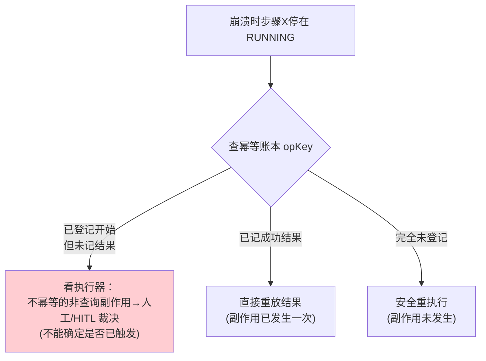

# 03-幂等重试与副作用登记

> **定位**：长任务引擎的**命门**——重试绝不重复触发副作用。核心：**① 工具副作用三段式（登记→执行→记结果）② 全局唯一 idempotency key ③ 崩溃后孤儿步骤的幂等闭合**。呼应 [20-支付幂等](../../项目/20-企业级Agent经济与结算平台/04-支付轨道与幂等.md)、[30-容错与弹性设计](../../教程/30-容错与弹性设计.md)。前置阅读：[02-Actor任务核与任务生命周期](02-Actor任务核与任务生命周期.md)。
>
> **铁律 0**：幂等账本自研「概念代码」（存 Redis/DB）；副作用为已实证 `@Tool`。

---

## 一、四问

| 问 | 答 |
|----|----|
| **新增了什么需求** | ①EffectLedger 幂等账本（登记/查重/记结果）②工具调用包幂等（唯一 opKey）③崩溃孤儿步骤幂等闭合 |
| **影响了哪些模块** | StepExecutor → 包幂等；新增 EffectLedger |
| **架构如何演进** | 从"裸执行步骤"演进为"副作用可追踪、可回放、可查重" |
| **上一版痛点** | 01 埋雷：重试会重复扣款/发消息/写库 |

**本迭代验收**：①同一副作用并发重试只执行一次 ②崩溃后恢复时孤儿步骤不重复副作用 ③幂等账本防篡改/可审计。

## 二、三段式幂等（核心）

```java
// 概念代码：副作用三段式幂等
@Component
public class IdempotentExecutor {
    private final EffectLedger ledger;   // 幂等账本(Redis SETNX / DB 唯一键)

    public <T> Mono<T> idempotent(String opKey, Supplier<Mono<T>> sideEffect) {
        return ledger.markStarted(opKey)                  // ①登记"已开始"(原子 upsert)，防并发重放
            .flatMap(first -> first
                ? sideEffectOp(opKey, sideEffect)          // 首执：执行副作用
                : ledger.readResult(opKey));               // 已登记：回放已有结果(不重执行)
    }

    private <T> Mono<T> sideEffectOp(String key, Supplier<Mono<T>> op) {
        return Mono.defer(op)
            .flatMap(res -> ledger.markDone(key, serialize(res))  // ②执行后登记结果
                .thenReturn(res))
            .onErrorResume(e -> ledger.markFailed(key, e)          // ③失败也登记(不误判已成功)
                .then(Mono.error(e)));
    }
}
```

**三段式为什么安全**：
- **登记-先于-执行**：用 `SETNX`/DB 唯一键锁定 opKey，并发重试只有一个能进入执行，其余直接读到"已开始"→ 等结果/回放。
- **记结果-not 仅记完成**：执行完把**结果序列化**存账，崩溃恢复时直接重放结果，不用重算（也无副作用）。
- **失败也登记**：失败状态单独记，避免"执行失败被误当成功，下次重试跳过"。

## 三、崩溃孤儿步骤的幂等闭合



**要点**：崩溃瞬间"孤儿步骤"是最危险的——**不能确定副作用是否已触发**。三条路径（重放/安全重跑/人工裁决）正确处理，**绝不允许无脑重跑**（防重复扣款）。

## 四、验收

| 测试 | 期望 |
|------|------|
| 同一 opKey 并发 10 次 | 副作用只执行 1 次 |
| 崩溃后孤儿步骤 | 已签名重放/未签名安全跑/不确定转 HITL |
| 重复网络请求 | 幂等账本挡重复副作用 |
| 失败重试 | 失败登记，重试按新 opKey 或重跑 |

> **下一步**：副作用不重复了，但长任务可能"无限跑下去烧钱"。04 迭代加**三层预算 + 死循环防护**——经济红线。
