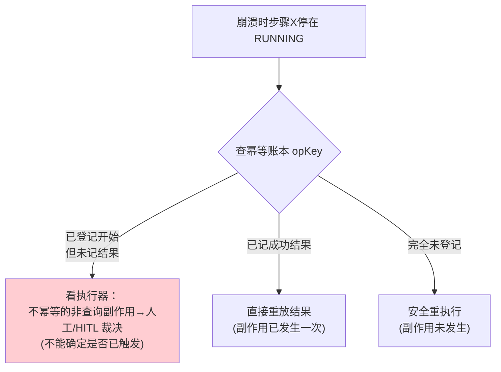

# 03-幂等重试与副作用登记

> **定位**：长任务引擎的**命门**——重试绝不重复触发副作用。核心：**① 工具副作用三段式（登记→执行→记结果）② 全局唯一 idempotency key ③ 崩溃后孤儿步骤的幂等闭合**。呼应 [20-支付幂等](../../项目/20-企业级Agent经济与结算平台/04-支付轨道与幂等.md)、[30-容错与弹性设计](../../教程/30-容错与弹性设计.md)。前置阅读：[02-Actor任务核与任务生命周期](02-Actor任务核与任务生命周期.md)。
>
> **铁律 0**：幂等账本自研「概念代码」（存 Redis/DB）；副作用为已实证 `@Tool`。

---

## 一、四问

| 问 | 答 |
|----|----|
| **新增了什么需求** | ①EffectLedger 幂等账本（登记/查重/记结果）②工具调用包幂等（唯一 opKey）③崩溃孤儿步骤幂等闭合 |
| **影响了哪些模块** | StepExecutor → 包幂等；新增 EffectLedger |
| **架构如何演进** | 从"裸执行步骤"演进为"副作用可追踪、可回放、可查重" |
| **上一版痛点** | 01 埋雷：重试会重复扣款/发消息/写库 |

**本迭代验收**：①同一副作用并发重试只执行一次 ②崩溃后恢复时孤儿步骤不重复副作用 ③幂等账本防篡改/可审计。

### 一.1 本节核对（四问与本迭代验收）

| # | 核对项 | 判据 |
|---|--------|------|
| 1 | 四问口径齐全 | 新增需求（EffectLedger/包幂等/孤儿闭合）/影响模块/架构演进/上一版痛点四行均有，无空答 |
| 2 | 本迭代验收可度量 | ①并发只执行一次 ②孤儿不重复 ③账本防篡改可审计——三项可判定 |

## 二、三段式幂等（核心）

```java
// 概念代码：副作用三段式幂等
@Component
public class IdempotentExecutor {
    private final EffectLedger ledger;   // 幂等账本(Redis SETNX / DB 唯一键)

    public <T> Mono<T> idempotent(String opKey, Supplier<Mono<T>> sideEffect) {
        return ledger.markStarted(opKey)                  // ①登记"已开始"(原子 upsert)，防并发重放
            .flatMap(first -> first
                ? sideEffectOp(opKey, sideEffect)          // 首执：执行副作用
                : ledger.readResult(opKey));               // 已登记：回放已有结果(不重执行)
    }

    private <T> Mono<T> sideEffectOp(String key, Supplier<Mono<T>> op) {
        return Mono.defer(op)
            .flatMap(res -> ledger.markDone(key, serialize(res))  // ②执行后登记结果
                .thenReturn(res))
            .onErrorResume(e -> ledger.markFailed(key, e)          // ③失败也登记(不误判已成功)
                .then(Mono.error(e)));
    }
}
```

**三段式为什么安全**：
- **登记-先于-执行**：用 `SETNX`/DB 唯一键锁定 opKey，并发重试只有一个能进入执行，其余直接读到"已开始"→ 等结果/回放。
- **记结果-not 仅记完成**：执行完把**结果序列化**存账，崩溃恢复时直接重放结果，不用重算（也无副作用）。
- **失败也登记**：失败状态单独记，避免"执行失败被误当成功，下次重试跳过"。

### 二.1 本节测试与验证（三段式幂等）

**前置条件**：`EffectLedger`（Redis SETNX / DB 唯一键，markStarted/markDone/markFailed）与 `IdempotentExecutor.idempotent(opKey, sideEffect)` 按上文代码实现并可编译；一个可计次副作用（如计数递增+扣款模拟）。

**材料——并发放量与重复 opKey 集**：同一 `opKey` 并发 N 次；多个不同 opKey；崩溃前"已 markStarted 未 markDone"的挂起 opKey。

**步骤与断言**：

| # | 操作 | 预期（PASS 判据） |
|---|------|------------------|
| 1 | 同一 opKey 并发 10 次 `idempotent` | 副作用执行 **1 次**（其余回放结果）；副作用计数 =1 |
| 2 | 失败后再以**同 opKey** 重试 | 因 markFailed 单独登记，不误判已成功；按新 opKey 或重跑规则处理（§四） |
| 3 | 多次不同 opKey | 各自独立执行，互不影响 |
| 4 | 模拟崩溃：某 opKey 已 markStarted 未 markDone、重启后重放 | 命中"未记结果"路径 → 不确定是否已触发 → 不无脑重跑（转人工/HITL 裁决） |

**失败排查**：①并发执行多次→`markStarted` 未原子 upsert（SETNX 语义丢失，多个线程同时获 `first=true`）；②结果未回放→`markDone` 未序列化结果或读错键；③失败被误当成功→副作用失败后未走 `markFailed`，账本记了 done。

## 三、崩溃孤儿步骤的幂等闭合



**要点**：崩溃瞬间"孤儿步骤"是最危险的——**不能确定副作用是否已触发**。三条路径（重放/安全重跑/人工裁决）正确处理，**绝不允许无脑重跑**（防重复扣款）。

### 三.1 本节核对（崩溃孤儿步骤幂等闭合）

- [ ] 孤儿步骤流程图三条出边（已签回放/未签安全跑/不确定转人工裁决）与正文要点一一对应，能复述"不确定→人工裁决、禁止无脑重跑"
- [ ] 三条路径在 §二.1 步骤 4 有落地断言验证，非口头承诺

## 四、验收

| 测试 | 期望 |
|------|------|
| 同一 opKey 并发 10 次 | 副作用只执行 1 次 |
| 崩溃后孤儿步骤 | 已签名重放/未签名安全跑/不确定转 HITL |
| 重复网络请求 | 幂等账本挡重复副作用 |
| 失败重试 | 失败登记，重试按新 opKey 或重跑 |

> **下一步**：副作用不重复了，但长任务可能"无限跑下去烧钱"。04 迭代加**三层预算 + 死循环防护**——经济红线。

### 四.1 本节核对（验收矩阵收口）

> 本节核对（一句话）：验收表四行（并发只执行一次/孤儿闭合/重复请求拦截/失败重试）在 §二.1 步骤 1/4/3/2 各有对应断言项，矩阵行无悬空即 PASS。
