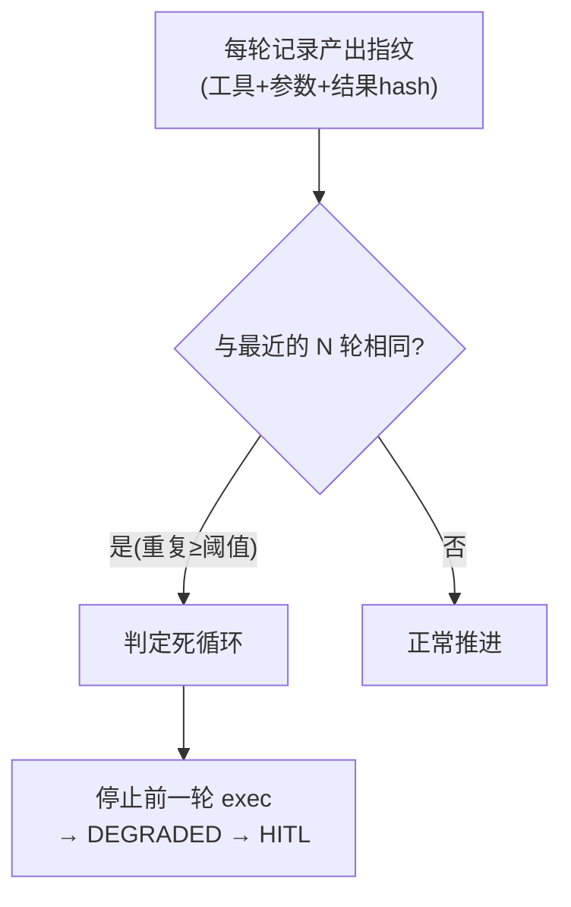

# 04-三层预算与死循环防护

> **定位**：长任务的经济红线——**绝不"烧钱跑飞"、绝不"死循环空转"**。核心：**① 三层预算闸门（轮次/Token/时长）② 死循环检测（"循环不进展"，而不只是最大轮次）③ 超限 → DEGRADED 转 HITL**。呼应 [27-成本治理与Token计量](../../教程/27-成本治理与Token计量.md)、[38-Agent性能优化](../../教程/38-Agent性能优化.md)。前置阅读：[03-幂等重试与副作用登记](03-幂等重试与副作用登记.md)。
>
> **铁律 0**：预算计量用已实证 `Usage`（配教程27）；死循环检测自研「概念代码」。

---

## 一、四问

| 问 | 答 |
|----|----|
| **新增了什么需求** | ①BudgetGate（轮次/Token/时长三闸）②DeadLoopDetector（循环不进展检测）③预算超限联动 02 状态机 → DEGRADED |
| **影响了哪些模块** | StepExecutor → 上报 Token/轮次；TaskActor → 预算闸门前置检查；新增 死循环检测器 |
| **架构如何演进** | 任务从"可无限跑"演进为"有预算上限、坏循环会被掐断" |
| **上一版痛点** | 长任务可能一直循环调用，Token 爆炸没人管 |

**本迭代验收**：①超出轮次/Token/时长任一 → 任务 DEGRADED，不继续花 Token ②"每轮产出与上轮相同"的死循环被检测 ③预算信息全程可观测。

## 二、三层预算闸门

```java
// 概念代码：轮次 / Token / 时长 三闸
@Component
public class BudgetGate {
    public boolean canContinue(RunContext ctx) {
        boolean round = ctx.rounds.incrementAndGet() <= ctx.maxRounds;   // ①最大轮次
        boolean token = ctx.usedTokens.get() <= ctx.tokenBudget;          // ②全程 Token
        boolean time  = ctx.startedAt().plus(ctx.maxDuration).isAfter(now());// ③最大时长
        return round && token && time;
    }
    // 每次 LLM 调用后：usage.outputTokens+usage.inputTokens 累加进 ctx.usedTokens
}
```

**Token 计量**：用 Spring AI 2.0 的 `Usage`（`Usage.outputTokens()` 实证，配 [27-成本治理](../../教程/27-成本治理与Token计量.md)）在每个工具/模型调用后累加。

## 三、死循环检测：不止最大轮次

最大轮次能防"无限"，但挡不住"烧钱但没进展"（如 ReAct 反复调用同一工具取同一结果）。需检测**循环不进展**：



```java
// 概念代码：循环不进展检测
public boolean isDeadLoop(RunContext ctx, StepResult last) {
    String fp = stateFingerprint(last);            // 工具+入参+结果的hash
    var recent = ctx.recentFingerprints;           // 滑动窗口(如最近5轮)
    if (recent.contains(fp) && ctx.rounds.get() - ctx.lastProgressRound.get() > DEADLOOP_WINDOW) {
        return true;
    }
    if (!fp.equals(ctx.lastFp)) { ctx.lastProgressRound.set(ctx.rounds.get()); ctx.lastFp = fp; }
    return false;
}
```

**要点**：正常的长任务"进回合"会换工具/换参数 → 指纹变化 → 判定有进展；只有"原地打转"（指纹重复）才掐断。

## 四、超限转 DEGRADED（联动状态机）

预算超限/死循环触发时，不直接 kill（避免破坏幂等闭合），而是**安全进入 DEGRADED**：当前步收尾 → 状态置 DEGRADED → 转 HITL（呼应 [28-Human-in-the-Loop](../../教程/28-Human-in-the-Loop与审批流.md)）由人决定：加预算续跑 / 暂停 / 取消。

## 五、验收

| 测试 | 期望 |
|------|------|
| 超过 maxRounds | 任务 DEGRADED，不继续花 Token |
| Token 超预算 | 掐断，可观测用量 |
| ReAct 反复调同一工具 | 死循环检测触发 |
| 超限转 HITL | 人工裁决（续/停/取消） |

> **下一步**：任务可控了（可暂停/可续跑/不跑飞），但还只能**单任务单步串行**。05 迭代做 **DAG 步骤化 + 多 Worker 抢任务**——把任务变成可编排、可并行的图。
