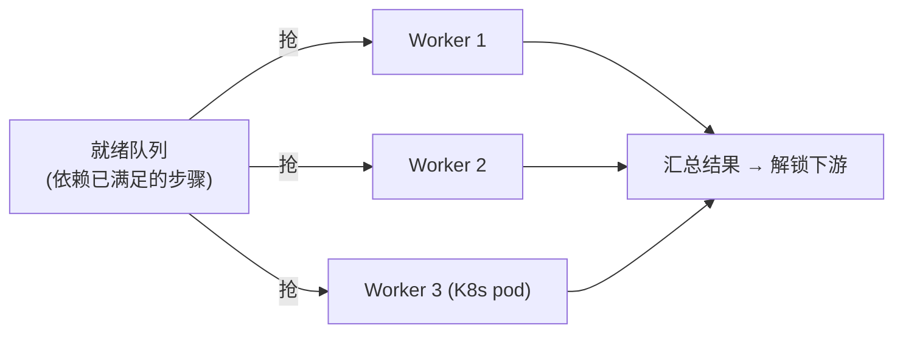

# 05-DAG 步骤化与多 Worker 抢任务

> **定位**：把"单任务串行"升级为**可编排、可并行的 DAG 工作流**。核心：**① 步骤依赖图（DAG）② 就绪步骤并行执行 ③ 多 Worker 抢任务**。呼应 [36-Agent工作流编排](../../教程/36-Agent工作流编排.md)、[47-多线程与会话Fork](../../项目/22-企业级Agent会话引擎/09-多线程与会话Fork.md)。前置阅读：[04-三层预算与死循环防护](04-三层预算与死循环防护.md)。
>
> **铁律 0**：DAG 调度自研「概念代码」；仅模型/工具调用用实证基准。

---

## 一、四问

| 问 | 答 |
|----|----|
| **新增了什么需求** | ①步骤依赖图（DAG，声明式）②拓扑就绪调度（依赖完成后才可执行）③多 Worker 抢就绪步骤（横向扩展） |
| **影响了哪些模块** | WorkflowEngine → 升级为 DAG 调度；StepExecutor → 可并发；新增 Worker 池 |
| **架构如何演进** | 任务从"线性 for 循环"演进为"有向图 + 并行执行" |
| **上一版痛点** | 只能串行；步骤无法编排依赖；单 JVM 顺序跑 |

**本迭代验收**：①DAG 中无依赖的步骤并行执行 ②有依赖的步骤严格按拓扑序 ③多 Worker 并发抢就绪步骤，总吞吐提升。

## 二、DAG 声明 + 拓扑调度

```java
// 概念代码：DAG 步骤声明（WebFlux 响应式）
record StepSpec(String id, List<String> dependsOn, Mono<StepResult> run(RunContext ctx)) {}

public Flux<StepResult> schedule(DAG<StepSpec> dag, RunContext ctx) {
    return Flux.fromIterable(topologicalReadyList(dag, ctx))   // 当前所有"依赖已满足"的就绪步骤
        .flatMap(spec -> spec.run(ctx), parallelism(ctx.workerCount()))  // 并行执行(限并发)
        .doOnNext(res -> ctx.markDone(res, dag))                 // 完成后解锁下游
        .repeatWhen(ready -> ready.delayElements(...))           // 一轮一轮，直到 DAG 全部完成
        .subscribeOn(Schedulers.boundedElastic());
}
```

**要点**：用**拓扑就绪列表**驱动——每轮取出"所有依赖已完成"的步骤并行跑，完成一个解锁下游，直到全部完成。**不是整图一次并发**，而是**按依赖一层层推进**。

## 三、多 Worker 抢任务（水平扩展）



- **抢任务**：用 Redis 队列+原子领取（`RPOPLPUSH`/事务），同一就绪步骤只能被一个 Worker 领取（配合 03 幂等，重复领取也无副作用）。
- **步骤迁移**：Worker 崩溃 → 步骤回到未完成 → 其他 Worker 幂等重拾（03 幂等兜底）。
- **预算共享**：多 Worker 共享一个 `RunContext` 预算计数器（原子累加，04 的三层预算仍有效）。

## 四、验收

| 测试 | 期望 |
|------|------|
| 无依赖步骤 | 并行执行 |
| 依赖链 | 严格拓扑序 |
| 3 Worker | 吞吐接近 3 倍（受依赖约束） |
| Worker 崩溃 | 步骤被其他 Worker 幂等重拾 |

> **下一步**：任务可编排可并行了，但**多 Worker / 并发下的崩溃与孤儿**更复杂。06 迭代做**断点续跑 + 崩溃闭合**——把并发下的恢复一致性彻底做稳。
