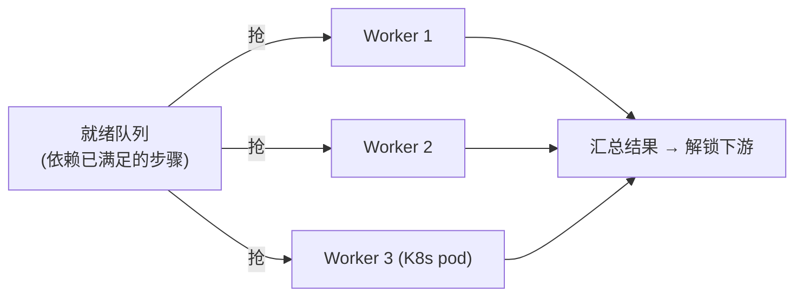

# 05-DAG 步骤化与多 Worker 抢任务

> **定位**：把"单任务串行"升级为**可编排、可并行的 DAG 工作流**。核心：**① 步骤依赖图（DAG）② 就绪步骤并行执行 ③ 多 Worker 抢任务**。呼应 [79-Agent工作流编排](../../教程/08-架构师进阶/02-Agent工作流编排.md)、[47-多线程与会话Fork](../../项目/22-企业级Agent会话引擎/09-多线程与会话Fork.md)。前置阅读：[04-三层预算与死循环防护](04-三层预算与死循环防护.md)。
>
> **铁律 0**：DAG 调度自研「概念代码」；仅模型/工具调用用实证基准。

---

## 一、四问

| 问 | 答 |
|----|----|
| **新增了什么需求** | ①步骤依赖图（DAG，声明式）②拓扑就绪调度（依赖完成后才可执行）③多 Worker 抢就绪步骤（横向扩展） |
| **影响了哪些模块** | WorkflowEngine → 升级为 DAG 调度；StepExecutor → 可并发；新增 Worker 池 |
| **架构如何演进** | 任务从"线性 for 循环"演进为"有向图 + 并行执行" |
| **上一版痛点** | 只能串行；步骤无法编排依赖；单 JVM 顺序跑 |

**本迭代验收**：①DAG 中无依赖的步骤并行执行 ②有依赖的步骤严格按拓扑序 ③多 Worker 并发抢就绪步骤，总吞吐提升。

### 一.1 本节核对（四问与本迭代验收）

| # | 核对项 | 判据 |
|---|--------|------|
| 1 | 四问口径齐全 | 新增需求（DAG 声明/拓扑就绪调度/多 Worker 抢任务）/影响模块/架构演进/上一版痛点四行均有，无空答 |
| 2 | 本迭代验收可度量 | ①无依赖并行 ②有依赖守拓扑序 ③多 Worker 吞吐提升——三项可判定 |

## 二、DAG 声明 + 拓扑调度

```java
// 概念代码：DAG 步骤声明（WebFlux 响应式）
record StepSpec(String id, List<String> dependsOn, Mono<StepResult> run(RunContext ctx)) {}

public Flux<StepResult> schedule(DAG<StepSpec> dag, RunContext ctx) {
    return Flux.fromIterable(topologicalReadyList(dag, ctx))   // 当前所有"依赖已满足"的就绪步骤
        .flatMap(spec -> spec.run(ctx), parallelism(ctx.workerCount()))  // 并行执行(限并发)
        .doOnNext(res -> ctx.markDone(res, dag))                 // 完成后解锁下游
        .repeatWhen(ready -> ready.delayElements(Duration.ofMillis(500)))  // 轮询间隔：每轮就绪步骤跑完并解锁下游后，等 500ms 再扫下一批就绪步骤——间隔过小空转耗 CPU，过大抬高下游步骤启动延迟
        .subscribeOn(Schedulers.boundedElastic());
}
```

**要点**：用**拓扑就绪列表**驱动——每轮取出"所有依赖已完成"的步骤并行跑，完成一个解锁下游，直到全部完成。**不是整图一次并发**，而是**按依赖一层层推进**。

### 二.1 本节测试与验证（DAG 声明与拓扑并行调度）

**前置条件**：`StepSpec`/`DAG`/`schedule` 按上文代码实现并可编译；构造一个 3 步 DAG：`pull`（无依赖）→ `clean`（依赖 pull）→ `write`（依赖 clean），另加一个可与 pull 并行的 `validate`（无依赖）。

**材料——并行与依赖序列**：运行 `schedule`，在每步 `run` 里打点记录执行顺序与时间戳。

```bash
mvn test -Dtest=DagScheduleTest        # 按 §二 代码手写 4 步 DAG 并行/拓扑序用例后执行
# 预期输出（节选）：
#   Tests run: 4, Failures: 0, Errors: 0, Skipped: 0
#   pull/validate 并行计数 =2；clean 晚于 pull、write 晚于 clean
#   BUILD SUCCESS
```


**步骤与断言**：

| # | 操作 | 预期（PASS 判据） |
|---|------|------------------|
| 1 | 提交 DAG，运行 `schedule` | `pull` 与 `validate` 两无依赖步骤**并行**执行（时间戳重叠或并发计数 =2） |
| 2 | 检查 `clean` 执行时机 | 仅在 `pull` 完成后才执行（`markDone` 解锁下游生效） |
| 3 | 检查 `write` 执行时机 | 仅在 `clean` 完成后执行，整条依赖链严格拓扑序 |
| 4 | 一轮轮推进直到 DAG 完成 | `Flux` 终止，全部步骤 `StepResult` 就绪 |

**失败排查**：①无依赖步骤串行→`flatMap` 未给 `parallelism(ctx.workerCount())` 或 workerCount=1；②下游提前执行→`markDone` 未在某步完成后正确解锁（依赖表读取错误/重复完成同一解锁）；③出现死锁不终止→`repeatWhen` 的信号触发条件错误（`markDone` 后未发"可推进"信号）。

## 三、多 Worker 抢任务（水平扩展）



- **抢任务**：用 Redis 队列+原子领取（`RPOPLPUSH`/事务），同一就绪步骤只能被一个 Worker 领取（配合 03 幂等，重复领取也无副作用）。
- **步骤迁移**：Worker 崩溃 → 步骤回到未完成 → 其他 Worker 幂等重拾（03 幂等兜底）。
- **预算共享**：多 Worker 共享一个 `RunContext` 预算计数器（原子累加，04 的三层预算仍有效）。

### 三.1 本节测试与验证（多 Worker 抢任务）

**前置条件**：就绪队列（Redis `RPOPLPUSH`/事务或本地等效实现）+ 多个 Worker 实例；`RunContext` 预算计数器为原子累加（配合 03 幂等防重复副作用）。

**材料——多 Worker 与崩溃注入**：启动 3 个 Worker；构造多个无依赖就绪步骤；模拟某 Worker 崩溃且其中一步已领取未完成。

```bash
mvn test -Dtest=WorkerStealTest        # 按 §三 手写领取唯一性/崩溃重拾/预算原子累加用例后执行
# 预期输出（节选）：
#   Tests run: 4, Failures: 0, Errors: 0, Skipped: 0
#   同一步骤领取 Worker 数 =1；崩溃步骤被其他 Worker 重拾
#   BUILD SUCCESS
```


**步骤与断言**：

| # | 操作 | 预期（PASS 判据） |
|---|------|------------------|
| 1 | 多个就绪步骤在 3 个 Worker 下派发 | 同一就绪步骤只被 **1** 个 Worker 领取（无重复执行，配合 03 幂等） |
| 2 | 对比 1 个 vs 3 个 Worker 的整体耗时时长 | 3 Worker 吞吐接近 3 倍（受依赖约束与串行瓶颈影响） |
| 3 | 模拟 Worker 崩溃（步骤已领取未完成） | 步骤回到未完成，被其他 Worker **幂等重拾**（复用 03） |
| 4 | 多 Worker 并发累加 `RunContext` 预算 | 预算计数原子正确，无漏加/多（04 三层预算仍有效） |

**失败排查**：①一步被多 Worker 领取→`RPOPLPUSH` 非原子或丢失事务语义；②崩溃步骤无人重拾→步骤未归还就绪队列/未标记孤儿，超时回收逻辑缺失；③预算漏加→`RunContext` 计数器非原子（用了普通 `int` 而非原子/Redis 原子命令）。

## 四、验收

| 测试 | 期望 |
|------|------|
| 无依赖步骤 | 并行执行 |
| 依赖链 | 严格拓扑序 |
| 3 Worker | 吞吐接近 3 倍（受依赖约束） |
| Worker 崩溃 | 步骤被其他 Worker 幂等重拾 |

### 四.1 本节核对（验收矩阵收口）

> 本节核对（一句话）：验收表四行（无依赖并行/依赖拓扑序/3 Worker 吞吐/崩溃重拾）在 §二.1 步骤 1/3、§三.1 步骤 2/3 各有对应落地断言项，矩阵行无悬空即 PASS。

## 五、全篇回归验证

> 各节断言已上移至 §二.1（DAG 拓扑并行调度）与 §三.1（多 Worker 抢任务）；本表为整篇迭代的回归验收，不重复材料。

| # | 验收项（断言） | 标准 | 复验方式 |
|---|---------------|------|---------|
| 1 | 无依赖步骤并行 | `pull`/`validate` 并发计数 =2 | 复验：执行 §二.1 核对命令 |
| 2 | 依赖链严格拓扑序 | `clean` 晚于 `pull`、`write` 晚于 `clean` | §二.1 步骤2-3 |
| 3 | 领取唯一性 | 同一就绪步骤只被 1 个 Worker 领取 | 复验：执行 §三.1 核对命令 |
| 4 | 吞吐提升 | 3 Worker 吞吐接近 3 倍（受依赖约束） | §三.1 步骤2 |
| 5 | 崩溃幂等重拾 | 崩溃 Worker 的步骤被其他 Worker 重拾 | §三.1 步骤3 |
| 6 | 预算原子共享 | 多 Worker 累加无漏加/多 | §三.1 步骤4 |

**回归失败排查**：按 §二.1/§三.1 失败排查逐条回溯（parallelism 缺失/markDone 解锁错/RPOPLPUSH 非原子/计数器非原子）。

## 六、验收对照

> 00-需求分析量化验收④（长任务 P95 可回放定位 ≤5s）的编排基础在本迭代奠定（步骤级 DAG 轨迹），①③为迭代自身收口。

| 验收项 | 标准 | 状态 |
|--------|------|------|
| 无依赖并行执行 | DAG 中无依赖步骤并发跑 | ✅（§二.1 步骤1） |
| 依赖按拓扑序 | 依赖链不提前、不乱序 | ✅（§二.1 步骤2-3） |
| 多 Worker 横向扩展 | 抢任务唯一 + 吞吐提升 + 崩溃重拾 | ✅（§三.1 步骤1-3） |

> **下一步**：任务可编排可并行了，但**多 Worker / 并发下的崩溃与孤儿**更复杂。06 迭代做**断点续跑 + 崩溃闭合**——把并发下的恢复一致性彻底做稳。
