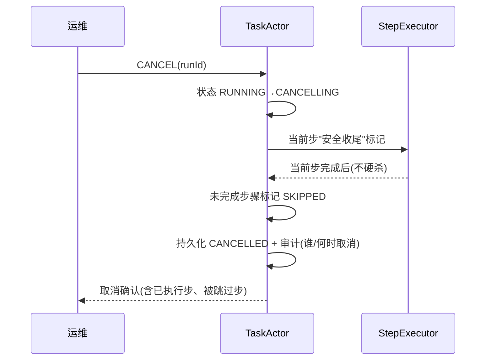

# 07-工作流可视回放与取消

> **定位**：让长任务"**看得见、可干预**"。核心：**① 工作流执行轨迹可视化（时间线 + DAG 进度）② 运行中取消（安全收尾，复用 02 三段取消 + 03 幂等）③ 状态/预算实时查询**。呼应 [09-审计回放](../../项目/23-企业级Agent意图路由网关/09-审计回放与合规.md)、[教程 22-全链路可观测性](../../教程/22-全链路可观测性.md)。前置阅读：[06-断点续跑与崩溃闭合](06-断点续跑与崩溃闭合.md)。
>
> **铁律 0**：轨迹事件流自研；状态/预算查询用已实证 Observation/日志。

---

## 一、四问

| 问 | 答 |
|----|----|
| **新增了什么需求** | ①执行轨迹事件（步骤开始/完成/失败/耗时/Token）②时间线 + DAG 进度视图 ③运行中取消命令 ④状态/预算实时查询 API |
| **影响了哪些模块** | StepExecutor → 发事件；TaskActor → 支持取消；新增 轨迹投影服务 |
| **架构如何演进** | 从"执行即完成"演进为"执行 + 全生命周期可视 + 可干预" |
| **上一版痛点** | 长任务跑几小时，运维看不到进度、不能中途取消或介入 |

**本迭代验收**：①实时看到每步状态与整体进度 ②运行中可取消（安全收尾）③查询单任务状态/预算/耗时。

## 二、执行轨迹事件流

```java
// 概念代码：工作流轨迹事件（投影成时间线 + DAG 视图）
public sealed interface WorkflowEvent permits
        WorkflowStarted, StepStarted, StepSucceeded, StepFailed,
        StepDegraded, BudgetExceeded, WorkflowPaused,
        WorkflowCancelled, WorkflowCompleted {
    long seq(); long ts(); String runId();
}
```

**投影**：事件 append 到日志（呼应 [22 会话引擎的事件流](../../项目/22-企业级Agent会话引擎/00-需求分析与架构设计.md)），前端用事件投影出**时间线**和**DAG 进度图**（已完成步骤绿、运行中黄、失败红、待执行灰）。

## 三、运行中取消（安全）



**纪律**：取消 = 进 CANCELLING → 当前副作用步安全收尾（配合 03 幂等，已发生的副作用结果保留）→ 未开始的步骤标记 SKIPPED → CANCELLED。**绝不硬杀正在写库/扣款的步骤**。

## 四、验收

| 测试 | 期望 |
|------|------|
| 实时进度 | 时间线 + DAG 视图实时更新 |
| 中速取消 | 当前步安全收尾后 CANCELLED |
| 取消审计 | 记录取消者与何时 |
| 状态查询 | 单任务状态/预算/耗时可查 |

> **下一步**：长任务引擎已完整（编排/幂等/预算/恢复/可视）。但引擎还嵌在业务代码里，不可复用。08 起进入**进阶**：先做**独立工作流引擎抽象**（把引擎做成可复用库/服务），再谈多机分布式（09）、预算可视化+HITL（10）。
