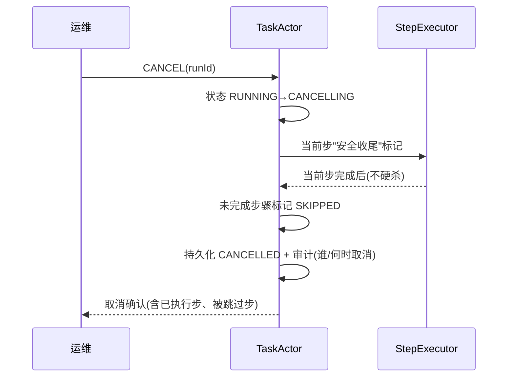

# 07-工作流可视回放与取消

> **定位**：让长任务"**看得见、可干预**"。核心：**① 工作流执行轨迹可视化（时间线 + DAG 进度）② 运行中取消（安全收尾，复用 02 三段取消 + 03 幂等）③ 状态/预算实时查询**。呼应 [09-审计回放](../../项目/23-企业级Agent意图路由网关/09-审计回放与合规.md)、[教程 31-全链路可观测性](../../教程/31-全链路可观测性.md)。前置阅读：[06-断点续跑与崩溃闭合](06-断点续跑与崩溃闭合.md)。
>
> **铁律 0**：轨迹事件流自研；状态/预算查询用已实证 Observation/日志。

---

## 一、四问

| 问 | 答 |
|----|----|
| **新增了什么需求** | ①执行轨迹事件（步骤开始/完成/失败/耗时/Token）②时间线 + DAG 进度视图 ③运行中取消命令 ④状态/预算实时查询 API |
| **影响了哪些模块** | StepExecutor → 发事件；TaskActor → 支持取消；新增 轨迹投影服务 |
| **架构如何演进** | 从"执行即完成"演进为"执行 + 全生命周期可视 + 可干预" |
| **上一版痛点** | 长任务跑几小时，运维看不到进度、不能中途取消或介入 |

**本迭代验收**：①实时看到每步状态与整体进度 ②运行中可取消（安全收尾）③查询单任务状态/预算/耗时。

### 一.1 本节核对（四问与本迭代验收）

| # | 核对项 | 判据 |
|---|--------|------|
| 1 | 四问口径齐全 | 新增需求（轨迹事件/时间线+DAG 视图/取消命令/实时查询 API）/影响模块/架构演进/上一版痛点四行均有，无空答 |
| 2 | 本迭代验收可度量 | ①实时进度 ②运行中可取消（安全收尾）③状态/预算/耗时可查——三项可判定 |

## 二、执行轨迹事件流

```java
// 概念代码：工作流轨迹事件（投影成时间线 + DAG 视图）
public sealed interface WorkflowEvent permits
        WorkflowStarted, StepStarted, StepSucceeded, StepFailed,
        StepDegraded, BudgetExceeded, WorkflowPaused,
        WorkflowCancelled, WorkflowCompleted {
    long seq(); long ts(); String runId();
}
```

**投影**：事件 append 到日志（呼应 [22 会话引擎的事件流](../../项目/22-企业级Agent会话引擎/00-需求分析与架构设计.md)），前端用事件投影出**时间线**和**DAG 进度图**（已完成步骤绿、运行中黄、失败红、待执行灰）。

### 二.1 本节测试与验证（执行轨迹事件流投影）

**前置条件**：`WorkflowEvent`（sealed interface 九个实现）与事件 append 日志、投影服务按上文实现；构造一次若干 `WorkflowStarted`/`StepStarted`/`StepSucceeded`/`StepFailed` 的事件序列。

**材料——事件序列与投影断言**：模拟 3 步任务完整生命周期的事件流，含一步失败、一步降级。

**步骤与断言**：

| # | 操作 | 预期（PASS 判据） |
|---|------|------------------|
| 1 | 跑一次 3 步任务，收集事件 | 事件流按 `seq()` 单调递增、`ts()` 时间递增，覆盖 Started/Succeeded/Completed 全部生命周期 |
| 2 | 投影成时间线 | 每步的开始/完成/耗时可读，顺序正确 |
| 3 | 投影成 DAG 进度视图 | 已完成步骤绿、运行中黄、失败红、待执行灰——颜色映射正确 |
| 4 | 注入一步失败/降级 | `StepFailed`/`StepDegraded` 事件正确产生并投影为失败态 |

**失败排查**：①时间线乱序→`seq()`/`ts()` 未在事件产生处正确赋值；②事件丢失→append 非可靠写（未持久化即返回）；③颜色映射错→投影服务对四个状态的分支判断遗漏某状态。

## 三、运行中取消（安全）



**纪律**：取消 = 进 CANCELLING → 当前副作用步安全收尾（配合 03 幂等，已发生的副作用结果保留）→ 未开始的步骤标记 SKIPPED → CANCELLED。**绝不硬杀正在写库/扣款的步骤**。

### 三.1 本节测试与验证（运行中取消安全收尾）

**前置条件**：TaskActor 收到 `CANCEL(runId)` 后按状态机 RUNNING→CANCELLING→CANCELLED 收尾并按上文实现；配合 03 幂等保留已发生副作用结果。

**材料——运行中途取消**：任务跑到第 2 步（正在写库/扣款的副作用步）时发送 `CANCEL`。

**步骤与断言**：

| # | 操作 | 预期（PASS 判据） |
|---|------|------------------|
| 1 | 任务运行中发送 `CANCEL(runId)` | 状态 RUNNING→CANCELLING，不立即终止 |
| 2 | 当前副作用步安全收尾 | 当前步**完成**后才推进（不硬杀写库/扣款），已发生副作用结果保留（复用 03） |
| 3 | 未开始的步骤 | 标记 SKIPPED（未执行、无副作用） |
| 4 | 收尾后持久化与审计 | 持久化 CANCELLED + 记录取消者/何时；`WorkflowCancelled` 事件产生；返回含已执行步、被跳过步的确认 |
| 5 | 取消已执行的副作用步 | 不重复触发（配合 03 幂等） |

**失败排查**：①取消直接 kill→未走 CANCELLING 安全收尾（硬杀在写库/扣款步上）；②未开始步骤被当作运行过→SKIPPED 标记缺失，续跑/重试时误重放；③取消无审计→`WorkflowCancelled` 缺 `who`/`when` 字段。

## 四、验收

| 测试 | 期望 |
|------|------|
| 实时进度 | 时间线 + DAG 视图实时更新 |
| 中速取消 | 当前步安全收尾后 CANCELLED |
| 取消审计 | 记录取消者与何时 |
| 状态查询 | 单任务状态/预算/耗时可查 |

### 四.1 本节核对（验收矩阵收口）

> 本节核对（一句话）：验收表四行（实时进度/中速取消 CANCELLED/取消审计/状态查询）在 §二.1 步骤 2-3、§三.1 步骤 2/4、均有对应落地断言项，状态查询可查性在本迭代验收②③中声明，矩阵行无悬空即 PASS。

> **下一步**：长任务引擎已完整（编排/幂等/预算/恢复/可视）。但引擎还嵌在业务代码里，不可复用。08 起进入**进阶**：先做**独立工作流引擎抽象**（把引擎做成可复用库/服务），再谈多机分布式（09）、预算可视化+HITL（10）。
