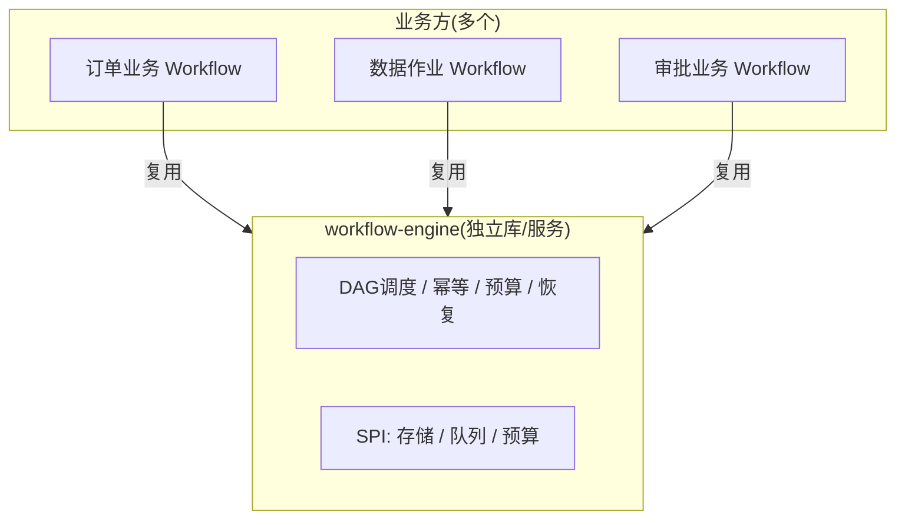

# 08-独立工作流引擎抽象

> **定位**：把嵌在业务里的引擎**抽成可复用、可独立部署的工作流引擎库/服务**。核心：**① 引擎核心与业务步骤解耦（声明式业务注册）② 引擎 SPI：存储适配 / 调度策略可插拔 ③ 沉淀为独立 artifact/服务**。这是从"某个长任务"到"企业级工作流基础设施"的关键。前置阅读：[07-工作流可视回放与取消](07-工作流可视回放与取消.md)。
>
> **铁律 0**：引擎为自研库（纯自研「概念代码」接口）；仅对外模型/工具调用用实证。

---

## 一、四问

| 问 | 答 |
|----|----|
| **新增了什么需求** | ①引擎核心（DAG调度/幂等/预算/恢复）与业务步骤解耦 ②SPI（Checkpoint 存储/队列/调度可插拔）③可复用库 + 独立部署形态 |
| **影响了哪些模块** | 引擎拆出为独立 `workflow-engine` 组件；业务只注册 Step/Workflow |
| **架构如何演进** | 从"单项目内嵌"演变为"独立引擎资产 + 多业务接入" |
| **上一版痛点** | 引擎与业务强耦合；换存储/换调度要改引擎；不能给其他业务复用 |

**本迭代验收**：①业务只需声明 StepSpec + 注册 Workflow，不碰引擎内部 ②换 Redis/DB 存储只改配置 ③可作为依赖复用。

### 一.1 本节核对（四问与本迭代验收）

| # | 核对项 | 判据 |
|---|--------|------|
| 1 | 四问口径齐全 | 新增需求（引擎核心与业务解耦/SPI 可插拔/独立 artifact）/影响模块/架构演进/上一版痛点四行均有，无空答 |
| 2 | 本迭代验收可度量 | ①业务不改引擎 ②换存储只改配置 ③可作依赖复用——三项可判定 |

## 二、引擎 SPI（可插拔）

```java
// 概念代码：引擎核心 SPI（业务不感知实现细节）
public interface CheckpointStore {           // 存储可插拔：Redis/JSONB/内存
    void upsert(String runId, StepRecord r);
    Map<String,StepRecord> load(String runId);
}
public interface StepQueue {                 // 就绪队列：Redis/ZK
    Optional<String> claim(String runId);    // 原子抢任务(配合幂等)
}
public interface BudgetLedger {              // 预算计量：本地/分布式计数
    long claimTokens(String runId, int n);
}

// 业务接入：只声明，不写引擎
@Component
public class MyWorkflows {
    @WorkflowSpec
    StepSpec pullData = StepSpec.of("pull", List.of(),
        ctx -> webClient.fetch(ctx.input()));      // 业务步骤
    @WorkflowSpec
    StepSpec cleanData = StepSpec.of("clean", List.of("pull"),
        ctx -> clean(ctx.inputOf("pull")));        // 依赖 pull
}
```

### 二.1 本节测试与验证（引擎 SPI 可插拔与业务解耦）

**前置条件**：`CheckpointStore`/`StepQueue`/`BudgetLedger` 三 SPI 接口 + `MyWorkflows` 声明式接入按上文实现；至少准备两套 SPI 实现（内存实现用于单测 + Redis/DB 生产实现）。

**材料——换实现与业务不加引擎代码**：同一 `MyWorkflows` 分别注入内存实现与 Redis/DB 实现；业务方只声明、不导入引擎内部类。

**步骤与断言**：

| # | 操作 | 预期（PASS 判据） |
|---|------|------------------|
| 1 | 用内存实现跑一次完整 Workflow | SPI 无状态实现正常完成（用于单测冒烟回归） |
| 2 | 切换为 Redis/DB 实现 | 只改 SPI 注入配置（或实现类），业务 `StepSpec` 代码零改动，仍正常跑 |
| 3 | 业务方代码扫描 | 业务类仅声明 `@WorkflowSpec`/`StepSpec.of`，不含引擎内部类引用（解耦达成） |
| 4 | 新业务接入第二个 Workflow | 只新增业务声明，不改引擎核心 |

**失败排查**：①换实现业务代码跟着改→业务直接依赖引擎内部类而非 SPI；②内存实现与 Redis 语义不一致（幂等/原子）→单测过、生产挂，两套实现需对同一断言收敛。

## 三、独立部署形态



**要点**：引擎是无业务状态的基础设施，业务以"声明式 StepSpec + Workflow"接入——这就是把 [05 迭代的 DAG 表达能力] 固化成了平台能力。

### 三.1 本节核对（独立部署形态）

- [ ] 独立部署图把引擎核心（DAG/幂等/预算/恢复 + SPI）与多个业务方（订单/数据作业/审批）清晰分层，`B1&B2&B3 --> engine` 复用边与正文"多业务接入"一致
- [ ] 能复述"引擎从内嵌演进为独立资产"的演进轨迹，且 §二.1 步骤 4（多业务接入不改引擎）落地下方

## 四、验收

| 测试 | 期望 |
|------|------|
| 新业务接入 | 只写 StepSpec，不改引擎 |
| 换存储 | 改 SPI 配置即切换 |
| 引擎复用 | 多业务共享同一引擎实例 |
| 引擎测试 | 用内存实现跑冒烟回归 |

### 四.1 本节核对（验收矩阵收口）

> 本节核对（一句话）：验收表四行（新业务只写 StepSpec/换存储只改 SPI 配置/引擎多业务复用/内存实现冒烟回归）在 §二.1 步骤 1-4、§三.1 均有对应落地断言项，矩阵行无悬空即 PASS。

> **下一步**：引擎独立了，但**单实例仍受容量上限**。09 进阶做**多机分布式续跑**——让引擎跑在 K8s 多副本上，任务可跨实例迁移与续跑。
