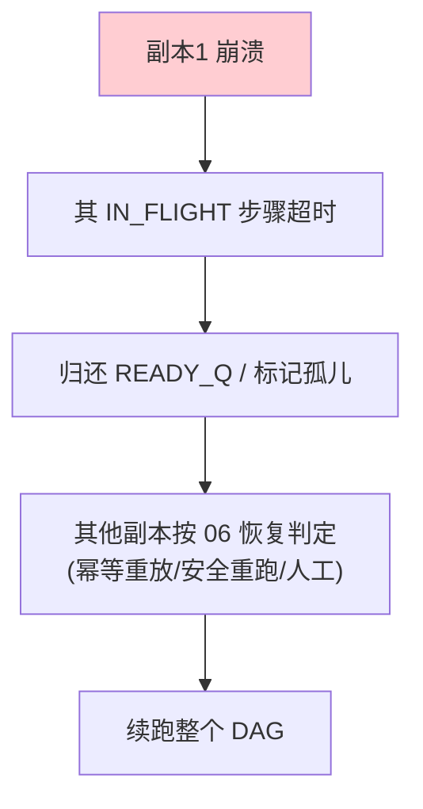

# 09-多机分布式续跑

> **定位**：让引擎**跑在 K8s 多副本**上，长任务跨实例**可迁移、可持续续跑**。核心：**① K8s Deployment 多副本 + 共享 Checkpoint/队列 ② 步骤级容错（一实例崩，步骤被其他实例幂等重拾）③ 分布式预算/锁一致性**。呼应 [16-多集群联邦](../../项目/16-企业级Agent服务网格/07-多集群联邦.md)、[05-多Worker抢任务](05-DAG步骤化与多Worker抢任务.md)。前置阅读：[08-独立工作流引擎抽象](08-独立工作流引擎抽象.md)。
>
> **铁律 0**：分布式协调（Redis 锁/队列/事务）为业界通用能力（自研封装「概念代码」）；仅模型/工具用实证。

---

## 一、四问

| 问 | 答 |
|----|----|
| **新增了什么需求** | ①K8s 多副本部署 ②共享 CheckpointStore/StepQueue/预算账本（Redis）③步骤跨实例抢取 + 幂等续跑 ④分布式一致性（锁/乐观并发） |
| **影响了哪些模块** | 引擎 SPI → 注入分布式实现；新增 K8s 部署清单 |
| **架构如何演进** | 从"单实例引擎"演进为"K8s 多副本 + 分布式协调" |
| **上一版痛点** | 单实例容量不足、单点故障；步骤只能在崩溃实例内恢复 |

**本迭代验收**：①水平扩容，吞吐随副本数提升 ②任意实例崩溃 → 其进行中任务被其他实例接管续跑（副作用不重复）③分布式预算原子正确。

## 二、多副本 + 分布式协调

```java
// 概念代码：分布式步骤领取（Redis 原子，配合 03 幂等）
public Optional<String> claimStep(String runId) {
    // RPOPLPUSH 到处理中队列 + Redis 锁；领取失败则其他副本可领取
    return redis.rpoplpush(READY_Q, IN_FLIGHT_Q);   // 原子领取
}
```

**一致性关键**：
- **Checkpoint 原子**：每步 `upsert(runId, step)` 用 **Redis WATCH/lua 或 DB 乐观锁**，防两个副本同写一步（05 已有每步原子）。
- **预算分布式**：预算计数器存 Redis（原子 `INCRBY`），04 的三层预算在多副本下仍准确。
- **步骤迁移**：实例崩溃 → IN_FLIGHT 中的步骤超时未完成 → 回读 READY_Q → 其他实例按 06 恢复判定幂等续跑。

## 三、恢复与容错闭环



**要点**：多机续跑不是把状态复制到新机器，而是**共享状态存储 + 任意副本可从 Checkpoint 续跑**。这是 [01-最小Demo 的断点续跑](01-最小Demo.md) 在多机的延伸。

## 四、验收

| 测试 | 期望 |
|------|------|
| 扩容到 3 副本 | 吞吐提升，任务分布执行 |
| 副本1 崩溃 | 步骤被其他副本幂等接管 |
| 分布式预算 | 多副本累加准确、超限统一掐断 |
| 并发同一步 | 只有一个副本执行（幂等+锁） |

> **下一步**：多机续跑已就绪。**但运维还缺"一眼看懂预算、一键介入长任务"**。10 进阶做**预算可视化 + HITL 暂停/恢复**——长任务的经济运营台与人工控制台。
