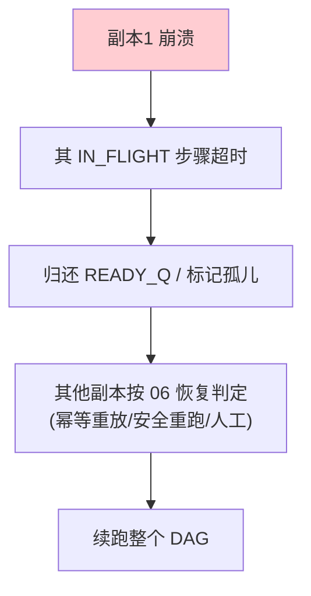

# 09-多机分布式续跑

> **定位**：让引擎**跑在 K8s 多副本**上，长任务跨实例**可迁移、可持续续跑**。核心：**① K8s Deployment 多副本 + 共享 Checkpoint/队列 ② 步骤级容错（一实例崩，步骤被其他实例幂等重拾）③ 分布式预算/锁一致性**。呼应 [16-多集群联邦](../../项目/16-企业级Agent服务网格/07-多集群联邦.md)、[05-多Worker抢任务](05-DAG步骤化与多Worker抢任务.md)。前置阅读：[08-独立工作流引擎抽象](08-独立工作流引擎抽象.md)。
>
> **铁律 0**：分布式协调（Redis 锁/队列/事务）为业界通用能力（自研封装「概念代码」）；仅模型/工具用实证。

---

## 一、四问

| 问 | 答 |
|----|----|
| **新增了什么需求** | ①K8s 多副本部署 ②共享 CheckpointStore/StepQueue/预算账本（Redis）③步骤跨实例抢取 + 幂等续跑 ④分布式一致性（锁/乐观并发） |
| **影响了哪些模块** | 引擎 SPI → 注入分布式实现；新增 K8s 部署清单 |
| **架构如何演进** | 从"单实例引擎"演进为"K8s 多副本 + 分布式协调" |
| **上一版痛点** | 单实例容量不足、单点故障；步骤只能在崩溃实例内恢复 |

**本迭代验收**：①水平扩容，吞吐随副本数提升 ②任意实例崩溃 → 其进行中任务被其他实例接管续跑（副作用不重复）③分布式预算原子正确。

### 一.1 本节核对（四问与本迭代验收）

| # | 核对项 | 判据 |
|---|--------|------|
| 1 | 四问口径齐全 | 新增需求（K8s 多副本/共享存储与队列/步骤跨实例抢取+幂等续跑/分布式一致性）/影响模块/架构演进/上一版痛点四行均有，无空答 |
| 2 | 本迭代验收可度量 | ①扩容吞吐提升 ②崩溃被接管续跑不重复副作用 ③分布式预算原子正确——三项可判定 |

## 二、多副本 + 分布式协调

```java
// 概念代码：分布式步骤领取（Redis 原子，配合 03 幂等）
public Optional<String> claimStep(String runId) {
    // RPOPLPUSH 到处理中队列 + Redis 锁；领取失败则其他副本可领取
    return redis.rpoplpush(READY_Q, IN_FLIGHT_Q);   // 原子领取
}
```

**一致性关键**：
- **Checkpoint 原子**：每步 `upsert(runId, step)` 用 **Redis WATCH/lua 或 DB 乐观锁**，防两个副本同写一步（05 已有每步原子）。
- **预算分布式**：预算计数器存 Redis（原子 `INCRBY`），04 的三层预算在多副本下仍准确。
- **步骤迁移**：实例崩溃 → IN_FLIGHT 中的步骤超时未完成 → 回读 READY_Q → 其他实例按 06 恢复判定幂等续跑。

### 二.1 本节测试与验证（多副本分布式协调）

**前置条件**：Redis 共享 CheckpointStore/StepQueue（`RPOPLPUSH`）/预算账本（`INCRBY`）+ 多个副本实例按上文实现；部署 K8s Deployment 多副本（或本地多进程模拟）。

**材料——扩容与崩溃注入**：启动 1→3 副本；在某副本领取步骤后终止该副本（模拟崩溃）。

**步骤与断言**：

| # | 操作 | 预期（PASS 判据） |
|---|------|------------------|
| 1 | 1→3 副本扩容跑同一批任务 | 吞吐随副本数提升，任务分布到多副本执行 |
| 2 | 并发领取同一就绪步骤 | 仅一个副本领取成功（`RPOPLPUSH` 原子 + 锁），其余失败不重复执行 |
| 3 | 终止已领取步骤的副本 | IN_FLIGHT 步骤超时未完成 → 归还 READY_Q → 其他副本按 06 判定幂等接管续跑（副作用不重复） |
| 4 | 多副本并发 `INCRBY` 预算 | 预算原子累加无漏/多；超限在多副本下统一掐断 |

**失败排查**：①同一步被两副本执行→`RPOPLPUSH` 非原子/锁过期；②崩溃步骤无人接管→IN_FLIGHT 超时回收未配置（步骤永停）；③预算多副本不一致→预算计数未走 Redis `INCRBY`（用了本地内存计数）。

## 三、恢复与容错闭环



**要点**：多机续跑不是把状态复制到新机器，而是**共享状态存储 + 任意副本可从 Checkpoint 续跑**。这是 [01-最小Demo 的断点续跑](01-最小Demo.md) 在多机的延伸。

### 三.1 本节核对（恢复与容错闭环）

- [ ] 恢复闭环图五节点（副本1崩溃→IN_FLIGHT 超时→归还 READY_Q/标孤儿→其他副本按 06 判定→续跑 DAG）链路与 §二.1 步骤 3 的崩溃接管断言一致
- [ ] 能复述"多机续跑 = 共享状态存储 + 任意副本从 Checkpoint 续跑"，且点出它与 [01 断点续跑](../../项目/24-企业级长任务工作流引擎/01-最小Demo.md) 是"单机→多机"的延伸关系

## 四、验收

| 测试 | 期望 |
|------|------|
| 扩容到 3 副本 | 吞吐提升，任务分布执行 |
| 副本1 崩溃 | 步骤被其他副本幂等接管 |
| 分布式预算 | 多副本累加准确、超限统一掐断 |
| 并发同一步 | 只有一个副本执行（幂等+锁） |

### 四.1 本节核对（验收矩阵收口）

> 本节核对（一句话）：验收表四行（扩容吞吐/副本崩溃接管/分布式预算准确/并发同一步单执行）在 §二.1 步骤 1/3/4/2 各有对应落地断言项，矩阵行无悬空即 PASS。

> **下一步**：多机续跑已就绪。**但运维还缺"一眼看懂预算、一键介入长任务"**。10 进阶做**预算可视化 + HITL 暂停/恢复**——长任务的经济运营台与人工控制台。
