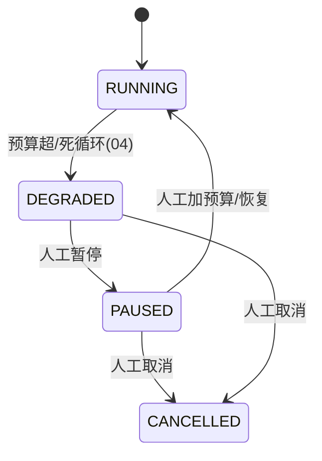

# 10-预算可视化与 HITL 暂停恢复

> **定位**：长任务的**经济运营台 + 人工控制台**。核心：**① 预算实时可视化（每任务/每业务线 Token 成本看板）② 超限/异常的 HITL 暂停/恢复 ③ 预算调整与告警**。呼应 [04-预算闸门](04-三层预算与死循环防护.md)、[20-预算预测](../../项目/20-企业级Agent经济与结算平台/08-预算预测与成本治理.md)、[28-HITL](../../教程/28-Human-in-the-Loop与审批流.md)。前置阅读：[09-多机分布式续跑](09-多机分布式续跑.md)。
>
> **铁律 0**：预算计量用实证 `Usage`；可视化/告警/暂停自研「概念代码」。

---

## 一、四问

| 问 | 答 |
|----|----|
| **新增了什么需求** | ①预算成本看板（实时 Token/成本/进度）②超限/死循环 → HITL 暂停/恢复 ③预算调整 + 浪费告警 |
| **影响了哪些模块** | 04 预算计量 → 可视化输出；04 DEGRADED → 联动 HITL；新增 看板/告警 |
| **架构如何演进** | 从"预算硬掐断"演进为"预算可视化 + 人工可裁决 + 可调整" |
| **上一版痛点** | 预算超限直接 DEGRADED，无人工介入通道；成本不可见 |

**本迭代验收**：①看板实时显示每任务成本/进度 ②DEGRADED 可人工暂停/加预算/恢复/取消 ③预算浪费有告警。

## 二、预算成本看板

```java
// 概念代码：预算看板数据（聚合 Trace/Metrics）
record TaskBudgetView(String runId, int usedTokens, int tokenBudget, BigDecimal estCost,
                      int rounds, int maxRounds, long elapsedMs, Timeline progress) {}

// 每任务/每业务线维度聚合，Observation 打点(配附录18) → Grafana
```

**两个视图**：
- **单任务**：该长任务用了多少 Token/花了多少钱、还有多少预算、进度到哪。
- **业务线聚合**：所有长任务的成本排行，谁是"烧钱大户"（呼应 [41-数据飞轮](../../教程/41-数据飞轮与持续改进.md) 的成本治理视角）。

## 三、HITL 暂停/恢复



- **DEGRADED 不是终点**，而是"等人工裁决"的**可暂停态**（02 状态机已支持 PAUSED）。
- 人工可：**加预算恢复**（授权新上限）、**暂停**（停住烧钱）、**取消**（安全收尾）。
- HITL 裁决记录进审计（07 取消审计延续 / 呼应 [28-HITL 审批流](../../教程/28-Human-in-the-Loop与审批流.md)）。

## 四、浪费告警

- 每任务成本突增（相比历史均值) → 告警。
- 死循环频发的业务线 → 告警 + 建议调高预算闸门或查步骤逻辑。
- 预算调整本身走审批（呼应 [08-策略下发](../../项目/23-企业级Agent意图路由网关/10-路由策略动态下发.md) 的审批-发布-审计）——改预算不是随便改。

## 五、验收

| 测试 | 期望 |
|------|------|
| 看板 | 实时成本/进度 |
| DEGRADED → 暂停 | 可 PAUSED |
| 加预算恢复 | 授权后从 Checkpoint 续跑 |
| 成本突增 | 告警触发 |

> **下一步**：10 个迭代/进阶把长任务引擎做完整：编排、幂等、预算、恢复、可视、多机、成本台、HITL。下一步进 **11-核心代码讲解** 串讲；随后 12-ADR、13-前沿收官。
