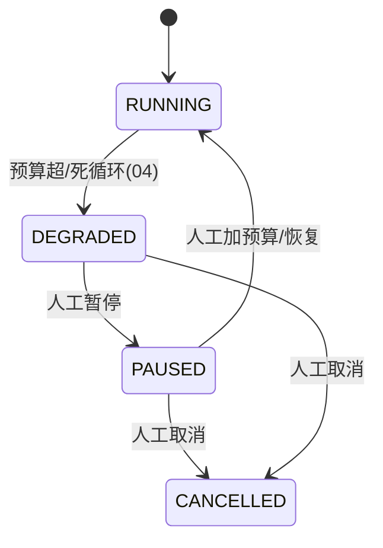

# 10-预算可视化与 HITL 暂停恢复

> **定位**：长任务的**经济运营台 + 人工控制台**。核心：**① 预算实时可视化（每任务/每业务线 Token 成本看板）② 超限/异常的 HITL 暂停/恢复 ③ 预算调整与告警**。呼应 [04-预算闸门](04-三层预算与死循环防护.md)、[20-预算预测](../../项目/20-企业级Agent经济与结算平台/08-预算预测与成本治理.md)、[28-HITL](../../教程/28-Human-in-the-Loop与审批流.md)。前置阅读：[09-多机分布式续跑](09-多机分布式续跑.md)。
>
> **铁律 0**：预算计量用实证 `Usage`；可视化/告警/暂停自研「概念代码」。

---

## 一、四问

| 问 | 答 |
|----|----|
| **新增了什么需求** | ①预算成本看板（实时 Token/成本/进度）②超限/死循环 → HITL 暂停/恢复 ③预算调整 + 浪费告警 |
| **影响了哪些模块** | 04 预算计量 → 可视化输出；04 DEGRADED → 联动 HITL；新增 看板/告警 |
| **架构如何演进** | 从"预算硬掐断"演进为"预算可视化 + 人工可裁决 + 可调整" |
| **上一版痛点** | 预算超限直接 DEGRADED，无人工介入通道；成本不可见 |

**本迭代验收**：①看板实时显示每任务成本/进度 ②DEGRADED 可人工暂停/加预算/恢复/取消 ③预算浪费有告警。

### 一.1 本节核对（四问与本迭代验收）

| # | 核对项 | 判据 |
|---|--------|------|
| 1 | 四问口径齐全 | 新增需求（预算看板/超限 HITL 暂停恢复/预算调整+告警）/影响模块/架构演进/上一版痛点四行均有，无空答 |
| 2 | 本迭代验收可度量 | ①看板实时成本/进度 ②DEGRADED 可人工暂停/加预算/恢复/取消 ③浪费有告警——三项可判定 |

## 二、预算成本看板

```java
// 概念代码：预算看板数据（聚合 Trace/Metrics）
record TaskBudgetView(String runId, int usedTokens, int tokenBudget, BigDecimal estCost,
                      int rounds, int maxRounds, long elapsedMs, Timeline progress) {}

// 每任务/每业务线维度聚合，Observation 打点(配附录18) → Grafana
```

**两个视图**：
- **单任务**：该长任务用了多少 Token/花了多少钱、还有多少预算、进度到哪。
- **业务线聚合**：所有长任务的成本排行，谁是"烧钱大户"（呼应 [41-数据飞轮](../../教程/41-数据飞轮与持续改进.md) 的成本治理视角）。

### 二.1 本节测试与验证（预算成本看板）

**前置条件**：`TaskBudgetView`（runId/usedTokens/tokenBudget/estCost/rounds/maxRounds/elapsedMs/progress）按上文聚合 Trace/Metrics（配附录 18 Observation 打点 → Grafana）实现；跑若干长任务产生用量。

**材料——单任务与业务线聚合**：一个长任务 + 多个长任务的用量数据；某任务用量接近预算线。

**步骤与断言**：

| # | 操作 | 预期（PASS 判据） |
|---|------|------------------|
| 1 | 查询单任务 `TaskBudgetView` | usedTokens/estCost/tokenBudget/rounds/progress 字段实时可读、与 04 预算计量一致 |
| 2 | 任务执行中反复查询 | 用量与进度随每次模型调用递增（实时性成立） |
| 3 | 汇总多任务 | 业务线成本排行正确，能定位"烧钱大户" |
| 4 | 用量接近 budget | estCost/进度线预警可见（不硬掐，仅展示，供 §四 告警消费） |

**失败排查**：①看板不实时→Observation 打点延迟或聚合窗口不对；②成本算错→`estCost` 单价/Token 换算错误；③进度不更新→`progress` 未随步骤完成推进（未接 07 轨迹事件）。

## 三、HITL 暂停/恢复



- **DEGRADED 不是终点**，而是"等人工裁决"的**可暂停态**（02 状态机已支持 PAUSED）。
- 人工可：**加预算恢复**（授权新上限）、**暂停**（停住烧钱）、**取消**（安全收尾）。
- HITL 裁决记录进审计（07 取消审计延续 / 呼应 [28-HITL 审批流](../../教程/28-Human-in-the-Loop与审批流.md)）。

### 三.1 本节测试与验证（HITL 暂停/恢复状态机）

**前置条件**：TaskActor 状态机支持 RUNNING→DEGRADED→PAUSED→CANCELLED/RUNNING 转换（02 状态机 + 04 超限联动）按上文实现；提供人工裁决入口（加预算恢复/暂停/取消）。

**材料——超限转 DEGRADED 后的人工操作**：构造三种人工裁决路径分别执行。

**步骤与断言**：

| # | 操作 | 预期（PASS 判据） |
|---|------|------------------|
| 1 | 预算超限/死循环触发（04） | 任务进入 **DEGRADED**（可暂停态，非硬 kill） |
| 2 | 人工"暂停" | DEGRADED→PAUSED，停住烧钱；状态可查 |
| 3 | 人工"加预算恢复" | 授权新上限后 PAUSED→RUNNING，从 Checkpoint 续跑（复用 06） |
| 4 | 人工"取消" | DEGRADED/PAUSED→CANCELLED，安全收尾（07），HITL 裁决写入审计 |
| 5 | 恢复后续跑结果 | 与未暂停路径一致（结果一致性） |

**失败排查**：①暂停未停烧钱→PAUSED 下事件循环仍放行步骤（状态机缺 PAUSED 分支拦截）；②加预算未续跑→授权后未从 Checkpoint 起点恢复（重头跑或缺失）；③裁决未审计→HITL 操作未落审计记录（缺 who/what/when）。

## 四、浪费告警

- 每任务成本突增（相比历史均值) → 告警。
- 死循环频发的业务线 → 告警 + 建议调高预算闸门或查步骤逻辑。
- 预算调整本身走审批（呼应 [08-策略下发](../../项目/23-企业级Agent意图路由网关/10-路由策略动态下发.md) 的审批-发布-审计）——改预算不是随便改。

### 四.1 本节核对（浪费告警）

- [ ] 能以对照句式复述不放狂阈值与审计：成本突增（比历史均值）→ 告警；死循环频发业务线 → 告警 + 建议查步骤；预算调整走审批而非直接改
- [ ] 三条告警内容与正文一致（成本突增/死循环频发/预算调整审批），且未虚构告警 API，仅陈述行为判据

## 五、验收

| 测试 | 期望 |
|------|------|
| 看板 | 实时成本/进度 |
| DEGRADED → 暂停 | 可 PAUSED |
| 加预算恢复 | 授权后从 Checkpoint 续跑 |
| 成本突增 | 告警触发 |

### 五.1 本节核对（验收矩阵收口）

> 本节核对（一句话）：验收表四行（看板实时成本/进度、DEGRADED→暂停 PAUSED、加预算恢复续跑、成本突增告警）在 §二.1 步骤 1-2、§三.1 步骤 2/3、§四 各有对应落地断言项，矩阵行无悬空即 PASS。

> **下一步**：10 个迭代/进阶把长任务引擎做完整：编排、幂等、预算、恢复、可视、多机、成本台、HITL。下一步进 **11-核心代码讲解** 串讲；随后 12-ADR、13-前沿收官。
