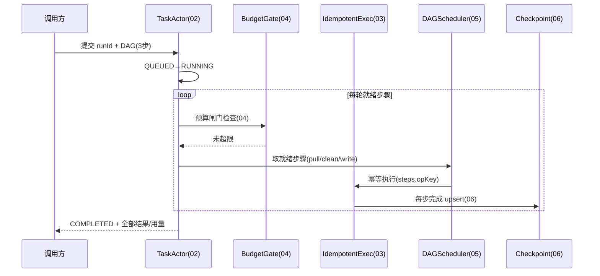

# 11-核心代码讲解

> **定位**：把项目 24 的核心实现串成主线——以**一次「批量数据清洗任务」**（3 步 DAG：拉数据→清洗→写库）贯穿各迭代关键代码的协作。前置阅读：[01-最小Demo](01-最小Demo.md) 至 [10-预算可视化与HITL暂停恢复](10-预算可视化与HITL暂停恢复.md) 全部。
>
> **铁律 0**：仅 `ChatClient`/`@Tool`/`Usage` 用实证基准；引擎为「概念代码」。

---

## 一、一次完整长任务的旅程



## 二、编排入口（串联各迭代）

```java
// 概念代码：任务提交主流程
public Mono<TaskResult> submit(WorkflowSpec wf, Map<String,Object> input) {
    String runId = wf.newRunId();
    return Mono.deferContextual(ctx -> taskActor.runLoop(runId)        // 02 Actor单写者
        .takeUntilOther(cancelOrDegrade(runId)))                       // 02 取消/降级
        .compose(bg -> budgetGate.wrap(bg))                            // 04 三层预算
        .flatMap(step -> idempotentExec.exec(step.opKey(), step))      // 03 幂等
        .flatMap(sel -> dagScheduler.parallelRound(sel, ctx))          // 05 DAG并行
        .doOnEach(sig -> checkpoint.persist(runId, sig))               // 06 Checkpoint
        .compose(evt -> traceProjector.record(evt))                    // 07 轨迹事件
        .contextWrite(ctx -> ctx.put(RUN_ID, runId))                   // Reactor Context
        .subscribeOn(Schedulers.boundedElastic());
}
```

**设计意图**：每个迭代是一个**可组合的响应式操作符**，串成完整链路——Actor 管生命周期、预算管红线、幂等管副作用、DAG 管编排、Checkpoint 管恢复、轨迹管可视。

## 三、分层职责（读代码抓手）

| 类 | 迭代 | 职责 |
|----|------|------|
| `TaskActor` | 02 | 单写者 + 生命周期状态机 |
| `IdempotentExecutor`/`EffectLedger` | 03 | 副作用三段式幂等 |
| `BudgetGate`/`DeadLoopDetector` | 04 | 三层预算 + 死循环 |
| `DAGScheduler` | 05 | 拓扑就绪 + 并行执行 |
| `RecoveryCoordinator` | 06/09 | Checkpoint 恢复 + 孤儿判定 |
| `TraceProjector` | 07 | 轨迹可视/取消 |
| `WorkflowEngine` (SPI) | 08/09 | 独立引擎 + 分布式 |

## 四、最容易踩的三个坑

1. **幂等登记晚于执行** → 崩溃重复副作用。**解法**：登记先于执行（03）。
2. **只在最大轮次检测死循环** → 烧钱但没进展。**解法**：指纹判"循环不进展"（04）。
3. **多 Worker 同写一致步无锁** → 数据竞争。**解法**：每步原子 upsert + Redis 锁（05/09）。

## 五、验收自测（对照 00 量化指标）

| 指标 | 目标 | 实现 |
|------|------|------|
| 崩溃断点续跑 | ≥95% | 06/09 |
| 副作用重复 | 0 | 03 |
| 预算超限拦截 | 100% | 04 |
| P95 回放定位 | ≤5s | 07 |

> **下一步**：代码串讲完成。12-ADR 记录本项目 8 条关键决策；13-前沿做业界对照与演进方向。
