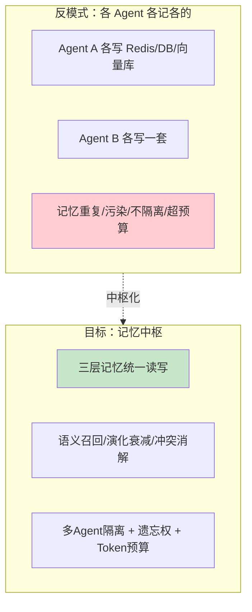
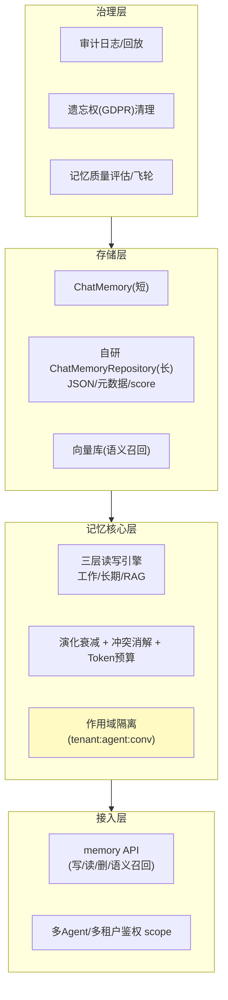

# 00-需求分析与架构设计：企业级 Agent 记忆中枢

> **定位**：第十二旗舰·**记忆基础设施视角**——第一性原理：**记忆不是"一个数据库"，而是分层的读写、演化、治理系统**。企业里多个 Agent 都要"记住用户偏好/长期事实/历史结论"，若各写各的会记忆重复、污染、超预算。本平台把记忆做成**基础设施（记忆中枢）**：三层记忆（工作/长期/RAG）统一读写、语义召回、演化衰减、冲突消解、多租户/多 Agent 读写隔离、被遗忘权(GDPR)、Token 预算内召回。读者画像：要回答"企业多个 Agent 怎么统一、安全、不爆炸地记忆"的架构师。前置阅读：[教程 52-工业级记忆架构]、[教程 39-高级记忆架构]、[教程 04-记忆与会话管理]。
>
> **铁律 0**：官方 `ChatMemory`（`get/add/clear` 单串参）+ `ChatMemoryRepository`（`findByConversationId/saveAll/deleteByConversationId`）javap 实证；官方仅 `InMemoryChatMemoryRepository`，长期持久化自研 `implements ChatMemoryRepository`（CLAUDE.md 铁律）。记忆中枢为自研「概念代码」（基于实证基座扩展）。

---

## ★ 阅读顺序总览（序号 = 阅读顺序）

> 本子文件夹 14 个文件（00-13）：

| 阶段 | 文件 | 读者定位 |
|------|------|---------|
| ① 全貌 | 00-需求分析与架构设计 | **先读**：记忆中枢四层架构 |
| ② 起步 | 01-最小Demo | **动手**：最小三层记忆读写 |
| ③ 主体迭代 | 02~07（工作记忆/长期持久化/语义召回/隔离/衰减冲突/遗忘权预算） | **严格顺序** |
| ④ 进阶 | 08~10（记忆演化飞轮/多语言多Agent共享/记忆审计与缓存） | **严格顺序** |
| ⑤ 讲解 | 11-核心代码讲解 | **回顾** |
| ⑥ 资产 | 12-ADR / 13-前沿 | **按需/收官** |

---

## 一、为什么需要独立的记忆中枢

**三个核心论点**：

1. **记忆 = 共享基础设施**：多个 Agent 的记忆应统一由中枢管理（登记、分区、检索），而非各写各的（呼应 [09-多Agent协作](../../教程/09-多Agent协作.md)）。
2. **记忆 = 治理对象**：要隔离（多租户不污染）、要衰减（过期记忆不误导）、要遗忘（GDPR 可删）、要预算（召回 fit 进 Token）（呼应 [52-工业级记忆架构](../../教程/52-工业级记忆架构.md)）。
3. **记忆 = 可观测资产**：每次读写可审计、可回放，记忆质量可评估（呼应 [23-可观测](../../教程/23-工具执行可观测与审计.md)）。

### 一.1 本节核对（独立记忆中枢的必要性）

- [ ] 能不看正文说出三个核心论点（共享基础设施 / 治理对象 / 可观测资产），并各举一个落地能力对应（统一读写登记 / 隔离或遗忘或预算 / 审计回放）
- [ ] 反模式"各 Agent 各记各的"能列出至少三条后果（重复/污染/不隔离/超预算），与论点 1 的"中枢化"动机对得上

## 二、总体架构（四层）

### 二.1 本节核对（四层总体架构）

- [ ] 四层（接入/记忆核心/存储/治理）各自职责能复述；每层至少一个组件能对应到微服务清单（memory-core / memory-store / memory-obs / memory-govern）
- [ ] 存储层的三个组件（ChatMemory 短 / 自研 Repository 长 / 向量库语义）与三层记忆一一对应，无遗漏

## 三、微服务清单与迭代路线

| 服务 | 职责 | 落地 |
|------|------|------|
| `memory-core` | 三层读写 + 复杂度（核心） | 主体迭代 |
| `memory-store` | 持久化（ChatMemoryRepository 自研 + 向量库） | 迭代 2/3 |
| `memory-govern` | 隔离/遗忘权/审计/评估 | 迭代 5-7 + 进阶 |
| `memory-obs` | 记忆写入/召回可观测 | 迭代 4 + 进阶 3 |

**迭代路线**（每迭代回答四问）：

| # | 迭代 | 核心新增 | 痛点回应 |
|---|------|---------|---------|
| 01-最小Demo | 三层记忆最小读写 | 起点 |
| 02 | 工作记忆 + 会话窗口管理 | 短记忆无管理 |
| 03 | 长期持久化（自研 Repository） | 内容重启即丢 |
| 04 | 语义召回 + 混合检索 | 长期记忆无法查询 |
| 05 | 作用域隔离（多租户/多Agent） | 记忆互相污染 |
| 06 | 演化衰减 + 冲突消解 | 过期/矛盾记忆误导 |
| 07 | 遗忘权 + Token 预算召回 | 合规/超预算 |
| 进阶08 | 记忆演化飞轮（反馈回流） | 记忆质量提升无依据 |
| 进阶09 | 多语言 / 多 Agent 共享记忆 | 跨 Agent 记忆协作 |
| 进阶10 | 记忆审计 + 缓存提速 | 可观测/读取慢 |

**量化验收**：①三层记忆写读一致（工作/长期/RAG）②语义召回 top5 命中相关记忆 ≥ 85% ③作用域隔离下无跨租户漏读 ④被遗忘权删除后全链路（含向量/元数据）清 5 ⑤召回 fit 进 Token 预算不爆窗。

### 三.1 本节核对（微服务清单、迭代路线与量化验收）

- [ ] 四个微服务（memory-core/store/govern/obs）职责与迭代落地可对应；迭代表 01-07 + 进阶 08-10 的"核心新增"能说出服务于哪条量化验收
- [ ] 五条量化验收（写读一致 / 召回≥85% / 隔离不漏读 / 遗忘权全清 / 预算不爆窗）都能在后续迭代篇（01-07）找到具体实现落点，无悬挂项

---

## 四、与教程/附录的映射

| 本平台能力 | 教程 | 附录/项目 |
|-----------|------|-----------|
| 记忆读写 API | [52-工业级记忆架构](../../教程/52-工业级记忆架构.md) | [05-API基准/00-Advisor与ChatMemory](../../附录/05-SpringAI2-API基准/00-Advisor与ChatMemory.md) |
| 三层记忆理论 | [39-高级记忆架构](../../教程/39-高级记忆架构.md) | [05-记忆前沿](../../前沿/05-Agent记忆前沿.md) |
| 记忆持久化 | [04-记忆与会话管理](../../教程/04-记忆与会话管理.md) | — |
| 多租户隔离 | [26-多租户隔离](../../教程/26-多租户隔离与资源治理.md) | — |
| 遗忘权/合规 | [25-历史持久化合规](../../教程/25-历史记录持久化与合规.md) | [43-治理](../../教程/43-Agent治理与合规框架.md) |
| Token 预算 | [27-成本治理](../../教程/27-成本治理与Token计量.md) | [34-上下文工程](../../教程/34-上下文工程.md) |

> **铁律提醒**：记忆中枢基于实证 `ChatMemory`/`ChatMemoryRepository` 基座扩展（自研持久化/召回/治理为「概念代码」）；任何新 SDK javap 实证后方可写入正文。

### 四.1 本节核对（教程/附录映射）

- [ ] 映射表中每条能力都能指出它依赖的实证基座（`ChatMemory`/`ChatMemoryRepository`）与自研扩展（持久化/召回/治理），区分明确
- [ ] 抽查任意两条前置教程 `[52-工业级记忆架构]`/`[39-高级记忆架构]` 与实际全篇用法一致，无超前照抄官方 main 分支 API
