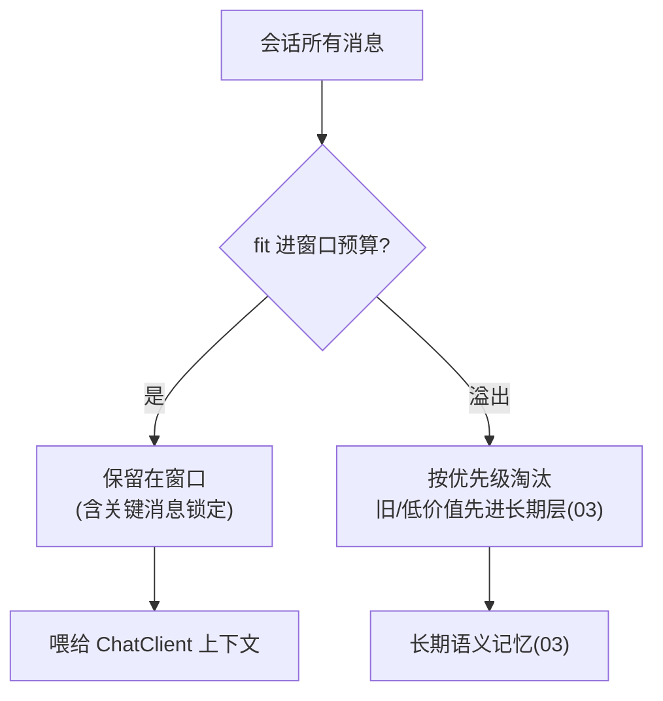

# 02-工作记忆与会话窗口管理

> **定位**：管好"工作/会话记忆"这一层——**① 会话窗口策略（窗口大小/滑动/截断）② 关键上下文保护（防止被旧消息挤掉）③ 与 [教程 77-上下文工程](../../教程/77-上下文工程.md) 的五层拼接衔接**。前置阅读：[01-最小Demo](01-最小Demo.md)、[教程 04-记忆与会话管理](../../教程/04-记忆与会话管理.md)。
>
> **铁律 0**：窗口用实证 `ChatMemory.get(String)` + 语言模型近 UTF-8 编码 Token 估算；窗口策略自研「概念代码」。

---

## 一、四问

| 问 | 答 |
|----|----|
| **新增了什么需求** | ①会话窗口策略（按 Token 预算滑窗，不简单按条数截）②窗口内优先级（系统提示/用户最新输入/关键记忆不被挤掉）③窗口与三层记忆的衔接（窗口外的进长期层） |
| **影响了哪些模块** | MemoryHub → 拆出 WorkMemoryWindow；引入滑动窗口策略 |
| **架构如何演进** | 工作记忆从"全量 get"演进为"受控窗口 + 优先级保鲜" |
| **上一版痛点** | get 全量会随对话增长超 Token；旧重要消息被顶掉 |

**本迭代验收**：①窗口 fit 进设定 Token 预算 ②窗口内关键消息（指令/最新输入）恒定保留 ③窗口溢出消息自动流转到长期层（03 接入）。

### 一.1 本节核对（四问）

- [ ] 四问口径齐全（新增需求/影响模块/架构演进/上一版痛点"全量 get 超 Token + 旧消息被顶"）
- [ ] 三条本迭代验收可度量：窗口 fit 预算 / 关键消息保鲜 / 溢出流转长期层，均是可判定行为

## 二、Token 预算滑动窗口

```java
// 概念代码：按 Token 预算滑窗（不按条数硬截）
public List<Message> trimToWindow(List<Message> all, int tokenBudget) {
    var deque = new ArrayDeque<Message>(all);
    int used = 0;
    while (!deque.isEmpty() && used < tokenBudget) {
        Message m = deque.peekFirst();
        int t = estimateTokens(m);            // 用模型tokenizer或近似估算
        if (used + t > tokenBudget) break;    // 装不下就停
        used += t; deque.removeFirst();
    }
    // 保护关键消息(系统指令/用户最新输入)不被滑掉：至少保留到末尾
    return ensureCritical(deque);
}
```

**要点**：滑动窗口按 **Token 预算**而非"最近 N 条"——避免长消息挤爆窗口、且保留最新上下文（呼应 [77-上下文工程](../../教程/77-上下文工程.md)）。

### 二.1 本节测试与验证（Token 预算滑动窗口）

**前置条件**：`trimToWindow(all, tokenBudget)` 与 `ensureCritical(deque)` 已实现；`estimateTokens(m)` 可对消息给出 Token 估算（可用语言模型 tokenizer 或近似）。

**材料——构造测例**（自造不同长度的 `Message` 列表压测，非外部 API）：

| 测例 | 输入 | 期望窗口行为 |
|------|------|------------|
| 长对话 | 多条长消息总计超预算 | 从尾部截断，used ≤ tokenBudget |
| 超长单条 | 单条消息本身就超预算 | 该条内截断/拒绝整条，不因单条挤爆 |

**步骤与断言**：

| # | 操作 | 预期（PASS 判据） |
|---|------|------------------|
| 1 | 触发长对话（消息总计超预算） | 返回窗口 `estimateTokens(全部保留)` ≤ tokenBudget；最新上下文保留在末尾 |
| 2 | 逐条累加实测 | 只要单条 < 预算必能被列入，窗口停在上限前最后可容纳的一条 |

**失败排查**：①窗口容量超预算→`used` 累计逻辑漏加某条；②最新消息被滑掉→`ensureCritical` 未把末位用户输入锁定。

## 三、关键上下文保护 + 溢出流转



- **保护**：系统指令（开头）与用户最新输入（末尾）在滑窗时**锁定不淘汰**；淘汰发生在"可折旧的中间历史"。
- **流转**：被滑出窗口的中间消息，降级转长期层保存摘要/记录，而非直接丢弃（保证 [01 的三层记忆] 完整）。

### 三.1 本节核对（关键上下文保护 + 溢出流转）

- [ ] 「系统指令锁定 + 用户最新输入锁定 + 中间历史可折旧」的淘汰边界能复述；与 §二 `ensureCritical` 的实现一致
- [ ] 溢出消息"转长期层而非丢弃"的流向能在流程图上定位（`L --> M`），并说明为何不直接丢（保三层完整）

## 四、全篇回归验证

> §二.1（Token 窗口）与 §三.1（关键保护/流转）均通过后的整体验收。

| # | 操作 | 预期（PASS 判据） |
|---|------|------------------|
| 1 | 长对话触发滑窗 | 窗口 fit 预算、最新上下文保留（§二.1 断言） |
| 2 | 同轮核对系统指令与用户输入 | 两者滑窗后仍保留（锁定不淘汰）；溢出中间消息转入长期层（§三.1） |
| 3 | 会话结束窗口关闭 | 短记忆按 03 归档，无中间消息被无声丢弃 |

**回归失败排查**：budget 超限或关键消息被滑 → 回 §二.1/§三.1 排查（累计逻辑 / `ensureCritical` 锁定）。

> **下一步**：窗口管理好了，但**长期层还很简单（1 的自研 Repository 无工程细节）**。03 迭代做**长期持久化工程化**——自研 ChatMemoryRepository 的完整实现（元数据/去重/幂等/事务）。
