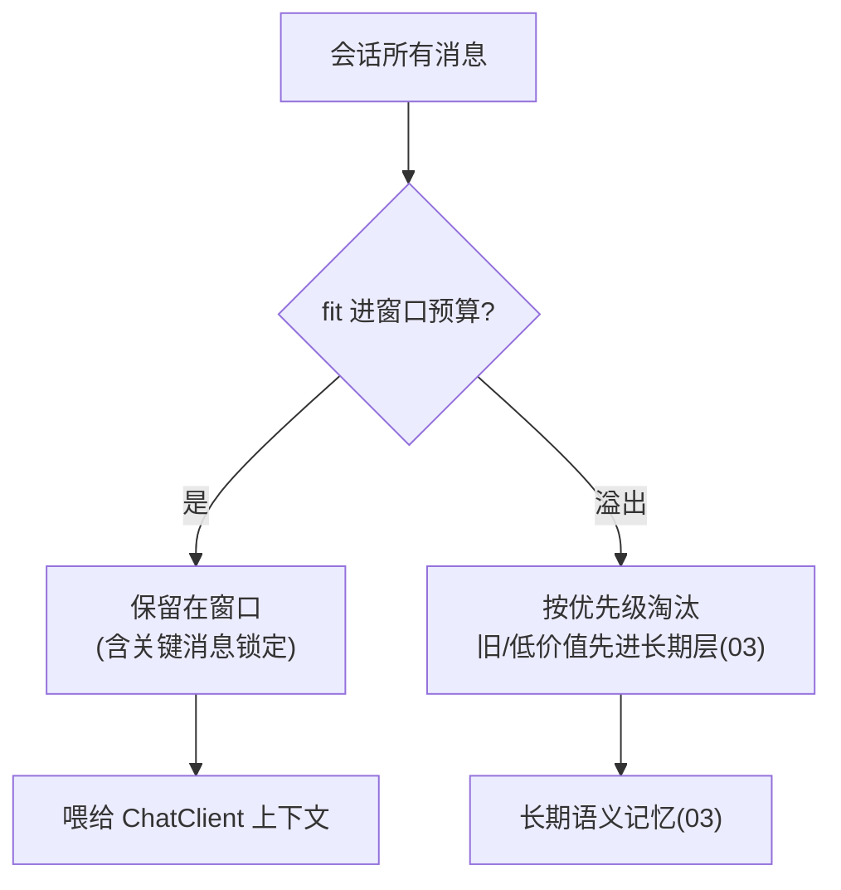

# 02-工作记忆与会话窗口管理

> **定位**：管好"工作/会话记忆"这一层——**① 会话窗口策略（窗口大小/滑动/截断）② 关键上下文保护（防止被旧消息挤掉）③ 与 [教程 34-上下文工程](../../教程/34-上下文工程.md) 的五层拼接衔接**。前置阅读：[01-最小Demo](01-最小Demo.md)、[教程 04-记忆与会话管理](../../教程/04-记忆与会话管理.md)。
>
> **铁律 0**：窗口用实证 `ChatMemory.get(String)` + 语言模型近 UTF-8 编码 Token 估算；窗口策略自研「概念代码」。

---

## 一、四问

| 问 | 答 |
|----|----|
| **新增了什么需求** | ①会话窗口策略（按 Token 预算滑窗，不简单按条数截）②窗口内优先级（系统提示/用户最新输入/关键记忆不被挤掉）③窗口与三层记忆的衔接（窗口外的进长期层） |
| **影响了哪些模块** | MemoryHub → 拆出 WorkMemoryWindow；引入滑动窗口策略 |
| **架构如何演进** | 工作记忆从"全量 get"演进为"受控窗口 + 优先级保鲜" |
| **上一版痛点** | get 全量会随对话增长超 Token；旧重要消息被顶掉 |

**本迭代验收**：①窗口 fit 进设定 Token 预算 ②窗口内关键消息（指令/最新输入）恒定保留 ③窗口溢出消息自动流转到长期层（03 接入）。

## 二、Token 预算滑动窗口

```java
// 概念代码：按 Token 预算滑窗（不按条数硬截）
public List<Message> trimToWindow(List<Message> all, int tokenBudget) {
    var deque = new ArrayDeque<Message>(all);
    int used = 0;
    while (!deque.isEmpty() && used < tokenBudget) {
        Message m = deque.peekFirst();
        int t = estimateTokens(m);            // 用模型tokenizer或近似估算
        if (used + t > tokenBudget) break;    // 装不下就停
        used += t; deque.removeFirst();
    }
    // 保护关键消息(系统指令/用户最新输入)不被滑掉：至少保留到末尾
    return ensureCritical(deque);
}
```

**要点**：滑动窗口按 **Token 预算**而非"最近 N 条"——避免长消息挤爆窗口、且保留最新上下文（呼应 [34-上下文工程](../../教程/34-上下文工程.md)）。

## 三、关键上下文保护 + 溢出流转



- **保护**：系统指令（开头）与用户最新输入（末尾）在滑窗时**锁定不淘汰**；淘汰发生在"可折旧的中间历史"。
- **流转**：被滑出窗口的中间消息，降级转长期层保存摘要/记录，而非直接丢弃（保证 [01 的三层记忆] 完整）。

## 四、验收

| 测试 | 期望 |
|------|------|
| 长对话 | 窗口 fit 预算，最新上下文保留 |
| 系统指令 | 滑窗后仍保留 |
| 溢出消息 | 流转到长期层 |
| 窗口关闭 | 会话结束，短记忆按 03 归档 |

> **下一步**：窗口管理好了，但**长期层还很简单（1 的自研 Repository 无工程细节）**。03 迭代做**长期持久化工程化**——自研 ChatMemoryRepository 的完整实现（元数据/去重/幂等/事务）。
