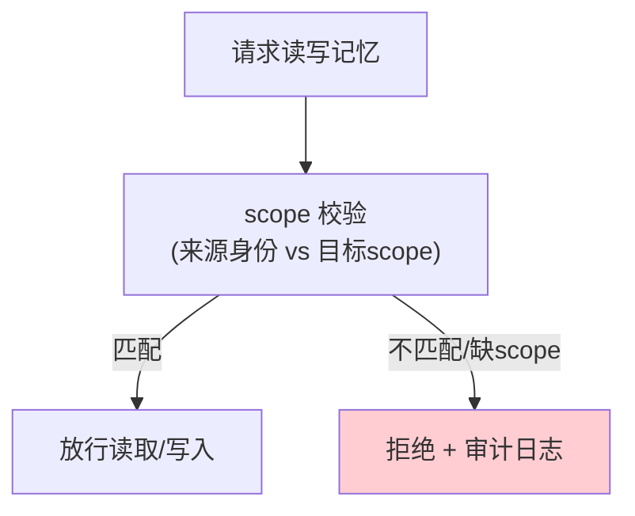

# 05-作用域隔离与多租户

> **定位**：让多 Agent / 多租户**共享记忆中枢但不互相污染**。核心：**① 记忆作用域（tenant:agent:conv 分区）② scope 级读写路由（隔离硬保证）③ 越权访问拦截与审计**。呼应 [26-多租户隔离与资源治理](../../教程/26-多租户隔离与资源治理.md)、[13-事件溯源租户隔离](../../项目/13-事件溯源Agent运行时平台/00-需求分析与架构设计.md)。前置阅读：[04-语义召回与混合检索](04-语义召回与混合检索.md)。
>
> **铁律 0**：当前话语义用实证 `ChatMemory.get(String)` 单参（会话即天然隔离）；长期层 scope 分区自研「概念代码」。

---

## 一、四问

| 问 | 答 |
|----|----|
| **新增了什么需求** | ①作用域模型（tenant:agent[:conv] 分区键）②scope 级读写路由（所有 SQL/向量检索强制带 scope）③越权拦截（跨 scope 访问拒绝 + 审计） |
| **影响了哪些模块** | MemoryHub 所有读写入口 → 强制 scope；持久化层加 scope 过滤 |
| **架构如何演进** | 记忆从"全局"演进为"按租户/Agent 硬分区" |
| **上一版痛点** | 若不加 scope，A 租户记忆可能被 B 租户召回泄漏 |

**本迭代验收**：①写时不带 / 带不同 scope 互不可见 ②强制 scope 过滤（漏配 scope 的查询默认拒绝）③越权尝试被拦截 + 审计。

## 二、作用域强制路由

```java
// 概念代码：作用域键 + 全读写入口强制 scope（Reactor Context 传递租户）
public record MemoryScope(String tenantId, String agentId, String conversationId) {
    public String key() {
        return tenantId + ":" + agentId + (conversationId!=null ? ":"+conversationId : "");
    }
    public static MemoryScope fromContext(ReactiveSecurityContext ctx) {
        return new MemoryScope(ctx.tenant(), ctx.agent(), ctx.conversation());
    }
}

// 所有召回强制带 scope 过滤（防漏配导致跨租户泄漏）
public List<MemoryRecord> recall(MemoryScope scope, String query, int topK) {
    Objects.requireNonNull(scope, "scope required");
    return hybridRecall(scope, query, topK);   // 内部所有 SQL/向量检索 WHERE scope=?
}
```

**关键**：用 **Reactor Context 传递租户**（WebFlux 铁律，[附录 06-WebFlux](../../附录/06-WebFlux与响应式编程/00-Reactor核心.md)，禁止 ThreadLocal 泄漏）——每个请求的 scope 随响应式上下文流，读写自动带隔离。

## 三、越权拦截 + 审计



- **越权**：非本人的 scope、越租户访问 → 拒绝。
- **审计**：越权尝试记录（who/target/ts），供安全与合规追溯（呼应 [23-审计](../../教程/23-工具执行可观测与审计.md)）。

## 四、验收

| 测试 | 期望 |
|------|------|
| 租户 A/B 同内容 | 各自 scope 读互不可见 |
| 漏配 scope | 查询默认拒绝（Fail-closed） |
| 越权访问 | 拦截 + 审计日志 |
| Reactor Context | 租户随响应式流传递不泄漏 |

> **下一步**：记忆隔离了，但**存进去的记忆会过期/矛盾**（旧偏好误导）。06 迭代做**演化衰减 + 冲突消解**——记忆的动态生命周期。
