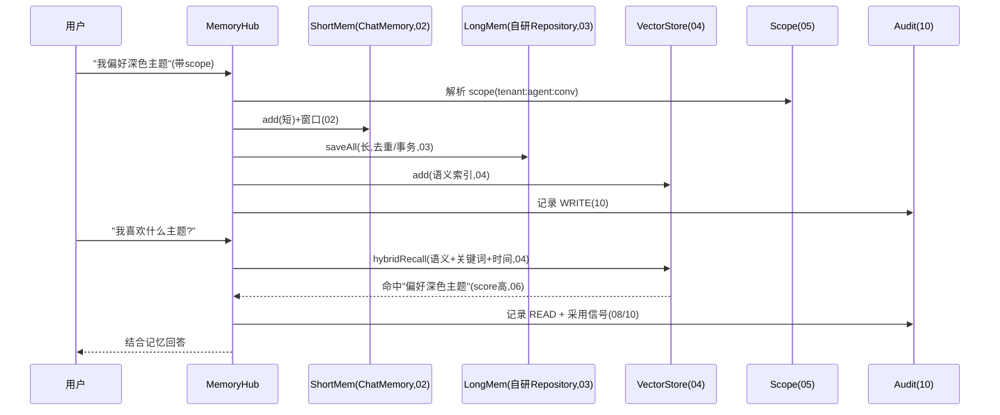

# 11-核心代码讲解

> **定位**：把项目 25 的核心实现串成主线——以**一次「用户说"我偏好深色主题" → 记忆写入 → 后续追问"我喜欢什么主题" → 语义召回命中」**贯穿各迭代关键代码的协作。前置阅读：[01-最小Demo](01-最小Demo.md) 至 [10-记忆审计与缓存提速](10-记忆审计与缓存提速.md) 全部。
>
> **铁律 0**：`ChatMemory`/`ChatMemoryRepository` 实证基座；持久化/召回/治理为「概念代码」。

---

## 一、记忆写入 + 后续召回的完整旅程



## 二、三层记忆的读写编排（串联各迭代）

```java
// 概念代码：MemoryHub 编排入口
@Component
public class MemoryHub {
    public Mono<MemoryPacket> recall(MemoryScope scope, String query, int tokenBudget) {
        return Mono.deferContextual(ctx -> {
            enforceScope(scope);                                     // 05 作用域强制
            return cachedRecall(scope, query, tokenBudget)           // 10 缓存 + 04 混合
                .doOnEach(sig -> audit.record(scope, sig))           // 10 审计
                .doOnNext(pkt -> trackUsage(scope, pkt));            // 08 采用信号
        });
    }
    public Mono<Void> remember(MemoryScope scope, Message m) {
        return Mono.fromRunnable(() -> {
            enforceScope(scope);
            shortWin.add(scope.conversationId(), m);                 // 02 短+窗口
            longStore.saveAll(scope.conversationId(), List.of(m));   // 03 长(去重/事务)
            vectorStore.add(document(m, scope));                     // 04 语义索引
            audit.record(scope, WRITE);                              // 10 审计
        });
    }
}
```

**设计意图**：每迭代是可组合环节——scope 管隔离、短窗管窗口、长存管持久化、向量管语义召回、缓存管性能、审计管可观测、飞轮管质量。

## 三、分层职责（读代码抓手）

| 类 | 迭代 | 职责 |
|----|------|------|
| `MemoryScope` | 05/09 | 作用域 + 可见域隔离 |
| `WorkMemoryWindow` | 02 | 短记忆窗口管理 |
| `JdbcSemanticMemoryRepository` | 03 | 长期持久化(去重/事务) |
| `HybridRetriever` | 04 | 语义+关键词+时间 RRf |
| `MemoryEvolver` | 06 | score 演化衰减 + 冲突消解 |
| `ComplianceEraser` | 07 | 遗忘权全链路删除 |
| `MemoryMiner` | 08 | 对话沉淀可复用记忆 |
| `AuditStream`/`RecallCache` | 10 | 审计 + 缓存 |

## 四、最容易踩的三个坑

1. **纯向量召回，忽略精确/时间** → 用户 ID/新近记忆召回不准。**解法**：混合检索（04）。
2. **忘配 scope** → 跨租户记忆泄漏。**解法**：Fail-closed 强制 scope（05）。
3. **删记忆只删库不留向量** → 合规漏洞（向量残留）。**解法**：级联同事务删除（07）。

## 五、验收自测（对照 00 量化指标）

| 指标 | 目标 | 实现 |
|------|------|------|
| 三层写读一致 | 全层 | 01/02/03 |
| 语义召回命中 | ≥85% | 04 混合 |
| 隔离不漏读 | 100% | 05 |
| 遗忘权全清 | 全链路 | 07 |
| 预算召回 | 不爆窗 | 07 |

> **下一步**：代码串讲完成。12-ADR 记录本项目关键决策；13-前沿做业界对照与演进方向。
