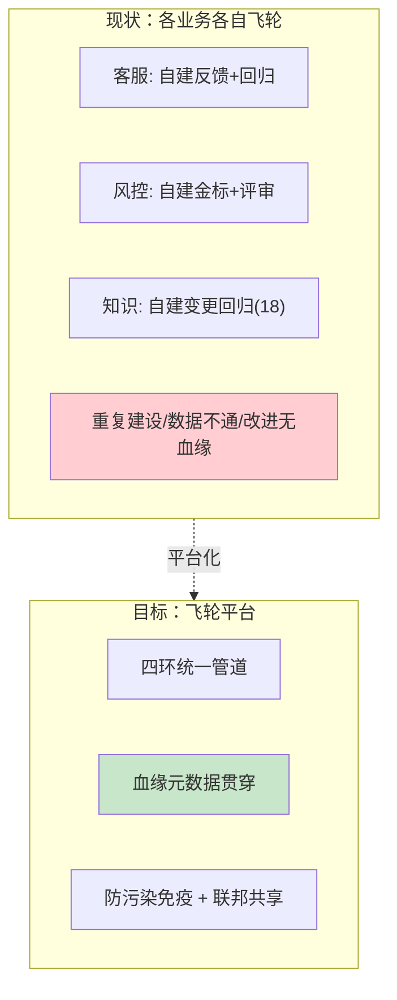
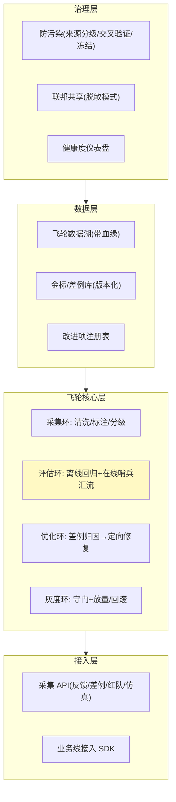

# 00-需求分析与架构设计：企业级 Agent 数据飞轮平台

> **定位**：第十五旗舰·**飞轮收束视角**——第一性原理：**飞轮 = 采集→评估→优化→灰度 四环咬合的齿轮组 + 免疫系统**。集团内知识（18）、评测（19）、仿真（21）各业务各有一条"改进循环"，烟囱式分散：反馈散落、金标重复建、优化无血缘、灰度各自搞。本平台把飞轮做成**统一基础设施**：四环管道、血缘元数据贯穿、防污染免疫（来源分级/交叉验证/异常冻结）、多业务线联邦（自治+脱敏共享）、飞轮健康度仪表盘。读者画像：要回答"企业多个 Agent 业务怎么合成一个越跑越快的改进引擎"的架构师。前置阅读：[教程 53-企业级数据飞轮闭环]、[教程 41-数据飞轮与持续改进]、[教程 29-灰度发布与版本管理]。
>
> **铁律 0**：基座=实证 Observation（数据采集）+ `entity()`（结构化判分）；飞轮管道/血缘/防污染/联邦为自研「概念代码」。收束 18/19/21 项目的飞轮能力但不依赖它们（项目独立性铁律）。

---

## ★ 阅读顺序总览（序号 = 阅读顺序）

> 本子文件夹 14 个文件（00-13）：

| 阶段 | 文件 | 读者定位 |
|------|------|---------|
| ① 全貌 | 00-需求分析与架构设计 | **先读**：飞轮平台四层架构 |
| ② 起步 | 01-最小Demo | **动手**：单业务四环最小闭环 |
| ③ 主体迭代 | 02~07（采集管道/血缘/评估汇流/优化归因/灰度联动/防污染） | **严格顺序** |
| ④ 进阶 | 08~10（联邦飞轮/健康度仪表盘/飞轮加速） | **严格顺序** |
| ⑤ 讲解 | 11-核心代码讲解 | **回顾** |
| ⑥ 资产 | 12-ADR / 13-前沿 | **按需/收官** |

---

## 一、为什么飞轮要做成平台

**三个核心论点**：

1. **飞轮是齿轮组**：单环优化（只改 Prompt 或只攒数据）不是飞轮——四环咬合才转（呼应 [53](../../教程/53-企业级数据飞轮闭环.md)）。
2. **血缘是归因钥匙**：数据带版本血缘（agent/prompt/kb version），差例才能定位到"哪层的变更引入的"。
3. **防污染是免疫系统**：恶意反馈/标注投毒会带偏整个飞轮——没有免疫的飞轮越转越歪。

## 二、总体架构（四层）

## 三、微服务清单与迭代路线

| 服务 | 职责 | 落地 |
|------|------|------|
| `flywheel-collect` | 采集环（清洗/标注/分级） | 迭代 2 |
| `flywheel-eval` | 评估汇流（离线+在线） | 迭代 4 |
| `flywheel-optimize` | 优化归因与改进项 | 迭代 5 |
| `flywheel-release` | 灰度联动 | 迭代 6 |
| `flywheel-gov` | 防污染/联邦/健康度 | 迭代 7 + 进阶 |

**迭代路线**（每迭代回答四问）：

| # | 迭代 | 核心新增 | 痛点回应 |
|---|------|---------|---------|
| 01-最小Demo | 单业务四环最小闭环 | 起点 |
| 02 | 采集管道（多源接入/清洗/标注） | 反馈散落 |
| 03 | 血缘元数据贯穿 | 差例无法归因到层 |
| 04 | 评估汇流（离线回归+在线哨兵） | 评估各自搞 |
| 05 | 优化归因（差例→层→定向修复项） | 改进盲目 |
| 06 | 灰度联动（改进项守门放量） | 改进=赌博 |
| 07 | 防污染免疫（三层防御） | 投毒带偏飞轮 |
| 进阶08 | 多业务联邦飞轮 | 数据孤岛/重复建设 |
| 进阶09 | 飞轮健康度仪表盘 | 飞轮停转不可见 |
| 进阶10 | 飞轮加速（主动采集/仿真前置） | 被动等差例太慢 |

**量化验收**：①差例→修复上线转化率 ≥ 30%②周期时长（发现→上线）P50 ≤ 7 天 ③改进引入回归率 ≤ 5%（灰度拦下）④标注污染检出率 ≥ 95% ⑤血缘覆盖 100%（数据可归因到层）。

---

## 四、与教程/附录的映射

| 本平台能力 | 教程 | 附录/项目 |
|-----------|------|-----------|
| 飞轮四环理论 | [53-企业级数据飞轮闭环](../../教程/53-企业级数据飞轮闭环.md) | [41-数据飞轮](../../教程/41-数据飞轮与持续改进.md) |
| 评估汇流 | [37-评估](../../教程/37-自我反思与Agent评估.md) | [12-评估生态](../../附录/12-评估与可观测生态/00-Langfuse与Ragas集成.md)、[19-评测平台](../../项目/19-企业级Agent信任与评测平台/00-需求分析与架构设计.md) |
| 灰度守门 | [29-灰度发布](../../教程/29-灰度发布与版本管理.md) | [23-灰度回滚](../../项目/23-企业级Agent意图路由网关/06-路由灰度与秒级回滚.md) |
| 采集基座 | [22-可观测](../../教程/22-全链路可观测性.md) | [18-Observation](../../附录/18-Observation/00-Observation全景与核心概念.md) |
| 知识回归 | — | [18-知识变更回归](../../项目/18-企业级Agent数据与知识中枢/09-知识变更回归与飞轮.md) |
| 仿真前置 | — | [21-仿真平台](../../项目/21-企业级Agent仿真与数字孪生平台/00-需求分析与架构设计.md) |

> **铁律提醒**：采集基座用实证 Observation/entity；飞轮管道自研「概念代码」。收束 18/19/21 的飞轮思想但保持项目独立（不互为前置）。
