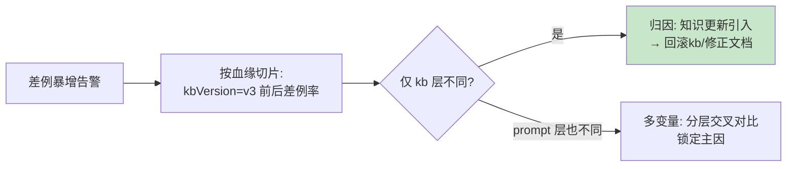

# 03-血缘元数据贯穿

> **定位**：飞轮的**归因钥匙**——每条数据带版本血缘，差例能定位到"哪层的变更引入"。核心：**① 血缘模型（agent/prompt/kb/rule/model 五层版本）② 血缘自动采集（执行时快照）③ 血缘查询（按版本切片对比）**。呼应 [30-归因](../../项目/30-企业级Agent可解释与透明平台/03-证据归因引擎.md)、[18-知识血缘](../../项目/18-企业级Agent数据与知识中枢/04-知识质量与血缘治理.md)。前置阅读：[02-采集管道与多源接入](02-采集管道与多源接入.md)。
>
> **铁律 0**：血缘模型/查询自研「概念代码」；版本快照来自配置中心（呼应 23-10）。

---

## 一、四问

| 问 | 答 |
|----|----|
| **新增了什么需求** | ①血缘五层模型（agent/prompt/kb/rule/model version）②执行时自动快照（每条数据带产生它的全版本组合）③血缘切片查询（"kbVersion=v3 后差例率对比"） |
| **影响了哪些模块** | 采集 → 强制血缘；新增 LineageStore + 切片查询 |
| **架构如何演进** | 数据从"裸样本"演进为"带版本坐标的可归因数据" |
| **上一版痛点** | 差例暴增但不知道是 kb 更新还是 Prompt 变更引入——改进无的放矢 |

**本迭代验收**：①新数据 100% 带五层血缘（00 验收⑤）②"v3 后差例率"切片可查 ③版本组合对比定位引入层。

### 一.1 本节核对（四问与迭代验收）

| # | 核对项 | 判据 |
|---|--------|------|
| 1 | 四问口径齐全 | 新增需求/影响模块/架构演进/上一版痛点四行均有且自洽（裸样本→带版本坐标可归因数据） |
| 2 | 三项验收可判定 | 五层血缘 100%/切片可查/版本组合对比定位——均可观察 |

## 二、血缘五层模型

```java
// 概念代码：数据血缘坐标
public record Lineage(String agentVersion, String promptVersion,
                      String kbVersion, String ruleVersion, String modelVersion) {
    // 每条飞轮数据/每次执行都带这个坐标——差例归因 = 坐标对比
    public List<String> diffFrom(Lineage other) { /* 返回不同的层名 */ }
}
// 采集/执行时自动快照(不可缺省——缺血缘数据降级为只读样本,不进优化环)
```

### 二.1 本节测试与验证（五层血缘模型）

**前置条件**：`Lineage` 记录 + LineageStore + 采集快照逻辑可编译运行；带版本坐标的样例数据就绪。

**步骤与断言**：

| # | 操作 | 预期（PASS 判据） |
|---|------|------------------|
| 1 | 提交一条新差例（采集管线） | 快照补全五层坐标（agent/prompt/kb/rule/model），`Lineage` 五字段均非空 |
| 2 | 对比两个只有 kb 不同的 Lineage | `diffFrom` 返回仅 `kb` 一层（归因定位到知识层） |
| 3 | 构造无血缘数据进入优化环 | 被降级为只读样本，不进 `FixSuggester`/优化环 |
| 4 | 查询"kbVersion=v3 前后"差例率 | 切片查询返回可对比的前后差例率 |

**失败排查**：①快照缺层→采集端未在写库前补全 Lineage；②`diffFrom` 返回多空层→版本字段比较逻辑有误；③缺血缘仍进优化环→优化环未做血缘前置拦截。

## 三、血缘切片归因



**价值**：血缘把"效果变差"从玄学变成**坐标对比**——五层中哪层变了 + 切片差例率对比 = 定位引入层（呼应 [30-分层归因](../../项目/30-企业级Agent可解释与透明平台/03-证据归因引擎.md)）。

### 三.1 本节核对（血缘切片归因）

| # | 核对项 | 判据 |
|---|--------|------|
| 1 | 归因闭环 | "差例暴增→按血缘切片→单层变化即定位、多层变化则交叉对比"的判定树与 §三 图一致 |
| 2 | 案例可复述 | 能举一个"kb 更新引入回归被血缘定位"的落点（对应 §二.1 步骤 2 的 `diffFrom` 仅 kb 层场景） |

## 四、全篇回归验证

> 回归断言在 §二.1（血缘模型）通过后，收尾验收迭代四项：

| # | 操作 | 预期（PASS 判据） |
|---|------|------------------|
| 1 | 新差例入湖 | 五层血缘齐 |
| 2 | 查 kb v3 切片 | 前后差例率可对比 |
| 3 | 双层变更 | 交叉对比定位主因 |
| 4 | 缺血缘数据 | 降级只读，不进优化环 |

**回归失败排查**：任一步 FAIL 按 §二.1 对应排查项回溯（快照补全 / diffFrom / 血缘前置拦截）。

> **下一步**：数据可归因了，但**评估还是各业务自己跑**。04 迭代做**评估汇流**——离线回归+在线哨兵统一到飞轮平台。
