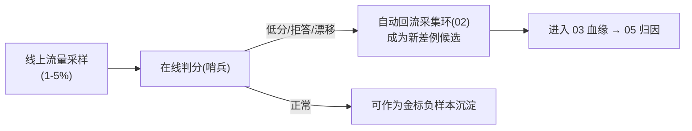

# 04-评估汇流与回归门禁

> **定位**：把**评估环**统一到飞轮平台——**① 离线回归（改进项必须过新旧对比）② 在线哨兵（线上效果滑坡监测）③ 回归门禁（不过门禁不进灰度）**。呼应 [19-离线流水线/在线哨兵](../../项目/19-企业级Agent信任与评测平台/03-离线评估流水线.md)、[12-附录评估生态](../../附录/12-评估与可观测生态/00-Langfuse与Ragas集成.md)。前置阅读：[03-血缘元数据贯穿](03-血缘元数据贯穿.md)。
>
> **铁律 0**：判分用实证 `entity()`/官方 Evaluator 思想；汇流门禁自研「概念代码」。

---

## 一、四问

| 问 | 答 |
|----|----|
| **新增了什么需求** | ①改进项离线回归（差例集修复 + 金标不回归双卡）②在线哨兵汇流（采样判分/漂移信号接入飞轮）③门禁编排（任何改进项 → 必过评估 → 才进 06 灰度） |
| **影响了哪些模块** | 新增 EvalPipeline（离线）+ SentryHub（在线）+ GateKeeper |
| **架构如何演进** | 评估从"各业务自跑"演进为"平台统一门禁" |
| **上一版痛点** | 改进凭感觉上线；线上滑坡要用户投诉才知道 |

**本迭代验收**：①改进项双卡判定（修复差例 + 金标无回归）②在线低分样本自动回流采集环 ③无门禁通过无法进灰度。

## 二、双卡回归 + 门禁

```java
// 概念代码：改进项评估门禁
public GateVerdict gate(ImprovementItem item) {
    // 卡1: 目标差例集(本改进要修复的) 修复率
    double fixRate = evalOffline(item.patch(), item.targetCases());
    // 卡2: 金标全集(不能引入回归) 通过率
    double goldenPass = evalOffline(item.patch(), golden.all(item.bizLine()));
    boolean pass = fixRate >= FIX_MIN && goldenPass >= baselineGolden - REGRESS_TOL;
    return pass ? GateVerdict.PASSED : GateVerdict.blocked(fixRate, goldenPass);
}
```

## 三、在线哨兵回流



**闭环价值**：线上问题**自动**变飞轮燃料（不靠人肉发现），在线与离线两环咬合（呼应 [19-04 哨兵](../../项目/19-企业级Agent信任与评测平台/04-在线哨兵与漂移告警.md)）。

## 四、验收

| 测试 | 期望 |
|------|------|
| 修复差例+金标不回归 | 门禁 PASSED |
| 金标回归 | BLOCKED（不进灰度） |
| 线上低分样本 | 自动回流为差例 |
| 跳过门禁 | 无法进灰度（流程强制） |

> **下一步**：评估能守门了，但**修复项怎么产生**（差例→哪层→什么修复）还是人工。05 迭代做**优化归因与定向修复**。
