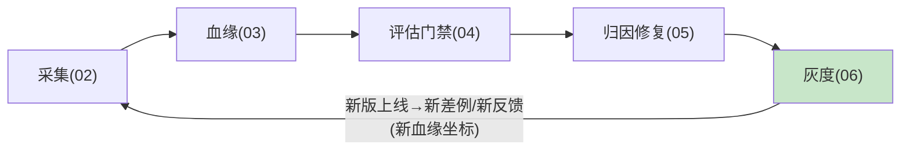

# 06-灰度联动与守门放量

> **定位**：飞轮**第四环**——改进项过门禁后灰度放量/回滚。核心：**① 灰度阶梯（10%→50%→100%）② 放量指标守门（差例率/满意度/成本不恶化）③ 自动回滚联动**。呼应 [29-灰度发布](../../教程/04-企业级架构主干/09-灰度发布与版本管理.md)、[12-AB统计](../../附录/11-评估与可观测生态/03-在线实验与AB统计.md)。前置阅读：[05-优化归因与定向修复](05-优化归因与定向修复.md)。
>
> **铁律 0**：灰度切流/守门自研「概念代码」；统计显著性用附录12 方法。

---

## 一、四问

| 问 | 答 |
|----|----|
| **新增了什么需求** | ①改进项灰度编排（门禁通过→10%起）②放量守门（三指标：差例率/满意度/成本）③自动回滚（恶化即回） |
| **影响了哪些模块** | 新增 ReleaseOrchestrator；对接 04 在线哨兵做放量观测 |
| **架构如何演进** | 四环完整咬合：采集→评估→优化→灰度→新数据回采集 |
| **上一版痛点** | 改进直接全量上线=赌博；出问题手动回滚慢 |

**本迭代验收**：①改进项按阶梯放量 ②任一守门指标恶化自动回滚 ③灰度期数据回流血缘（新版坐标）④回归拦截率支撑 00 验收③（≤5% 上线）。

### 一.1 本节核对（四问与迭代验收）

| # | 核对项 | 判据 |
|---|--------|------|
| 1 | 四问口径齐全 | 新增需求/影响模块/架构演进/上一版痛点四行均有且自洽（四环完整咬合，直接全量上线=赌博） |
| 2 | 四项验收可判定 | 阶梯放量/自动回滚/数据回流带新版血缘/回归拦截率——均可观察 |

## 二、灰度阶梯与守门

```java
// 概念代码：改进项放量编排
public Flux<ReleaseEvent> rollout(ImprovementItem item) {
    return Flux.just(0.10, 0.50, 1.00)
        .concatMap(pct -> traffic.shift(item.releaseId(), pct)          // 切流
            .then(monitor.observeFor(item.releaseId(), WATCH_WINDOW))   // 观测窗口
            .flatMap(verdict -> verdict.healthy()
                ? Mono.just(ReleaseEvent.scaled(pct))                    // 健康→下一阶
                : traffic.rollback(item.releaseId())                     // 恶化→回滚
                    .then(Mono.error(new RolledBack(verdict.reason())))));
}
```

**守门三指标**：差例率（哨兵）不升、满意度（反馈）不降、成本（Usage）不超预算——**任何一项恶化即回滚**，不看平均（呼应 [12-AB 统计](../../附录/11-评估与可观测生态/03-在线实验与AB统计.md) 的显著性纪律）。

### 二.1 本节测试与验证（灰度阶梯与守门）

**前置条件**：`ReleaseOrchestrator` + 流量切流 + 哨兵观测可编译运行；改进项样例与三指标信号源就绪。

**步骤与断言**：

| # | 操作 | 预期（PASS 判据） |
|---|------|------------------|
| 1 | 门禁通过的改进项发起 `rollout` | 从 10% 起步，观测窗口健康 → 50% → 100% 逐级 `scaled` |
| 2 | 构造任一守门指标恶化（差例率/满意度/成本） | 在观测期被 `monitor` 发现 → `traffic.rollback` 触发，抛 `RolledBack` 含 reason |
| 3 | 三指标健康到 100% | 放量完成，灰度期数据带新版血缘坐标回流采集 |
| 4 | 统计回归拦截率 | 恶化被 06 拦下占比支撑 ≤5% 上线（对照 00 验收③，非观察全量） |

**失败排查**：①怎么恶化都不回滚→`monitor` 的观测窗口/阈值未生效或 verdict 判定方向错；②一步上 100%→`concatMap` 阶梯没按 0.10/0.50/1.00 串行；③回滚后数据仍带旧血缘→回流量未打新版坐标。

## 三、飞轮完整咬合



### 三.1 本节核对（飞轮完整咬合）

| # | 核对项 | 判据 |
|---|--------|------|
| 1 | 四环闭环线 | 采集(02)→血缘(03)→门禁(04)→归因修复(05)→灰度(06)→回流采集的循环边与 §三 图一致 |
| 2 | 第四环地位 | 能说清 06 是第四环，且"新版上线→新差例回流"让飞轮自转 |

## 四、全篇回归验证

> 回归断言在 §二.1（灰度守门）通过后，收尾验收迭代四项：

| # | 操作 | 预期（PASS 判据） |
|---|------|------------------|
| 1 | 门禁过 → 10% | 阶梯起步 |
| 2 | 差例率恶化 | 自动回滚 + 原因记录 |
| 3 | 三指标健康 | 放量到 100% |
| 4 | 灰度期数据 | 带新版血缘回流 |

**回归失败排查**：任一步 FAIL 按 §二.1 对应排查项回溯（观测阈值 / 阶梯串行 / 回流坐标）。

> **下一步**：四环转起来了，但**飞轮会被投毒**（恶意反馈/标注污染）。07 迭代做**防污染免疫**——飞轮的免疫系统。
