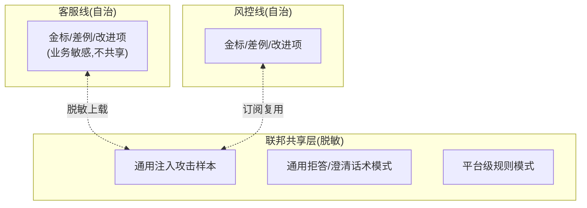

# 08-多业务联邦飞轮

> **定位**：企业级收束——**多业务线飞轮自治 + 联邦共享**。核心：**① 业务线自治（各自金标/差例/节奏）② 脱敏模式共享（注入样本/通用模式跨线复用）③ 联邦治理（共享准入/贡献度量）**。呼应 [教程 53 §4](../../教程/53-企业级数据飞轮闭环.md)、[26-多租户](../../教程/26-多租户隔离与资源治理.md)、[27-联邦](../../项目/27-企业级Agent协作平台/09-跨组织协作与联邦.md)。前置阅读：[07-防污染与标注免疫](07-防污染与标注免疫.md)。
>
> **铁律 0**：联邦机制自研「概念代码」；共享数据强制脱敏（呼应 25-PII）。

---

## 一、四问

| 问 | 答 |
|----|----|
| **新增了什么需求** | ①业务线命名空间（数据/金标/改进项按线隔离）②共享模式库（脱敏后的通用差例/攻击样本/话术模式）③贡献度量（各线贡献/消费统计） |
| **影响了哪些模块** | 数据湖 → 命名空间；新增 SharedPatternLibrary + 联邦治理 |
| **架构如何演进** | 从"单业务飞轮"演进为"联邦飞轮网络" |
| **上一版痛点** | 各线重复发现同类问题（同一注入攻击客服线踩完风控线再踩）；敏感数据不敢共享 |

**本迭代验收**：①跨线数据默认不可见 ②脱敏模式可跨线复用（新线免踩已知坑）③共享准入与贡献可度量。

## 二、自治 + 共享的边界

**原则**：**业务数据（会话/业务事实）永不跨线**；**通用模式（攻击样本/话术模式）脱敏后共享**——新业务线订阅共享库即可免疫已知攻击（飞轮价值的跨线复利）。

## 三、共享准入与贡献度量

- **准入**：上载模式须脱敏校验（PII 扫描）+ 抽样人审（防借共享投毒——07 免疫的联邦延伸）。
- **贡献度量**：各线"上载模式数 / 被他线消费数"统计——**贡献多的业务线获得更高共享配额**（生态激励，呼应 [27-市场](../../项目/27-企业级Agent协作平台/10-协作市场与生态.md)）。

## 四、验收

| 测试 | 期望 |
|------|------|
| 跨线查原始数据 | 拒绝（命名空间隔离） |
| 上载含 PII | 脱敏校验拦截 |
| 新线订阅共享库 | 免疫已知注入攻击 |
| 贡献统计 | 各线上载/消费可查 |

> **下一步**：联邦飞轮成形了，但**飞轮转没转、转多快**不可见。09 进阶做**飞轮健康度仪表盘**。
