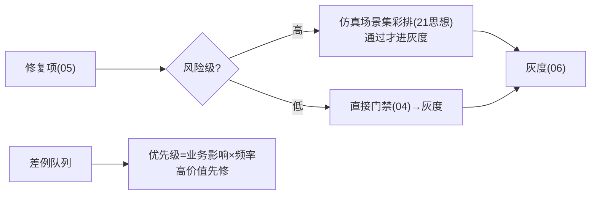

# 10-飞轮加速与主动采集

> **定位**：从"被动等差例"升级为**主动找问题**——**① 主动采集（定向探针：低置信/边缘场景主动试探）② 仿真前置（改进先仿真再灰度）③ 优先级调度（高价值差例优先修）**。呼应 [21-仿真平台](../../项目/21-企业级Agent仿真与数字孪生平台/00-需求分析与架构设计.md)、[19-攻防自博弈](../../项目/19-企业级Agent信任与评测平台/09-攻防自博弈与自动修复.md)。前置阅读：[09-飞轮健康度仪表盘](09-飞轮健康度仪表盘.md)。
>
> **铁律 0**：探针/调度自研「概念代码」；试探用实证 ChatClient。

---

## 一、四问

| 问 | 答 |
|----|----|
| **新增了什么需求** | ①定向探针（对低置信/新意图/边缘场景主动生成试探请求）②仿真前置（改进项灰度前先跑仿真场景集）③修复优先级（业务影响×频率排序） |
| **影响了哪些模块** | 采集环 → 主动源；04 门禁 → 前置仿真卡；新增 探针与调度器 |
| **架构如何演进** | 飞轮从"被动响应"演进为"主动巡检+定向加速" |
| **上一版痛点** | 等用户踩坑才发现问题；高频差例与低频差例同队修复 |

**本迭代验收**：①探针提前发现潜在差例（上线前拦截）②高风险改进先过仿真场景 ③高影响差例优先出队。

## 二、主动探针（定向找问题）

```java
// 概念代码：低置信场景主动试探
public Flux<ProbeFinding> probe(ProbeTarget target) {
    return Flux.fromIterable(generateEdgeQueries(target))   // 低置信/新意图边缘 query 生成
        .flatMap(q -> agent.ask(q).map(a -> ProbeFinding.of(q, a, scorer.score(a))))
        .filter(f -> f.score() < SUSPECT_THRESHOLD);        // 可疑结果 → 转差例候选(入02管道)
}
```

**价值**：不等用户踩坑——上线前/巡检中对**边缘场景**主动试探，可疑结果进入飞轮（呼应 [19-自博弈](../../项目/19-企业级Agent信任与评测平台/09-攻防自博弈与自动修复.md) 的主动攻防思想）。

## 三、仿真前置 + 优先级



## 四、验收

| 测试 | 期望 |
|------|------|
| 探针跑边缘场景 | 可疑结果转差例 |
| 高风险修复 | 先仿真再灰度 |
| 高影响差例 | 优先出队修复 |
| 周期 | 高优先级周期显著缩短 |

> **下一步**：10 个迭代/进阶让飞轮平台完整：四环管道/血缘/门禁/归因修复/灰度/免疫/联邦/健康度/加速。下一步进 **11-核心代码讲解**；随后 12-ADR、13-前沿收官。
