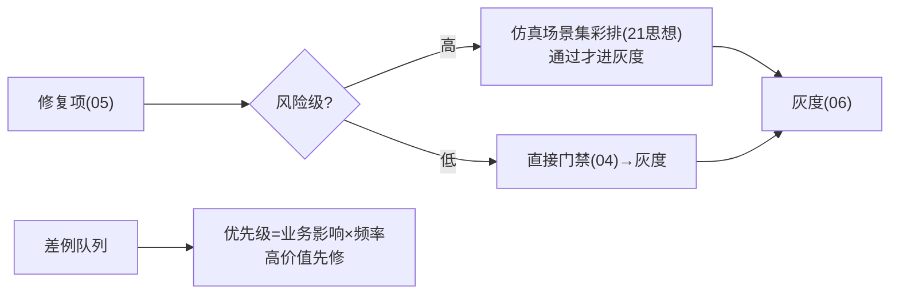

# 10-飞轮加速与主动采集

> **定位**：从"被动等差例"升级为**主动找问题**——**① 主动采集（定向探针：低置信/边缘场景主动试探）② 仿真前置（改进先仿真再灰度）③ 优先级调度（高价值差例优先修）**。呼应 [21-仿真平台](../../项目/21-企业级Agent仿真与数字孪生平台/00-需求分析与架构设计.md)、[19-攻防自博弈](../../项目/19-企业级Agent信任与评测平台/09-攻防自博弈与自动修复.md)。前置阅读：[09-飞轮健康度仪表盘](09-飞轮健康度仪表盘.md)。
>
> **铁律 0**：探针/调度自研「概念代码」；试探用实证 ChatClient。

---

## 一、四问

| 问 | 答 |
|----|----|
| **新增了什么需求** | ①定向探针（对低置信/新意图/边缘场景主动生成试探请求）②仿真前置（改进项灰度前先跑仿真场景集）③修复优先级（业务影响×频率排序） |
| **影响了哪些模块** | 采集环 → 主动源；04 门禁 → 前置仿真卡；新增 探针与调度器 |
| **架构如何演进** | 飞轮从"被动响应"演进为"主动巡检+定向加速" |
| **上一版痛点** | 等用户踩坑才发现问题；高频差例与低频差例同队修复 |

**本迭代验收**：①探针提前发现潜在差例（上线前拦截）②高风险改进先过仿真场景 ③高影响差例优先出队。

### 一.1 本节核对（四问与迭代验收）

| # | 核对项 | 判据 |
|---|--------|------|
| 1 | 四问口径齐全 | 新增需求/影响模块/架构演进/上一版痛点四行均有且自洽（被动响应→主动巡检+定向加速） |
| 2 | 三项验收可判定 | 探针提前拦截/高风险先仿真/高影响优先出队——均可观察 |

## 二、主动探针（定向找问题）

```java
// 概念代码：低置信场景主动试探
public Flux<ProbeFinding> probe(ProbeTarget target) {
    return Flux.fromIterable(generateEdgeQueries(target))   // 低置信/新意图边缘 query 生成
        .flatMap(q -> agent.ask(q).map(a -> ProbeFinding.of(q, a, scorer.score(a))))
        .filter(f -> f.score() < SUSPECT_THRESHOLD);        // 可疑结果 → 转差例候选(入02管道)
}
```

**价值**：不等用户踩坑——上线前/巡检中对**边缘场景**主动试探，可疑结果进入飞轮（呼应 [19-自博弈](../../项目/19-企业级Agent信任与评测平台/09-攻防自博弈与自动修复.md) 的主动攻防思想）。

### 二.1 本节测试与验证（主动探针）

**前置条件**：探针（边缘 query 生成 + 实证 ChatClient 试探 + `scorer` 打分）可编译运行；低置信/边缘场景目标可配置。

**步骤与断言**：

| # | 操作 | 预期（PASS 判据） |
|---|------|------------------|
| 1 | 对低置信/新意图生成探针 query 集 | `probe` 逐个试探，返回 ProbeFinding（query+answer+score） |
| 2 | 构造 score < SUSPECT_THRESHOLD 的可疑结果 | 被 `.filter` 拦下 → 转差例候选进入 02 采集管道 |
| 3 | 全为高分场景 | 无可疑结果，不产生无谓差例（探针消耗可控） |

**失败排查**：①无任何探针差例→`generateEdgeQueries` 未覆盖边缘场景或 SUSPECT_THRESHOLD 过严；②所有模糊答案都进飞轮→`scorer.score` 未接实证判分；③探针 token 消耗失控→目标集合未定向。

## 三、仿真前置 + 优先级



### 三.1 本节核对（仿真前置与优先级）

| # | 核对项 | 判据 |
|---|--------|------|
| 1 | 分流逻辑 | 高风险改进"仿真彩排后才进灰度"、低风险"直接门禁→灰度"两条支路与 §三 图一致 |
| 2 | 优先级公式 | 能说清"优先级=业务影响×频率，高价值先修"的调度含义 |

## 四、全篇回归验证

> 回归断言在 §二.1（主动探针）通过后，收尾验收迭代四项：

| # | 操作 | 预期（PASS 判据） |
|---|------|------------------|
| 1 | 探针跑边缘场景 | 可疑结果转差例 |
| 2 | 高风险修复 | 先仿真再灰度 |
| 3 | 高影响差例 | 优先出队修复 |
| 4 | 周期 | 高优先级周期显著缩短 |

**回归失败排查**：任一步 FAIL 按 §二.1/§三.1 对应排查项回溯（探针召回 / 仿真分流 / 优先级调度）。

> **下一步**：10 个迭代/进阶让飞轮平台完整：四环管道/血缘/门禁/归因修复/灰度/免疫/联邦/健康度/加速。下一步进 **11-核心代码讲解**；随后 12-ADR、13-前沿收官。
