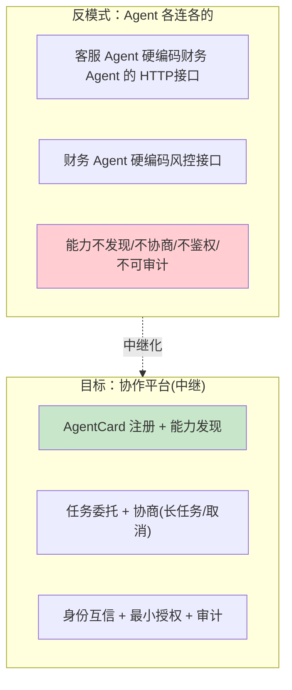
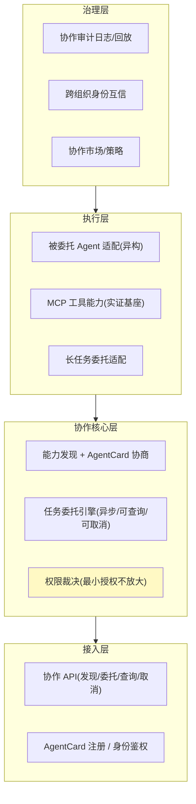

# 00-需求分析与架构设计：企业级 Agent 协作平台

> **定位**：第十三旗舰·**协作互操作视角**——第一性原理：**协作 = 跨信任域的能力发现 + 可控委托 + 可审计**。企业内不同团队、不同厂商构建的异构 Agent（客服/财务/法务/风控…）要"能安全地把活委托给对方做"，不能靠硬编码对方接口。本平台作为**协作中继**：AgentCard 注册与能力发现、任务委托与协商（支持异步长任务/取消）、身份互信 + 最小授权（委托不放大）+ 注入边界、协作全链路可观测与失败补偿、跨组织市场。读者画像：要回答"异构 Agent 怎么在受控、可审计前提下跨团队协作"的架构师。前置阅读：[教程 09-前沿专题/08-Agent间协作协议工程化]、[教程 00-基础与核心/09-多Agent协作]、[前沿 00-A2A协议]。
>
> **铁律 0**：A2A/AgentCard 为开放协议，**本机无官方 Java SDK**（find a2a 空），适配层全部标「概念代码」；基座用已验证 MCP 2.0 SDK（`io.modelcontextprotocol.sdk.mcp` 2.0.0 jar 实证）+ `ChatClient`/WebFlux + 自研协议层。呼应项目 16 网格 A2A 篇的实证结论。

---

## ★ 阅读顺序总览（序号 = 阅读顺序）

> 本子文件夹 14 个文件（00-13）：

| 阶段 | 文件 | 读者定位 |
|------|------|---------|
| ① 全貌 | 00-需求分析与架构设计 | **先读**：协作平台四层架构 |
| ② 起步 | 01-最小Demo | **动手**：两 Agent 最小委托协作 |
| ③ 主体迭代 | 02~07（AgentCard/能力发现/任务委托/身份互信/最小授权/失败补偿） | **严格顺序** |
| ④ 进阶 | 08~10（协作可观测/跨组织协作/协作市场） | **严格顺序** |
| ⑤ 讲解 | 11-核心代码讲解 | **回顾** |
| ⑥ 资产 | 12-ADR / 13-前沿 | **按需/收官** |

---

## 一、为什么需要独立的协作中继

**三个核心论点**：

1. **协作要"发现"而非"硬编码"**：Agent 通过 AgentCard 声明能力，协作方查询注册表按能力匹配（呼应 [03-MCP网关](../../项目/03-MCP工具网关/00-需求分析与架构设计.md) 的注册思想、[前沿 00-A2A](../../前沿/00-A2A协议.md)）。
2. **协作要"委托 + 协商"**：把任务委托出去并在执行前协商"能做什么/成本/时长"，支持异步长任务与取消（呼应 [教程 05-Observation可观测/07-指标治理：Token计量、SLO与基数熔断](../../教程/08-架构师进阶/06-长任务持久化与中断恢复.md)、[24-长任务引擎](../../项目/24-企业级长任务工作流引擎/00-需求分析与架构设计.md)）。
3. **协作要"安全 + 可审计"**：身份互信、最小授权（委托不放大）、注入边界——协作是跨信任域，不安全等于放大攻击面（呼应 [31-安全](../../教程/04-企业级架构主干/11-安全与权限控制.md)、[08-安全网关](../../项目/08-Agent供应链安全网关/00-需求分析与架构设计.md)）。

### 一.1 本节核对（协作第一性论点）

| # | 核对项 | 判据 |
|---|--------|------|
| 1 | 三个核心论点齐全 | 发现/委托协商/安全可审计三条均落笔，且每条都给出"反例"（硬编码/事后才知道/放大攻击面）作对照 |
| 2 | 反模式 vs 目标的对照成立 | Mermaid 中反模式框（硬编码/不发现/不审计）与目标框（中继化）一一对应 |

## 二、总体架构（四层）

### 二.1 本节核对（四层架构）

| # | 核对项 | 判据 |
|---|--------|------|
| 1 | 四层各含职责且治理层在底 | 接入/协作核心/执行/治理四层齐全，依赖方向 `l1→l2→l3→l4`（治理在最底承托）与正文一致 |
| 2 | 关键框映射迭代 | 接入层(A1/A2)→迭代01/05、委托引擎(C2)→03/04、权限裁决(C3)→05、审计(G1)→08，每框都能落到后续某篇 |

## 三、微服务清单与迭代路线

| 服务 | 职责 | 落地 |
|------|------|------|
| `collab-registry` | AgentCard 注册 + 能力发现 | 迭代 2 |
| `collab-mediator` | 任务委托 + 协商（核心） | 迭代 3/4 |
| `collab-security` | 身份互信 + 最小授权 + 注入边界 | 迭代 5 |
| `collab-obs` | 审计/回放/失败补偿 | 迭代 6-7 + 进阶 |

**迭代路线**（每迭代回答四问）：

| # | 迭代 | 核心新增 | 痛点回应 |
|---|------|---------|---------|
| 01-最小Demo | 两 Agent 最小委托协作 | 起点 |
| 02 | AgentCard 注册 + 能力发现 | Agent 无法被找到 |
| 03 | 任务委托 + 协商(异步长任务) | 委托后才知道做不了/太贵 |
| 04 | 委托执行 + 进度/取消 | 长任务不可控 |
| 05 | 身份互信 + 最小授权 | 跨域不可信裸奔 |
| 06 | 注入边界 + 结果校验 | 跨域返回危险 |
| 07 | 协作失败补偿 + 降级链 | 协作失败无退路 |
| 进阶08 | 协作全链路可观测/审计 | 协作黑盒 |
| 进阶09 | 跨组织身份互信 + 联邦 | 跨团队/跨公司 |
| 进阶10 | 协作市场/策略市场 | 协作规模化复用 |

**量化验收**：①能力发现 top 匹配正确率 ≥ 95% ②最小授权下"委托不放大"校验 100% ③跨域协作注入尝试 100% 被拦 ④协作失败可降级（不中断业务）⑤协作全链路可审计回放 ≤5s。

### 三.1 本节核对（微服务清单与迭代路线）

| # | 核对项 | 判据 |
|---|--------|------|
| 1 | 四问贯穿每迭代 | 路线表中每行都落在某个迭代篇（01-10），无悬空迭代；每个迭代都有"核心新增 + 痛点回应"两列 |
| 2 | 服务↔迭代对应 | 四个服务（registry/mediator/security/obs）落地迭代号与"三、总体架构"关键框映射一致 |
| 3 | 五项量化验收可度量 | 每一条都有可判定数字/比例（≥95% / 100% / ≤5s），非空话；后续迭代篇逐条回溯兑现 |

---

## 四、与教程/附录的映射

| 本平台能力 | 教程 | 附录/项目 |
|-----------|------|-----------|
| A2A/AgentCard 协议 | [97-Agent间协作协议工程化](../../教程/09-前沿专题/08-Agent间协作协议工程化.md) | [00-A2A协议](../../前沿/00-A2A协议.md) |
| 协作安全 | [64-安全与权限控制](../../教程/04-企业级架构主干/11-安全与权限控制.md) | [09-安全深度](../../附录/08-Agent安全深度/00-Prompt注入分类与案例.md) |
| 委托长任务 | [40-长任务持久化](../../教程/08-架构师进阶/06-长任务持久化与中断恢复.md) | [24-长任务引擎](../../项目/24-企业级长任务工作流引擎/00-需求分析与架构设计.md) |
| 注册/发现 | [20-MCP协议](../../教程/02-SpringAI核心机制/01-MCP协议.md) | [03-MCP网关](../../项目/03-MCP工具网关/00-需求分析与架构设计.md) |
| 网格 A2A | — | [16-网格/A2A](../../项目/16-企业级Agent服务网格/10-A2A互操作与策略市场.md) |

### 四.1 本节核对（教程/附录映射）

| # | 核对项 | 判据 |
|---|--------|------|
| 1 | 每能力都能溯源 | 表内每个本平台能力都有对应教程/附录/项目锚点，无"无处学"的能力 |
| 2 | 引用路径有效 | 抽查任一 `../` 相对链接能打开对应文档，未指向不存在的文件 |
| 3 | 铁律 0 遵守 | 全篇 A2A/AgentCard 均标「概念代码」，未作真实 API 断言 |

> **铁律提醒**：A2A/AgentCard 适配层全为「概念代码」（无官方 SDK）；基座用 MCP 2.0 SDK + ChatClient（实证）。任何新 SDK javap 实证后方可写入正文。
