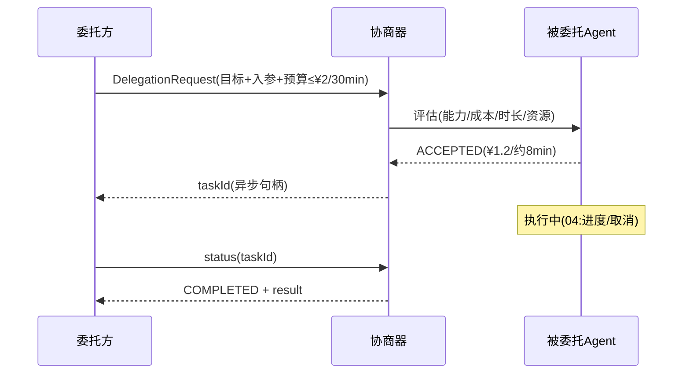

# 03-任务委托与协商

> **定位**：把委托从"同步调用"升级为**先协商后执行的异步任务**。核心：**① 委托请求（目标+入参+期望+预算）② 协商响应（接受/拒绝 + 预计成本/时长）③ 异步任务句柄（可查询）**。呼应 [教程 54 §3](../../教程/54-Agent间协作协议工程化.md)、[24-长任务引擎](../../项目/24-企业级长任务工作流引擎/00-需求分析与架构设计.md)。前置阅读：[02-AgentCard注册与能力发现](02-AgentCard注册与能力发现.md)。
>
> **铁律 0**：委托/协商协议自研「概念代码」；任务状态机承 [24-长任务生命周期](../../项目/24-企业级长任务工作流引擎/02-Actor任务核与任务生命周期.md) 思想。

---

## 一、四问

| 问 | 答 |
|----|----|
| **新增了什么需求** | ①DelegationRequest（目标/入参/期望schema/预算上限）②协商阶段（被委托方回 接受+报价 或 拒绝+原因）③异步任务句柄（taskId + 状态查询） |
| **影响了哪些模块** | CollabMediator → 拆出 Negotiator + DelegationTask；新增任务状态存储 |
| **架构如何演进** | 从"同步 RPC"演进为"协商→异步任务→可查询"两阶段 |
| **上一版痛点** | 同步调用长任务必超时；委托后才知道做不了/超预算 |

**本迭代验收**：①超预算/超能力的委托在协商阶段被拒（不执行）②接受后返回 taskId，可查询状态 ③协商拒绝原因可读（委托方可降级）。

### 一.1 本节核对（四问与迭代验收）

| # | 核对项 | 判据 |
|---|--------|------|
| 1 | 四问口径齐全 | 新增需求/影响模块/架构演进/上一版痛点四行均有；痛点（同步长任务超时/事后才知道超预算）与需求对应 |
| 2 | 本迭代验收可度量 | ①协商拒（不执行）②taskId+状态可查 ③拒绝原因可读，三项均可判定 |

## 二、两阶段：协商 → 异步执行

```java
// 概念代码：协商 + 异步委托
public NegotiationResponse negotiate(DelegationRequest req) {
    AgentCard target = registry.pickOne(req.capability());
    // 被委托方视角评估：能力匹配 / 预算够不够 / 资源(队列)是否可接
    return target.negotiate(req);   // ACCEPTED(estCost,estDuration) | REJECTED(reason)
}

public String delegate(DelegationRequest req, NegotiationResponse ok) {
    String taskId = newTaskId();
    taskStore.save(taskId, DelegationTask.submitted(req, ok));  // 异步任务落库
    executor.submit(taskId, req);                                // 交给执行层(04迭代深化)
    return taskId;                                               // 委托方拿句柄
}
public TaskStatus status(String taskId) { return taskStore.get(taskId).status(); }
```

### 二.1 本节测试与验证（协商与异步委托）

**前置条件**：`Negotiator` / `DelegationTask` / `taskStore` 可编译运行；一个目标 Agent 可对协商请求给出 接受(报价) 或 拒绝(原因)；预算上限可在 `DelegationRequest` 中人工设置。

**材料——协商对案例**（预算上限 vs 目标报价）：

| 测试 | 期望 |
|------|------|
| 预算 ¥0.5 < 报价 ¥1.2 | 协商拒绝，不执行 |
| 能力不匹配 | 协商拒绝（原因可读） |
| 协商通过（报价 ¥1.2 ≤ 预算 ¥2） | 返回 taskId，状态可查 |
| 长任务 8min | 委托方不阻塞，异步拿结果 |

**步骤与断言**：

| # | 操作 | 预期（PASS 判据） |
|---|------|------------------|
| 1 | 提交超预算委托 | 返回 `REJECTED`（含超预算原因），未产生 taskId、未执行 |
| 2 | 提交能力不匹配委托 | 返回 `REJECTED`（原因可读，供委托方降级） |
| 3 | 提交协商通过委托 | 返回 `taskId`；`status(taskId)` 可查到状态（submitted/running...） |
| 4 | 长任务委托期间 `status(taskId)` | 委托方主流程不阻塞，任务在后台执行，稍后查得结果 |

**失败排查**：①超预算仍执行→协商阶段未校验 `req.budget` vs 报价；②通过后拿不到 taskId→`delegate` 未保存任务或未生成句柄；③拒绝原因不可读→`REJECTED(reason)` 未携可读字段。

## 三、协商语义（合同三要素）



**合同三要素**：能做什么（能力+schema）、花多少（预算 vs 报价）、何时交（时长估计）——**协商通过才执行**，避免"执行完才发现超预算"（呼应 [27-成本治理](../../教程/27-成本治理与Token计量.md)、[20-经济平台的授权三闸](../../项目/20-企业级Agent经济与结算平台/02-授权三闸.md)）。

### 三.1 本节核对（协商语义与合同三要素）

| # | 核对项 | 判据 |
|---|--------|------|
| 1 | 合同三要素齐全 | 能做什么/花多少/何时交三条在时序图中均有体现（DELEGATIONREQ 携带 目标+入参+预算，评估返回 报价+时长） |
| 2 | "协商通过才执行"语义贯穿 | 拒绝（`REJECTED`）在 §二.1 中被验证不产生 taskId；合同三要素与 §二 的 `negotiate`/`delegate` 落点一致 |

## 四、全篇回归验证

> §二.1（协商与异步委托）与 §三.1（合同三要素）均通过后的整体验收。

| # | 操作 | 预期（PASS 判据） |
|---|------|------------------|
| 1 | 超预算/能力不匹配各委托一次 | 均在协商阶段被拒，无 taskId、无执行（"协商通过才执行"） |
| 2 | 协商通过委托一次 | 返回 taskId，状态在 submitted→running 间可查 |
| 3 | 长任务委托 + 期间查状态 | 委托方不阻塞，异步最终拿到结果 |

**回归失败排查**：任一步 FAIL 按 §二.1 排查项回溯（预算校验 / 句柄生成 / 拒绝原因可读）；对照 00 验收④「协作失败可降级」。

> **下一步**：异步任务跑起来了，但**执行中怎么看进度、怎么取消**还没做。04 迭代做**委托执行与进度/取消**——长任务委托的可控性。
