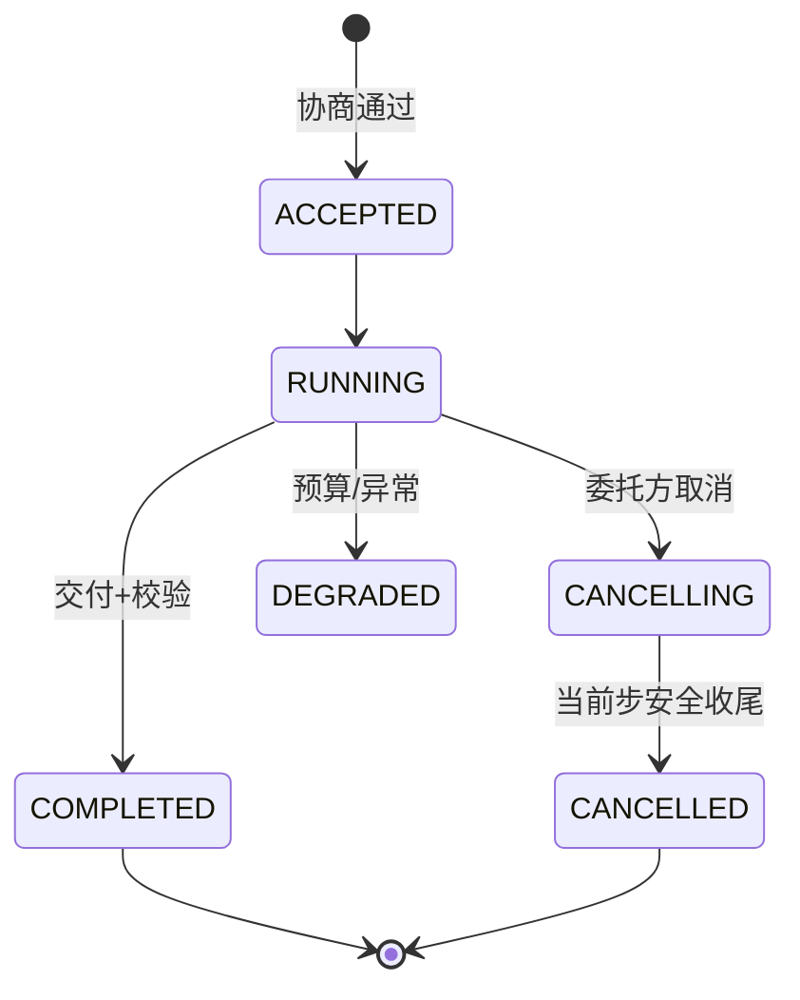

# 04-委托执行与进度取消

> **定位**：让异步委托任务**执行中可控**——**① 进度事件流（委托方可订阅）② 运行中取消（安全收尾，不硬杀）③ 委托方超时与重查语义**。呼应 [24-长任务的可视回放与取消](../../项目/24-企业级长任务工作流引擎/07-工作流可视回放与取消.md)、[22-会话引擎三段取消](../../项目/22-企业级Agent会话引擎/00-需求分析与架构设计.md)。前置阅读：[03-任务委托与协商](03-任务委托与协商.md)。
>
> **铁律 0**：任务事件/取消协议自研「概念代码」（SSE 推送用 WebFlux Flux）；执行基座 `ChatClient`/`@Tool` 实证。

---

## 一、四问

| 问 | 答 |
|----|----|
| **新增了什么需求** | ①进度事件（SSE：STEP/PROGRESS/DEGRADED/COMPLETED）②取消命令（CANCELLING→安全收尾→CANCELLED）③委托方超时语义（超时查询任务状态而非盲目重委托） |
| **影响了哪些模块** | executor → 事件流 + 取消钩子；taskStore → 状态机扩展 |
| **架构如何演进** | 从"提交后黑盒等结果"演进为"进度可见、可取消、可超时重查" |
| **上一版痛点** | 提交后黑盒；无法中途取消；超时后只能盲目重委托（副作用风险） |

**本迭代验收**：①委托方可 SSE 订阅进度 ②运行中取消 → 安全收尾（已发生副作用结果保留）③超时后查询任务真实状态再决策。

## 二、进度事件流（SSE）

```java
// 概念代码：委托任务进度事件（WebFlux SSE 推送）
public sealed interface DelegationEvent permits
        TaskAccepted, StepProgress, TaskDegraded, TaskCompleted, TaskCancelled {
    String taskId(); long ts();
}

// 委托方订阅
@GetMapping(value="/delegations/{id}/events", produces=MediaType.TEXT_EVENT_STREAM_VALUE)
public Flux<ServerSentEvent<DelegationEvent>> events(@PathVariable String id) {
    return eventBus.subscribe(id);      // Flux 推送(进度/降级/完成)
}
```

## 三、运行中取消（三段语义，承 24）



**取消纪律**（承 [24-07](../../项目/24-企业级长任务工作流引擎/07-工作流可视回放与取消.md)）：标记 CANCELLING → 当前工具步安全收尾（已发生的副作用结果保留并注明）→ 未开始步骤 SKIPPED → CANCELLED。**不硬杀正在执行副作用的步骤**。

## 四、超时语义

超时 ≠ 失败。委托方等不到结果时：先 `status(taskId)` 查真实状态——可能仍在跑（延长等待）也可能已完成（取结果），**绝不盲目重委托**（防重复副作用，呼应 [24-幂等](../../项目/24-企业级长任务工作流引擎/03-幂等重试与副作用登记.md)）。

## 五、验收

| 测试 | 期望 |
|------|------|
| SSE 订阅 | 实时收到进度事件 |
| 运行中取消 | 安全收尾 → CANCELLED（副作用结果保留） |
| 委托方超时 | 先查状态再决策 |
| 降级事件 | 委托方及时感知 |

> **下一步**：委托可控了，但**谁都能委托任何 Agent**——裸奔。05 迭代做**身份互信与最小授权**——协作安全的根基。
