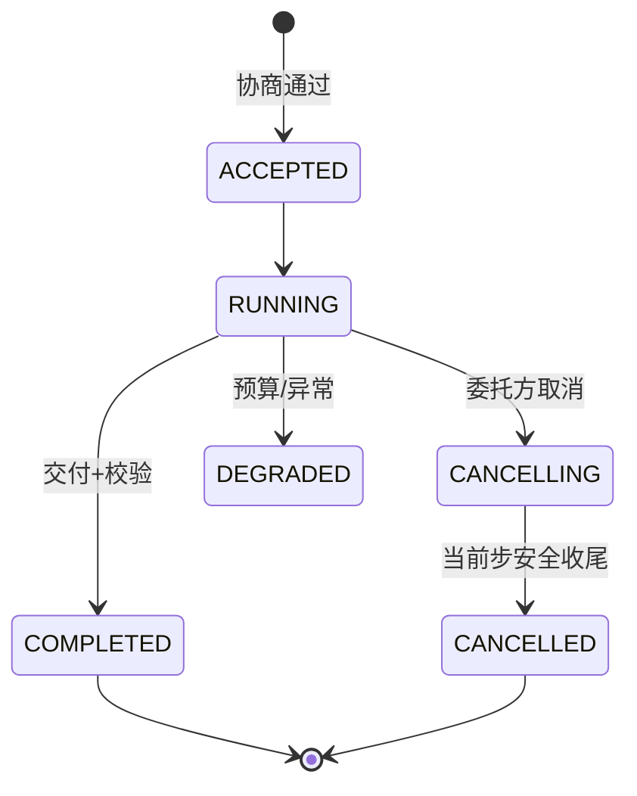

# 04-委托执行与进度取消

> **定位**：让异步委托任务**执行中可控**——**① 进度事件流（委托方可订阅）② 运行中取消（安全收尾，不硬杀）③ 委托方超时与重查语义**。呼应 [24-长任务的可视回放与取消](../../项目/24-企业级长任务工作流引擎/07-工作流可视回放与取消.md)、[22-会话引擎三段取消](../../项目/22-企业级Agent会话引擎/00-需求分析与架构设计.md)。前置阅读：[03-任务委托与协商](03-任务委托与协商.md)。
>
> **铁律 0**：任务事件/取消协议自研「概念代码」（SSE 推送用 WebFlux Flux）；执行基座 `ChatClient`/`@Tool` 实证。

---

## 一、四问

| 问 | 答 |
|----|----|
| **新增了什么需求** | ①进度事件（SSE：STEP/PROGRESS/DEGRADED/COMPLETED）②取消命令（CANCELLING→安全收尾→CANCELLED）③委托方超时语义（超时查询任务状态而非盲目重委托） |
| **影响了哪些模块** | executor → 事件流 + 取消钩子；taskStore → 状态机扩展 |
| **架构如何演进** | 从"提交后黑盒等结果"演进为"进度可见、可取消、可超时重查" |
| **上一版痛点** | 提交后黑盒；无法中途取消；超时后只能盲目重委托（副作用风险） |

**本迭代验收**：①委托方可 SSE 订阅进度 ②运行中取消 → 安全收尾（已发生副作用结果保留）③超时后查询任务真实状态再决策。

### 一.1 本节核对（四问与迭代验收）

| # | 核对项 | 判据 |
|---|--------|------|
| 1 | 四问口径齐全 | 新增需求/影响模块/架构演进/上一版痛点四行均有；痛点（提交后黑盒/不能取消/超时盲目重委托）与需求对应 |
| 2 | 本迭代验收可度量 | ①SSE 订阅 ②取消安全收尾 ③超时先查状态，三项均可判定 |

## 二、进度事件流（SSE）

```java
// 概念代码：委托任务进度事件（WebFlux SSE 推送）
public sealed interface DelegationEvent permits
        TaskAccepted, StepProgress, TaskDegraded, TaskCompleted, TaskCancelled {
    String taskId(); long ts();
}

// 委托方订阅——端点全路径：http://localhost:8081/collab/delegations/{id}/events
@RestController
@RequestMapping("/collab")
public class DelegationEventController {

    @GetMapping(value = "/delegations/{id}/events", produces = MediaType.TEXT_EVENT_STREAM_VALUE)
    public Flux<ServerSentEvent<DelegationEvent>> events(@PathVariable("id") String id) {
        return eventBus.subscribe(id);      // Flux 推送(进度/降级/完成)
    }
}
```

### 二.1 本节测试与验证（SSE 进度事件流）

**前置条件**：`DelegationEvent`（sealed）已定；`eventBus.subscribe(id)` 返回 `Flux<ServerSentEvent<DelegationEvent>>`；一个可产生多步进度的委托任务可跑。

**材料——事件类型核对**：sealed 许可 `TaskAccepted, StepProgress, TaskDegraded, TaskCompleted, TaskCancelled`，各事件含 `taskId()/ts()`。

**步骤与断言**：

| # | 操作 | 预期（PASS 判据） |
|---|------|------------------|
| 1 | SSE 订阅一个进行中任务 | 实时收到 `StepProgress` 类事件（流不阻塞、持续推进） |
| 2 | 任务完成后订阅端 | 收到 `TaskCompleted`（含任务结果或完成标记） |
| 3 | 触发预算/异常降级 | 订阅端收到 `TaskDegraded`，委托方及时感知 |
| 4 | 核对事件字段 | 每个事件均可取 `taskId()`/`ts()`，字段齐全 |

**失败排查**：①订阅收不到事件→`eventBus.subscribe` 未与事件发布者关联或 Flux 未订阅（无背压消费）；②完成无事件→完成钩子未 emit `TaskCompleted`；③sealed 之外类型→新增事件未加 `permit`。

## 三、运行中取消（三段语义，承 24）



**取消纪律**（承 [24-07](../../项目/24-企业级长任务工作流引擎/07-工作流可视回放与取消.md)）：标记 CANCELLING → 当前工具步安全收尾（已发生的副作用结果保留并注明）→ 未开始步骤 SKIPPED → CANCELLED。**不硬杀正在执行副作用的步骤**。

### 三.1 本节核对（取消三段语义）

| # | 核对项 | 判据 |
|---|--------|------|
| 1 | 状态机完整 | `ACCEPTED→RUNNING→CANCELLING→CANCELLED` 及 `COMPLETED/DEGRADED` 路径与正文纪律一致，无非法转移 |
| 2 | "不硬杀副作用步"落地 | CANCELLING 在当前步安全收尾后才 CANCELLED，未直接跳杀 RUNNING |

## 四、超时语义

超时 ≠ 失败。委托方等不到结果时：先 `status(taskId)` 查真实状态——可能仍在跑（延长等待）也可能已完成（取结果），**绝不盲目重委托**（防重复副作用，呼应 [24-幂等](../../项目/24-企业级长任务工作流引擎/03-幂等重试与副作用登记.md)）。

### 四.1 本节核对（超时语义）

| # | 核对项 | 判据 |
|---|--------|------|
| 1 | "超时≠失败"表述成立 | 明确"先查状态再决策"，无"超时即重委托"的表述 |
| 2 | 防重复副作用落地 | 盲目重委托被显式禁止，且呼应 24 幂等/副作用纪律 |

## 五、全篇回归验证

> §二.1（SSE 进度）与 §三.1（取消纪律）均通过后的整体验收。

| # | 操作 | 预期（PASS 判据） |
|---|------|------------------|
| 1 | SSE 订阅并在运行中取消 | 收到 `StepProgress`→`TaskCancelled`，且 CANCELLING 前已发生副作用的步骤结果被保留注明 |
| 2 | 超时后查 `status(taskId)` 再决策 | 不盲目重委托；仍在跑则延长等待、已完成则取结果 |
| 3 | 触发降级 | 委托方订阅端收到 `TaskDegraded`（对照 00 验收③/④的降级信号） |

**回归失败排查**：任一步 FAIL 按 §二.1/§三.1 排查项回溯（事件订阅 / 取消收尾 / 状态迁移）；对照 00 验收④「协作失败可降级」。

> **下一步**：委托可控了，但**谁都能委托任何 Agent**——裸奔。05 迭代做**身份互信与最小授权**——协作安全的根基。
