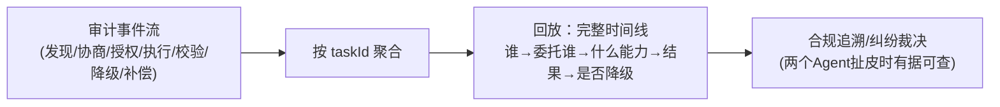

# 08-协作全链路可观测

> **定位**：让协作**看得见**——一次委托从发现→协商→执行→结果的全链路 Trace/指标/审计。核心：**① 协作 Trace（委托链路 Span）② 协作健康指标（成功率/时延/拒收率/注入检出率）③ 协作审计回放**。呼应 [22-可观测](../../教程/22-全链路可观测性.md)、[附录 18-Observation](../../附录/18-Observation/00-Observation全景与核心概念.md)。前置阅读：[07-协作失败补偿与降级链](07-协作失败补偿与降级链.md)。
>
> **铁律 0**：Observation/Micrometer 实证体系（附录18）；协作语义维度自研「概念代码」。

---

## 一、四问

| 问 | 答 |
|----|----|
| **新增了什么需求** | ①协作阶段 Span（discover/negotiate/execute/validate 各一段，taskId 贯穿）②指标（成功率/协商拒率/时延/拒收率/注入数）③审计回放（单委托全时间线） |
| **影响了哪些模块** | 各环节 → 打点；新增 协作观测聚合 |
| **架构如何演进** | 从"各环节黑盒"演进为"单委托全链路可追踪" |
| **上一版痛点** | 协作失败排障要在委托方/中继/被委托方三处日志人肉拼时间线 |

**本迭代验收**：①一次委托一个 traceId 贯穿三端 ②关键指标上 Grafana ③任意委托可回放完整时间线 ≤5s（对照 00 验收⑤）。

## 二、协作 Span 与指标

```java
// 概念代码：协作链路打点（Observation 实证体系）
return Observation.createNotStarted("agent.collab.delegate", registry)
    .lowCardinalityKeyValue("collab.taskId", taskId)
    .lowCardinalityKeyValue("collab.target", targetAgent)
    .lowCardinalityKeyValue("collab.outcome", "unknown")
    .observe(() -> doDelegate(req));   // observe 内更新 outcome(成功/拒收/降级)
```

**核心指标**（Grafana 视图）：

| 指标 | 意义 |
|------|------|
| 委托成功率 / 协商拒率 | 生态供需健康度 |
| P95 委托时延 | 协作体验 |
| 结果拒收率（按 Agent） | 某 Agent 结果质量差的风向标 |
| 注入检出数（按来源） | 恶意/被入侵 Agent 信号 |
| 降级链触发分布 | 哪类失败最常见 → 针对性治理 |

## 三、协作审计回放



**价值**：跨组织协作出纠纷（"我没收到/结果不对"）时，中继的审计时间线是**中立裁决证据**（呼应 [19-跨组织互认](../../项目/19-企业级Agent信任与评测平台/10-跨组织信任互认与监管披露.md)）。

## 四、验收

| 测试 | 期望 |
|------|------|
| 单委托 trace | 三端 Span 同 traceId 串联 |
| 指标 | Grafana 可见五大协作指标 |
| 回放 | taskId → 完整时间线 ≤5s |
| 注入检出 | 按来源可统计 |

> **下一步**：单组织协作可观测了。09 进阶做**跨组织身份互信与联邦**——把协作面扩展到组织外。
