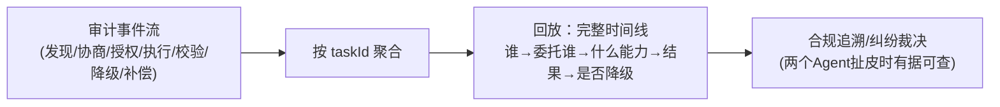

# 08-协作全链路可观测

> **定位**：让协作**看得见**——一次委托从发现→协商→执行→结果的全链路 Trace/指标/审计。核心：**① 协作 Trace（委托链路 Span）② 协作健康指标（成功率/时延/拒收率/注入检出率）③ 协作审计回放**。呼应 [教程 31-全链路可观测性](../../教程/31-全链路可观测性.md)、[教程 33-最小闭环：Agent各阶段输出打印到控制台](../../教程/33-最小闭环：Agent各阶段输出打印到控制台.md)。前置阅读：[07-协作失败补偿与降级链](07-协作失败补偿与降级链.md)。
>
> **铁律 0**：Observation/Micrometer 实证体系（附录18）；协作语义维度自研「概念代码」。

---

## 一、四问

| 问 | 答 |
|----|----|
| **新增了什么需求** | ①协作阶段 Span（discover/negotiate/execute/validate 各一段，taskId 贯穿）②指标（成功率/协商拒率/时延/拒收率/注入数）③审计回放（单委托全时间线） |
| **影响了哪些模块** | 各环节 → 打点；新增 协作观测聚合 |
| **架构如何演进** | 从"各环节黑盒"演进为"单委托全链路可追踪" |
| **上一版痛点** | 协作失败排障要在委托方/中继/被委托方三处日志人肉拼时间线 |

**本迭代验收**：①一次委托一个 traceId 贯穿三端 ②关键指标上 Grafana ③任意委托可回放完整时间线 ≤5s（对照 00 验收⑤）。

### 一.1 本节核对（四问与迭代验收）

| # | 核对项 | 判据 |
|---|--------|------|
| 1 | 四问口径齐全 | 新增需求/影响模块/架构演进/上一版痛点四行均有；痛点（三处日志人肉拼时间线）与需求对应 |
| 2 | 本迭代验收可度量 | ①traceId 贯穿 ②指标上 Grafana ③回放 ≤5s，三项均可判定 |

## 二、协作 Span 与指标

```java
// 概念代码：协作链路打点（Observation 实证体系）
return Observation.createNotStarted("agent.collab.delegate", registry)
    .lowCardinalityKeyValue("collab.taskId", taskId)
    .lowCardinalityKeyValue("collab.target", targetAgent)
    .lowCardinalityKeyValue("collab.outcome", "unknown")
    .observe(() -> doDelegate(req));   // observe 内更新 outcome(成功/拒收/降级)
```

**核心指标**（Grafana 视图）：

| 指标 | 意义 |
|------|------|
| 委托成功率 / 协商拒率 | 生态供需健康度 |
| P95 委托时延 | 协作体验 |
| 结果拒收率（按 Agent） | 某 Agent 结果质量差的风向标 |
| 注入检出数（按来源） | 恶意/被入侵 Agent 信号 |
| 降级链触发分布 | 哪类失败最常见 → 针对性治理 |

### 二.1 本节测试与验证（协作 Span 与指标）

**前置条件**：打点代码（`Observation.createNotStarted(...).lowCardinalityKeyValue("collab.taskId",...).observe(...)`）已接入委托主流程；Micrometer 注册表 + 导出管线（Grafana 源）可用；可制造成功/拒收/降级/超时多态结果。

**材料——关键指标核对**：委托成功率、协商拒率、P95 委托时延、结果拒收率（按 Agent）、注入检出数（按来源）、降级链触发分布。

**步骤与断言**：

| # | 操作 | 预期（PASS 判据） |
|---|------|------------------|
| 1 | 触发一次委托 | 产出 Span（`agent.collab.delegate`），`collab.taskId`/`collab.target` low-cardinality 维度可读 |
| 2 | 制造成功 / 拒收 / 降级各一次 | `collab.outcome` 在 observe 内被更新为对应值（成功/拒收/降级） |
| 3 | 核对指标已产出 | 成功率/时延/拒收率/注入数/降级分布 均可从导出查询到 |
| 4 | 委托方/中继/被委托方三端 | 同一次委托共享同一 `collab.taskId`（traceId 贯穿三端） |

**失败排查**：①Span 未产出→`Observation` 未在委托路径启动/未 scan 到注册表；②outcome 恒 unknown→observe 内未在分支更新 `lowCardinalityKeyValue("collab.outcome",...)`；③三端对不上 taskId→taskId 未随调用上下文传递。

## 三、协作审计回放



**价值**：跨组织协作出纠纷（"我没收到/结果不对"）时，中继的审计时间线是**中立裁决证据**（呼应 [19-跨组织互认](../../项目/19-企业级Agent信任与评测平台/10-跨组织信任互认与监管披露.md)）。

### 三.1 本节核对（协作审计回放）

| # | 核对项 | 判据 |
|---|--------|------|
| 1 | 回放要素齐全 | 时间线含"谁→委托谁→什么能力→结果→是否降级"，可支撑纠纷裁决 |
| 2 | 审计中立性成立 | 中继作为独立第三方留存时间线，非任一方自证 |

## 四、全篇回归验证

> §二.1（Span/指标）与 §三.1（回放）均通过后的整体验收。

| # | 操作 | 预期（PASS 判据） |
|---|------|------------------|
| 1 | 一次委托三端打点 | 三端 Span 同 traceId/collab.taskId 串联 |
| 2 | 触发成功/拒收/降级/超时各一次 | Grafana 可见对应指标变化（success/拒收率/降级分布） |
| 3 | `taskId → 回放完整时间线` | ≤5s，含协商/授权/执行/校验/降级各段（对照 00 验收⑥「≤5s」） |

**回归失败排查**：任一步 FAIL 按 §二.1/§三.1 排查项回溯（Observation 打点 / outcome 更新 / taskId 传递 / 回放聚合性能）。

> **下一步**：单组织协作可观测了。09 进阶做**跨组织身份互信与联邦**——把协作面扩展到组织外。
