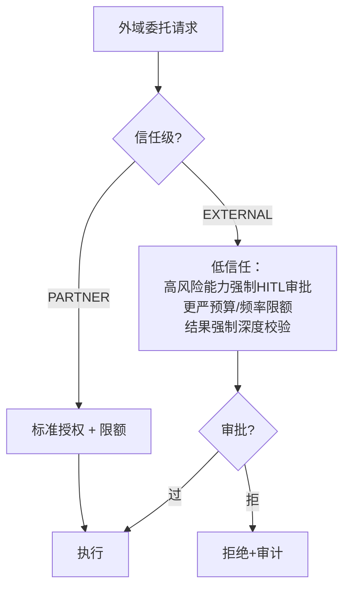

# 09-跨组织协作与联邦

> **定位**：把协作从"企业内"扩展到**跨组织**——**① 组织间身份互信（信任锚/联邦凭证互认）② 跨组织委托的加强约束（外域默认低信任 + 更严审批）③ 多中继联邦路由**。呼应 [16-多集群联邦](../../项目/16-企业级Agent服务网格/07-多集群联邦.md)、[19-跨组织互认](../../项目/19-企业级Agent信任与评测平台/10-跨组织信任互认与监管披露.md)。前置阅读：[08-协作全链路可观测](08-协作全链路可观测.md)。
>
> **铁律 0**：联邦互信自研「概念代码」（OIDC 联邦/SPIFFE 信任域为业界标准，需引入依赖后实证）。

---

## 一、四问

| 问 | 答 |
|----|----|
| **新增了什么需求** | ①组织信任锚（对方组织 IdP 的凭证在本方可验证）②外域委托加强策略（低默认信任/HITL 审批/限额更严）③多中继联邦（A 组织中继可发现 B 组织中继的 AgentCard） |
| **影响了哪些模块** | 身份层 → 多信任域；授权层 → 组织边界策略；注册中心 → 联邦发现 |
| **架构如何演进** | 从"单组织协作平台"演进为"联邦化协作网络" |
| **上一版痛点** | 只有内部身份有效；外部 Agent 无法安全接入；各组织中继孤岛 |

**本迭代验收**：①外部组织凭证可验证（互信锚生效）②外域委托默认低信任 + 高风险强制 HITL ③联邦发现能查到对方组织的 Agent。

### 一.1 本节核对（四问与迭代验收）

| # | 核对项 | 判据 |
|---|--------|------|
| 1 | 四问口径齐全 | 新增需求/影响模块/架构演进/上一版痛点四行均有；痛点（只有内部身份有效/中继孤岛）与需求对应 |
| 2 | 本迭代验收可度量 | ①互信锚验证 ②外域低信任+强制 HITL ③联邦发现，三项均可判定 |

## 二、组织互信锚

```java
// 概念代码：多信任域验证
public Identity verifyFederated(AuthCredential cred) {
    TrustAnchor anchor = anchors.of(cred.issuerOrg());     // 预配置的互信组织
    if (anchor == null) throw new Unauthorized("未互信组织");
    return anchor.verify(cred.token());                     // 用对方组织的公钥/IdP验证
    // 信任分级：INTERNAL(全) > PARTNER(标准) > EXTERNAL(受限+审批)
}
```

### 二.1 本节测试与验证（组织互信锚）

**前置条件**：`verifyFederated(cred)` 可执行；预配置互信组织锚（其公钥/IdP）与未互信组织；可构造对方组织签发的合法/伪造凭证。注意：OIDC 联邦/SPIFFE 信任域校验需引入依赖后实证，先以测试密钥/模拟 IdP 落地。

**材料——互信矩阵**：

| 测试 | 期望 |
|------|------|
| 未互信组织凭证 | 拒绝（Unrecognized issuer） |
| PARTNER 委托 | 标准授权流程 |
| EXTERNAL 高风险 | 强制 HITL 审批 |

**步骤与断言**：

| # | 操作 | 预期（PASS 判据） |
|---|------|------------------|
| 1 | 无互信锚的组织凭证 | `Unauthorized("未互信组织")` 拒绝 |
| 2 | 互信组织合法凭证 | `anchor.verify(token)` 通过，返回 Identity，信任级可判定（INTERNAL/PARTNER/EXTERNAL） |
| 3 | 互信组织伪造凭证 | 校验失败（用对方公钥/IdP 验拒） |
| 4 | EXTERNAL 高风险委托 | 走强制审批路径（不进直接执行） |

**失败排查**：①未互信也通过→未查 `anchors.of(issuerOrg)` 或默认放行；②伪造通过→未用对方 IdP 真实验签；③信任级错乱→信任分级未随 issuer 映射。

## 三、跨组织加强策略



**原则**：**信任越低、约束越严**——外域不是不能协作，而是**贵**（要审批、限额、深校验），让"要不要跨域"成为显式成本决策（呼应 [43-治理](../../教程/86-Agent治理与合规框架.md)）。

### 三.1 本节核对（跨组织加强策略）

| # | 核对项 | 判据 |
|---|--------|------|
| 1 | 决策流完整 | flowchart 覆盖 PARTNER / EXTERNAL 两分支，EXTERNAL 高风险强制 HITL 后才执行，拒绝落审计 |
| 2 | "信任越低约束越严"落地 | EXTERNAL 三级约束（高成本：审批/限额/深校验）非一句带过 |

## 四、多中继联邦路由

- 各组织中继保留本地注册中心；联邦层只同步**对外公开的 AgentCard 子集**（能力/联系端点，不泄内部细节）。
- 委托路由：本地无 → 查联邦目录 → 跨中继委托（带联邦凭证）→ 结果回流仍走 06 注入边界。
- 联邦审计：跨域委托双方组织各存一份审计（呼应 [19-监管披露](../../项目/19-企业级Agent信任与评测平台/10-跨组织信任互认与监管披露.md)）。

### 四.1 本节核对（多中继联邦路由）

| # | 核对项 | 判据 |
|---|--------|------|
| 1 | 联邦发现只同步公开子集 | 联邦层仅同步对外公开的 AgentCard（能力/联系端点），不漏内部细节 |
| 2 | 委托路由完整 | 本地无→查联邦→跨中继委托→结果仍走 06 注入边界；双边审计 |

## 五、全篇回归验证

> §二.1（互信锚）与 §三.1/§四.1（加强策略/联邦路由）均通过后的整体验收。

| # | 操作 | 预期（PASS 判据） |
|---|------|------------------|
| 1 | 未互信 / 伪造组织凭证 各触发一次 | 拒绝 |
| 2 | PARTNER 委托一次 | 标准授权流程放行 |
| 3 | EXTERNAL 高风险委托一次 | 强制 HITL 审批，审批过才执行 |
| 4 | 联邦发现一次 | 查到对方组织公开 Agent（仅公开子集） |
| 5 | 跨域结果回流 | 深度校验后进上下文 + 双边审计 |

**回归失败排查**：任一步 FAIL 按 §二.1/§三.1/§四.1 排查项回溯（互信锚验证 / 信任级映射 / 强制审批 / 联邦同步范围 / 注入边界）。

> **下一步**：协作能跨组织了。10 进阶做**协作市场**——能力资产化（发布/订阅/计费），协作规模化复用。
