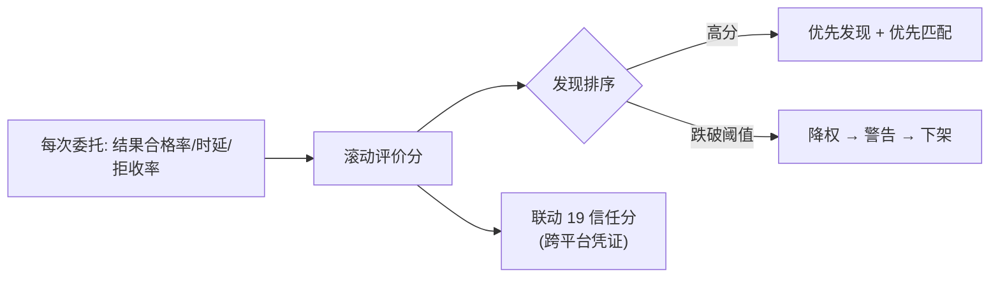

# 10-协作市场与生态

> **定位**：把协作能力**资产化**——Agent 能力像商品一样发布/订阅/计费/评价，形成协作生态。核心：**① 能力上架（AgentCard + 定价 + SLA）② 订阅与用量计量（呼应 20-计量）③ 评价与信任分联动**。呼应 [03-工具市场](../../项目/03-MCP工具网关/06-工具市场与计费.md)、[20-计量与计费](../../项目/20-企业级Agent经济与结算平台/03-计量与计费引擎.md)、[16-策略市场](../../项目/16-企业级Agent服务网格/10-A2A互操作与策略市场.md)。前置阅读：[09-跨组织协作与联邦](09-跨组织协作与联邦.md)。
>
> **铁律 0**：市场/计量自研「概念代码」；Token 计量用实证 `Usage`（呼应 [20-项目](../../项目/20-企业级Agent经济与结算平台/00-需求分析与架构设计.md)）。

---

## 一、四问

| 问 | 答 |
|----|----|
| **新增了什么需求** | ①能力上架（定价模型：按次/按 Token/按订阅）②用量计量与对账（委托方付费/被委托方结算）③评价体系（结果合格率/响应速度 → 联动发现排序与信任） |
| **影响了哪些模块** | 注册中心 → 市场化元数据；新增 计量结算 + 评价 |
| **架构如何演进** | 从"免费协作目录"演进为"可计价、可评价的能力市场" |
| **上一版痛点** | Agent 提供能力无回报激励；质量差无淘汰；成本无法按委托方归因 |

**本迭代验收**：①能力可上架定价、按用量计量对账 ②评价影响发现排序（好 Agent 优先被发现）③烂 Agent（低合格率）被降权/下架。

## 二、上架与定价

```java
// 概念代码：市场条目（AgentCard 扩展商业元数据）
public record MarketListing(AgentCard card,
                            PricingModel pricing,       // PER_CALL / PER_TOKEN / SUBSCRIPTION
                            BigDecimal unitPrice,
                            SlaPromise sla) {}           // P95 时延 / 可用率承诺
```

## 三、计量对账（复用 20 的账本思想）

- 每次委托完成 → 计量事件（capability/Token 用量/时长）→ 双方账本。
- **对账三副本**（委托方/被委托方/中继）按周期核对——与 [20-计量与计费](../../项目/20-企业级Agent经济与结算平台/03-计量与计费引擎.md) 同一纪律，防单边记账。

## 四、评价与优胜劣汰



**生态闭环**：质量好 → 多被委托 → 多收益 + 高信任分（可携带，呼应 [19-跨组织互认](../../项目/19-企业级Agent信任与评测平台/10-跨组织信任互认与监管披露.md)）；质量差 → 降权下架。**市场是协作质量的飞轮**。

## 五、验收

| 测试 | 期望 |
|------|------|
| 上架定价 | 委托按价计量 |
| 对账 | 三副本一致 |
| 高分 Agent | 发现排序靠前 |
| 低分 Agent | 降权/下架 |

> **下一步**：10 个迭代/进阶让协作平台完整：发现/委托协商/进度取消/身份授权/注入边界/失败补偿/可观测/跨组织/市场。下一步进 **11-核心代码讲解** 串讲；随后 12-ADR、13-前沿收官。
