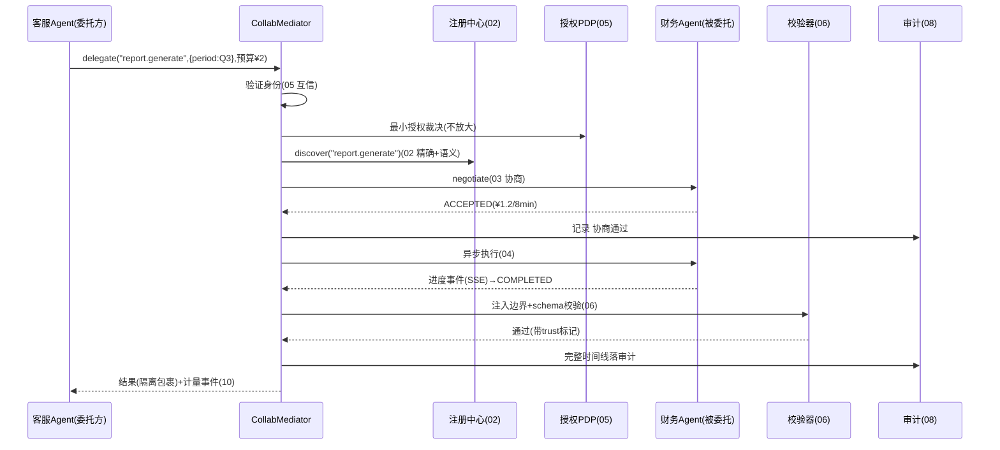

# 11-核心代码讲解

> **定位**：把项目 27 的核心实现串成主线——以**一次「客服 Agent 委托财务 Agent 生成季度报表」**贯穿各迭代关键代码的协作。前置阅读：[01-最小Demo](01-最小Demo.md) 至 [10-协作市场与生态](10-协作市场与生态.md) 全部。
>
> **铁律 0**：`ChatClient`/`EmbeddingModel`/Observation 用实证基准；协作协议/市场为「概念代码」。

---

## 一、一次跨 Agent 委托的完整旅程



## 二、编排入口（串联各迭代）

```java
// 概念代码：委托主流程
public Mono<DelegationResult> delegate(DelegationRequest req, AuthCredential cred) {
    return Mono.deferContextual(ctx -> {
        Identity id = verify(cred);                                   // 05 身份
        adjudicate(req, id);                                          // 05 最小授权
        AgentCard target = registry.discover(req.capability()).get(0);// 02 发现
        NegotiationResponse ok = negotiate(req, target);              // 03 协商
        String taskId = submit(target, req, ok);                      // 03/04 异步任务
        return observe(taskId)                                        // 08 打点
            .map(raw -> sandboxAndValidate(raw, target))              // 06 边界+校验
            .transform(this::resilient)                               // 07 降级链
            .doOnNext(r -> { metering.record(r); rating.record(r); });// 10 计量+评价
    });
}
```

## 三、分层职责（读代码抓手）

| 类 | 迭代 | 职责 |
|----|------|------|
| `AgentCardRegistry` | 02 | 注册/心跳/两级发现 |
| `Negotiator`/`DelegationTask` | 03/04 | 协商 + 异步任务 + 进度取消 |
| `AuthorizationPDP` | 05 | 身份互信 + 委托不放大 |
| `ResultSandbox` | 06 | 注入边界 + schema 校验 |
| `DegradationChain`/`Compensator` | 07 | 降级链 + 副作用补偿 |
| `CollabObservability` | 08 | Span/指标/审计回放 |
| `Federation`/`Market` | 09/10 | 跨组织 + 市场 |

## 四、最容易踩的三个坑

1. **委托无授权裁决** → 权限放大事故。**解法**：交集裁决前置（05）。
2. **对方返回直接进系统提示** → 间接注入。**解法**：边界包裹 + 指令样检测（06）。
3. **超时盲目重委托** → 副作用重复。**解法**：先查状态再降级（04/07）。

## 五、验收自测（对照 00 量化指标）

| 指标 | 目标 | 实现 |
|------|------|------|
| 发现匹配正确率 | ≥95% | 02 两级发现 |
| 委托不放大 | 100% | 05 交集裁决 |
| 注入拦截 | 100% | 06 边界 |
| 失败可降级 | 不中断 | 07 降级链 |
| 审计回放 | ≤5s | 08 时间线 |

> **下一步**：代码串讲完成。12-ADR 记录本项目 8 条关键决策；13-前沿做业界对照与演进。
