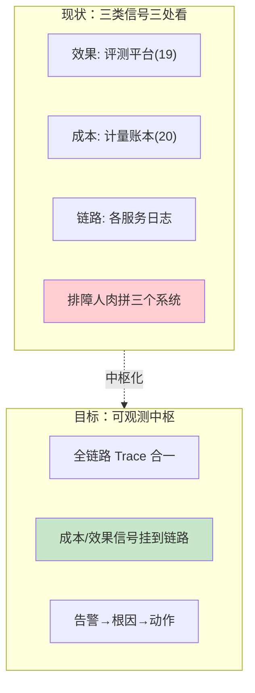
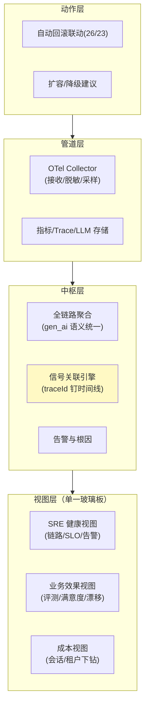

# 00-需求分析与架构设计：企业级 Agent 统一可观测平台

> **定位**：第十六旗舰·**可观测合一视角**——第一性原理：**单一玻璃板看全 Agent 系统**。22/23 教程 + 附录18/21 讲透了机制，但企业里"效果（评测）、交易（成本）、变更（发布）"三类信号散落在 19/20/23 各自平台——排障要在三个系统人肉拼。本平台把 **gen_ai 全链路 Trace（LLM→工具→检索→记忆→协作）+ 成本归因 + 评测/漂移信号 + 告警根因 + 跨服务聚合**合成**一个可观测中枢**：OTel 管道地基（附录21）、单一玻璃板、成本下钻到会话/租户、可观测驱动的自动回滚联动。读者画像：要回答"Agent 系统出了问题，一块屏幕能不能定位"的架构师。前置阅读：[教程 31-全链路可观测性]、[教程 60-成本治理与Token计量]、[附录 18-可观测平台实践/00-OTel管道与gen_ai语义]。
>
> **铁律 0**：基座=实证 Micrometer Observation（gen_ai 语义，附录18/21）；玻璃板/聚合/根因为自研「概念代码」。收束 19/20/23 的信号但不依赖（项目独立）。

---

## ★ 阅读顺序总览（序号 = 阅读顺序）

> 本子文件夹 14 个文件（00-13）：

| 阶段 | 文件 | 读者定位 |
|------|------|---------|
| ① 全貌 | 00-需求分析与架构设计 | **先读**：可观测中枢四层架构 |
| ② 起步 | 01-最小Demo | **动手**：全链路 Span 聚合查询 |
| ③ 主体迭代 | 02~07（OTel管道/玻璃板/成本归因/评测信号汇入/告警根因/SLO） | **严格顺序** |
| ④ 进阶 | 08~10（自动回滚联动/多租户视图/容量观测） | **严格顺序** |
| ⑤ 讲解 | 11-核心代码讲解 | **回顾** |
| ⑥ 资产 | 12-ADR / 13-前沿 | **按需/收官** |

---

## 一、为什么可观测要合一

**三个核心论点**：

1. **信号要挂到链路**：成本/评测信号若与 Trace 无关联，仍是"三张孤立报表"——用 traceId/会话 ID 把三类信号**钉在同一条时间线**上。
2. **玻璃板要按角色**：SRE 看健康、业务看效果、财务看成本——同一数据不同视图（呼应 [30-解释分层](../../项目/30-企业级Agent可解释与透明平台/02-解释时间线工程化.md) 的受众分层）。
3. **可观测要驱动动作**：观测的终点是自动回滚/扩容/降级（呼应 [28-教程HITL](../../教程/61-Human-in-the-Loop与审批流.md)、[32-模型降级](../../教程/65-模型路由与降级.md)），不是看完拉倒。

### 一.1 本节核对（为什么可观测要合一）

- [ ] 三个核心论点（信号挂链路 / 玻璃板按角色 / 可观测驱动动作）能不看正文各复述一句
- [ ] 能说清"单一玻璃板"≠"把三个系统做成一个页面"，而是效果、成本、链路三类信号靠 traceId/会话 ID 钉在**同一条时间线**上

## 二、总体架构（四层）

### 二.1 本节核对（总体架构四层）

- [ ] 四层（动作→管道→中枢→视图）的层次方向与服务间依赖能说清
- [ ] 视图层三视图（健康/效果/成本）分别由后续哪篇（03-05/09）承接，映射一致

## 三、微服务清单与迭代路线

| 服务 | 职责 | 落地 |
|------|------|------|
| `obs-pipeline` | OTel 管道（脱敏/采样/多路导出） | 迭代 2 |
| `obs-core` | 聚合 + 信号关联 + 根因 | 迭代 3-5 |
| `obs-views` | 三视图玻璃板 | 迭代 3 + 进阶 |
| `obs-actions` | 告警→回滚/扩容联动 | 迭代 6 + 进阶 |

**迭代路线**（每迭代回答四问）：

| # | 迭代 | 核心新增 | 痛点回应 |
|---|------|---------|---------|
| 01-最小Demo | 全链路 Span 聚合查询 | 起点 |
| 02 | OTel 管道（脱敏/采样/多路） | 遥测散/含敏感内容 |
| 03 | 单一玻璃板三视图 | 三系统人肉拼 |
| 04 | 成本归因（会话/租户下钻） | 成本看不到链路 |
| 05 | 评测/漂移信号挂链路 | 效果与链路脱节 |
| 06 | 告警与根因定位 | 告警风暴无根因 |
| 07 | SLO 与错误预算 | 健康无量化标准 |
| 进阶08 | 可观测驱动自动回滚 | 观测不驱动动作 |
| 进阶09 | 多租户可观测视图 | 租户互相看不见细节 |
| 进阶10 | 容量与性能观测 | 容量拍脑袋 |

**量化验收**：①单次排障"一块屏"定位根因 P95 ≤ 3min ②全链路 Trace 覆盖（LLM/工具/检索/记忆/协作）≥ 95% ③成本可下钻到会话级 100% ④告警含根因建议率 ≥ 80% ⑤遥测脱敏 100%（敏感内容不落原始存储）。

### 三.1 本节核对（服务清单与迭代路线）

- [ ] 四个服务（obs-pipeline / obs-core / obs-views / obs-actions）的职责与迭代落地行（2 / 3-5 / 3+进阶 / 6+进阶）一一对应
- [ ] 五条量化验收每条都能指出由哪个迭代（01-10）承接落实

---

## 四、与教程/附录的映射

| 本平台能力 | 教程 | 附录/项目 |
|-----------|------|-----------|
| 可观测机制 | [31-全链路可观测性](../../教程/31-全链路可观测性.md) | [教程 33-最小闭环：Agent各阶段输出打印到控制台](../../教程/33-最小闭环：Agent各阶段输出打印到控制台.md)、[21-管道实践](../../附录/18-可观测平台实践/00-OTel管道与gen_ai语义.md) |
| 工具观测 | [23-工具可观测](../../教程/32-工具执行可观测与审计.md) | — |
| 成本 | [27-成本治理](../../教程/60-成本治理与Token计量.md) | [20-计量计费](../../项目/20-企业级Agent经济与结算平台/03-计量与计费引擎.md) |
| 效果信号 | [37-评估](../../教程/80-自我反思与Agent评估.md) | [19-在线哨兵](../../项目/19-企业级Agent信任与评测平台/04-在线哨兵与漂移告警.md) |
| 降级/回滚 | [32-模型降级](../../教程/65-模型路由与降级.md) | [26-灰度守门](../../项目/26-企业级Agent数据飞轮平台/06-灰度联动与守门放量.md) |

### 四.1 本节核对（教程/附录映射）

- [ ] 每条平台能力都能找到锚点（机制 22/23、成本 27、效果 37、降级回滚 32 + 附录 18/21）
- [ ] 铁律 0 边界（基座 Observation/OTel 实证、聚合/玻璃板/根因为概念代码）在本文出现处口径一致

> **铁律提醒**：基座 Observation/OTel 语义实证；聚合/玻璃板/根因为「概念代码」。信号收束 19/20/23 但保持项目独立。
