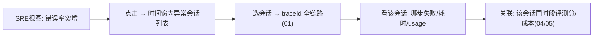

# 03-单一玻璃板与三视图

> **定位**：把"三系统人肉拼"变**一块屏**——**① 三角色视图（SRE 健康/业务效果/财务成本）② 会话下钻（玻璃板→单会话链路）③ 统一时间线（跨服务事件按时间对齐）**。呼应 [30-受众分层](../../项目/30-企业级Agent可解释与透明平台/02-解释时间线工程化.md)。前置阅读：[02-OTel管道与遥测治理](02-OTel管道与遥测治理.md)。
>
> **铁律 0**：视图聚合自研「概念代码」；数据来自 01-02 管道。

---

## 一、四问

| 问 | 答 |
|----|----|
| **新增了什么需求** | ①三视图（健康：链路/SLO/告警；效果：评测/满意度/漂移；成本：Token/费用下钻）②会话级下钻（点任意指标→相关会话→traceId 链路）③统一时间线（指标异动与链路事件对齐） |
| **影响了哪些模块** | 新增 GlassBoard 聚合服务 + 三视图前端 |
| **架构如何演进** | 从"查询 API"演进为"角色化玻璃板" |
| **上一版痛点** | SRE/业务/财务各看各的；从指标异常到定位会话要跨系统 |

**本迭代验收**：①三视图各自完整 ②指标异常 → 3 跳内下钻到具体会话链路 ③时间线跨服务对齐。

## 二、会话下钻（玻璃板的核心交互）

**价值链**：**指标 → 会话 → 链路 → 关联信号**四跳内完成定位（00 验收① 的交互基础）。

## 三、三视图内容

| 视图 | 角色人群 | 核心内容 |
|------|---------|---------|
| 健康 | SRE | 服务/SLO/告警/容量（02 管道供原始指标 + 10 容量观测实现） |
| 效果 | 业务 | 评测分/满意度/漂移（05 汇入） |
| 成本 | 财务/架构 | Token/费用/按租户业务线（04） |

**同一数据不同切片**——玻璃板是聚合层不是三个系统（呼应管控分离：数据面统一管道，视图面角色化）。

## 四、验收

| 测试 | 期望 |
|------|------|
| 三视图 | 各自指标齐 |
| 下钻 | 指标→会话→链路 ≤3 跳 |
| 时间对齐 | 异动与事件同屏 |

> **下一步**：玻璃板能看了，但**成本还只是总量**。04 迭代做**成本归因**——Token 下钻到会话/租户/业务线。
