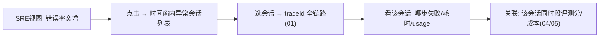

# 03-单一玻璃板与三视图

> **定位**：把"三系统人肉拼"变**一块屏**——**① 三角色视图（SRE 健康/业务效果/财务成本）② 会话下钻（玻璃板→单会话链路）③ 统一时间线（跨服务事件按时间对齐）**。呼应 [30-受众分层](../../项目/30-企业级Agent可解释与透明平台/02-解释时间线工程化.md)。前置阅读：[02-OTel管道与遥测治理](02-OTel管道与遥测治理.md)。
>
> **铁律 0**：视图聚合自研「概念代码」；数据来自 01-02 管道。

---

## 一、四问

| 问 | 答 |
|----|----|
| **新增了什么需求** | ①三视图（健康：链路/SLO/告警；效果：评测/满意度/漂移；成本：Token/费用下钻）②会话级下钻（点任意指标→相关会话→traceId 链路）③统一时间线（指标异动与链路事件对齐） |
| **影响了哪些模块** | 新增 GlassBoard 聚合服务 + 三视图前端 |
| **架构如何演进** | 从"查询 API"演进为"角色化玻璃板" |
| **上一版痛点** | SRE/业务/财务各看各的；从指标异常到定位会话要跨系统 |

**本迭代验收**：①三视图各自完整 ②指标异常 → 3 跳内下钻到具体会话链路 ③时间线跨服务对齐。

### 一.1 本节核对（四问与迭代验收）

- [ ] 四问与"查询 API → 角色化玻璃板"的演进一致
- [ ] 三条验收（三视图完整 / 指标→会话链路 3 跳 / 时间线跨服务对齐）与正文能力对应

## 二、会话下钻（玻璃板的核心交互）



**价值链**：**指标 → 会话 → 链路 → 关联信号**四跳内完成定位（00 验收① 的交互基础）。

### 二.1 本节测试与验证（会话下钻交互）

**前置条件**：01-02 管道与 Span 聚合就绪，玻璃板能列时间窗内会话并取到 traceId。

**材料——核对路径**：在 SRE 视图制造一个错误率突增指标，沿"异常指标 → 会话列表 → 会话 traceId 链路 → 关联信号"逐级点击。

**材料——核对命令**：

```bash
# 玻璃板下钻第一跳：按时间窗列异常会话（返回 traceId 供 01 链路查询，signals 挂 04/05 信号）
curl "http://localhost:8081/obs/sessions?window=1h&status=ERROR"
```

预期输出示例（会话列表带 traceId 入口与关联信号，支撑 ≤3 跳下钻）：

```json
{
  "window": "1h",
  "sessions": [
    { "sessionId": "sess-1024", "tenant": "acme", "errorRate": 0.18, "traceId": "trace-abc123",
      "signals": { "score": 0.42, "costUsd": 0.19 } }
  ]
}
```

**步骤与断言**：

| # | 操作 | 预期（PASS 判据） |
|---|------|------------------|
| 1 | 制造指标异常，点时间窗 | 返回该时间窗内异常会话列表（含 traceId 入口） |
| 2 | 选一个会话 | 3 跳内拉出该会话全链路（复用 01 聚合） |
| 3 | 在链路上看失败点 | 能指出哪步失败/耗时/usage |
| 4 | 关联合并 | 同时段该会话的评测分/成本信号（04/05）能挂在链路旁 |

**失败排查**：①会话列表空 → 时间窗/指标筛选条件错位，核对窗口字段；②跳数超 3 → 链路聚合（01）或关联键未通，回查 01；③关联信号缺失 → 04/05 信号未写入会话元数据，先查该迭代已完成。

## 三、三视图内容

| 视图 | 角色人群 | 核心内容 |
|------|---------|---------|
| 健康 | SRE | 服务/SLO/告警/容量（02 管道供原始指标 + 10 容量观测实现） |
| 效果 | 业务 | 评测分/满意度/漂移（05 汇入） |
| 成本 | 财务/架构 | Token/费用/按租户业务线（04） |

**同一数据不同切片**——玻璃板是聚合层不是三个系统（呼应管控分离：数据面统一管道，视图面角色化）。

### 三.1 本节核对（三视图内容）

- [ ] 三视图（健康/效果/成本）各自面向的人群与核心内容能说清
- [ ] 三张视图的数据来源分别指向哪些迭代（02/05/04），"同一数据不同切片"的口径一致

## 四、全篇回归验证

**回归断言**（`## 二.1` 本节测试通过后整体验收）：

| # | 操作 | 预期（PASS 判据） |
|---|------|------------------|
| 1 | 三视图逐一打开 | 三个角色各见其齐的指标（原始指标/评测/成本） |
| 2 | 从健康视图异常指标出发下钻一轮 | 指标→会话→链路 ≤3 跳，异动与事件同屏 |
| 3 | 时间线对齐 | 指标异动与链路事件在同一时间线上呈现 |

**失败排查**：①某视图空 → 对应数据源（05/04）未汇入，回查该迭代；②下钻超跳 → 关联键（traceId/会话 ID）未打通，回 `## 二.1` 排查。

> **下一步**：玻璃板能看了，但**成本还只是总量**。04 迭代做**成本归因**——Token 下钻到会话/租户/业务线。
