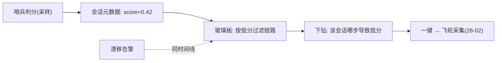

# 05-评测信号汇入链路

> **定位**：把**效果信号**（评测分/满意度/漂移）挂到链路——效果与链路同屏。核心：**① 在线哨兵判分按会话标注 ② 漂移信号与链路事件关联 ③ 差例会话一键转飞轮**。呼应 [19-在线哨兵](../../项目/19-企业级Agent信任与评测平台/04-在线哨兵与漂移告警.md)、[26-采集](../../项目/26-企业级Agent数据飞轮平台/02-采集管道与多源接入.md)。前置阅读：[04-成本归因与会话下钻](04-成本归因与会话下钻.md)。
>
> **铁律 0**：判分基座=实证 entity/Evaluator 思想；信号关联自研「概念代码」。

---

## 一、四问

| 问 | 答 |
|----|----|
| **新增了什么需求** | ①会话级评分标注（哨兵采样判分写入会话元数据）②漂移事件与链路时间线关联 ③低分会话一键推送飞轮采集 |
| **影响了哪些模块** | 哨兵 → 会话标注；玻璃板效果视图 → 联动链路 |
| **架构如何演进** | 效果从"独立报表"演进为"挂在链路上的信号" |
| **上一版痛点** | 效果下滑与链路异常两屏幕对时间；差例要人工搬运 |

**本迭代验收**：①会话带评分（可按分过滤链路）②漂移告警联动时间线 ③低分会话一键进飞轮。

## 二、信号关联与飞轮联动

**闭环价值**：效果差→链路定位→飞轮修复，全程一块屏（19/26 的信号在可观测中枢汇合，但两平台仍独立运作）。

## 三、验收

| 测试 | 期望 |
|------|------|
| 低分会话过滤 | 列出并下钻链路 |
| 漂移告警 | 与链路异动同屏 |
| 一键转飞轮 | 差例入 26 采集管道 |

> **下一步**：信号齐了，但**告警还是风暴**（一条链路断触发几十条告警）。06 迭代做**告警与根因定位**。
